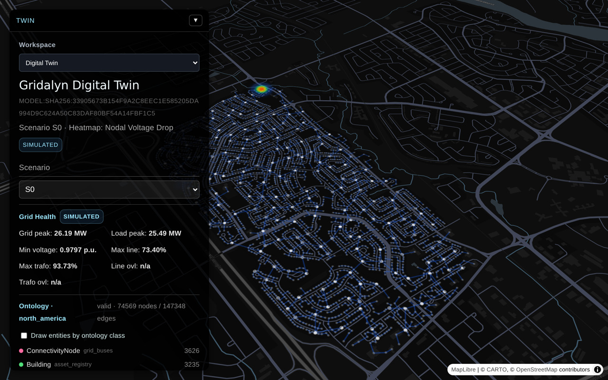
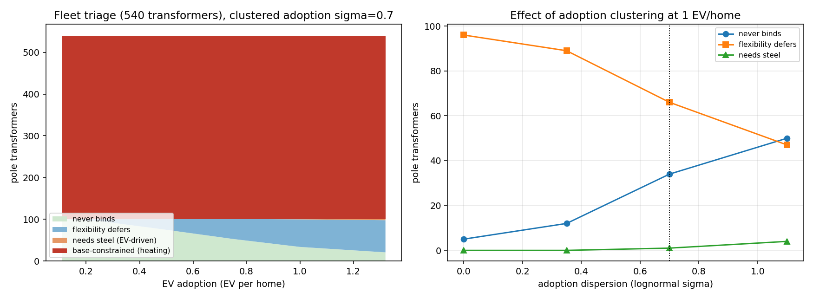

# Gridalyn


**Reproducible, citable studies of electric distribution grids and their
distributed energy resources — declarative YAML in, baseline-pinned numbers
out.**

[](https://lirei.ca/gridalyn/)
[](LICENSE)
[](https://www.python.org/)

📖 **[Documentation](https://lirei.ca/gridalyn/)** ·
[Quickstart](https://lirei.ca/gridalyn/start/quickstart/) ·
[Studies](https://lirei.ca/gridalyn/start/studies/) ·
[Components](https://lirei.ca/gridalyn/components/overview/) ·
[Contributing](CONTRIBUTING.md)

Gridalyn is an open-source Python SDK for modeling, simulating, and
optimizing multi-scale distribution systems — the flexible building loads, EV
chargers, and storage at the edge, and the feeders and transformers they
stress. It is built for researchers who need studies that survive re-running:
validated synthetic data, recorded seeds, and headline numbers that carry their
uncertainty. Its core has the parts a utility digital-twin platform is built
on — a canonical network model, ingest adapters, a measured-state path — without
being one;
[What Is Gridalyn?](https://lirei.ca/gridalyn/start/what-is-gridalyn/) states
exactly what it is and is not.

Most grid studies are hard to reproduce: the load generator was never validated
against anything real, the seed was never written down, and the scripts drifted
after the paper shipped. Gridalyn's answer is to make a study **data, not
code** — and to enforce that posture with tests rather than convention.



<sub>The browser dashboard under `dashboard/`, on the network model in
`instances/default/digital_twin/`. Everything in the panel is read from the
generated artifacts — the model SHA-256, the scenario, and the entity counts
that match the network tables. `SIMULATED` is the observation provenance the
model records, not a label added for the screenshot.</sub>

## Access to the source

The documentation is public; the source repository is private until the
work it supports is published. At publication a citable snapshot (the code,
the study YAMLs and their pinned baselines) is released in
[lirei-lab/gridalyn](https://github.com/lirei-lab/gridalyn) and archived on
Zenodo with a DOI. Until then, collaborators with access clone
`github.com/lirei-lab/gridalyn-dev`; to request access, write to lirei.info@uqtr.ca.

## Install and run

Requires Python 3.12+, Git and [`uv`](https://github.com/astral-sh/uv):

```bash
git clone https://github.com/lirei-lab/gridalyn-dev.git gridalyn
cd gridalyn
uv sync
uv run gridalyn quickstart my-first-study
```

The last command scaffolds a small power-flow study and runs it — the first
result in one command:


<sub>The `gridalyn quickstart` output is a real run, replayed with compressed
pacing; the clone and `uv sync` output is abridged. Regenerated by
`tools/render_quickstart_recording.py`.</sub>

`uv sync` alone gives the core library (plain `pip install -e .` also works);
the optional `geo`, `sim` and `ops` extras, and what each is needed for, are
on [Installation](https://lirei.ca/gridalyn/start/installation/).

## A study is data, not code

A study is two YAML files: a `StudyProject` that declares inputs, scenarios,
and metrics, and a `Workflow` that names the stages which compute them.

```yaml
# project.yaml — the study's contract (abridged)
kind: StudyProject
metadata:
  name: minimal_grid_project
  version: 0.1.0
spec:
  problem:
    type: powerflow_validation
    environment: pandapower_powerflow
  experiments:
    - id: baseline_powerflow
      scenario: baseline
      metrics: [powerflow_converged, min_voltage_pu, bus_count]
```

The runner executes the stage DAG, and every artifact-producing stage writes a
governed platform report. The run closes with a manifest that records the git
commit, the per-stage seed map, the numeric-stack versions, SHA-256 hashes of
the pinned inputs, and which load-generation model the environment selects:

```bash
uv run gridalyn validate
uv run gridalyn project run projects/minimal_grid_project
uv run gridalyn project verify projects/minimal_grid_project
uv run gridalyn project regression projects/minimal_grid_project
```

`validate` checks the artifact policy and every study's contract. `verify`
checks one study's declared artifacts and sense checks. `regression` is what
pins the numbers: it compares every declared metric against the study's
committed baseline, with explicit tolerances, and a metric whose source file
is missing is a failure, not a skip.

## What "reproducible" means here

Each of these is held by a dedicated gate in `tests/`, so regressing one is a
red build rather than a silent drift:

- **Provenance over trust.** Seeds are declared in YAML and resolved per stage;
  the run manifest hashes the pinned inputs and records which macro load model
  the generator selects, because a silent model substitution changes the
  generated load.
- **One report contract.** Every artifact-producing run emits the same governed
  JSON envelope; a test classifies every JSON write site in the repository, so
  a hand-rolled report cannot slip in.
- **Baselines with teeth.** Studies are pinned metric by metric against
  committed baselines. The CI fixture studies run end to end on every push,
  and `gridalyn project regression` checks each against its baseline.
- **Architecture as a test, not a diagram.** Seven layers, imports strictly
  downward; import hygiene is checked per sub-package in isolated subprocesses;
  the packaging gate builds a real wheel and imports from it.

## The studies

| Study | Tier | What it is |
| --- | --- | --- |
| `ev_hosting_flex` | operator-verified | The flagship: EV hosting capacity and flexibility on a Québec all-electric distribution feeder. |
| `admm_thermal_consensus` | operator-verified | Distributed ADMM coordination of cold-climate electric heating, on the same Québec calibration. |
| `measured_shadow_feeder` | operator-verified | A week of measured per-home power fed into a feeder through the semantic graph, compared with the synthetic generator. |
| `minimal_grid_project` and the other small studies | CI fixture | The studies CI runs end to end on every push and checks against their baselines. |

Operator-verified studies run too long, or need data too private, for CI; an
operator runs and verifies them locally. The full inventory, with what each
study shows, is [The Studies](https://lirei.ca/gridalyn/start/studies/).

The flagship's headline numbers, their uncertainty and how its generators were
validated against real data are in its own README and CALIBRATION.md
(`projects/ev_hosting_flex/` in the source repository), which are their
source of truth. A full run from a cold cache takes hours; to run it and check
its pinned results:

```bash
uv run gridalyn project run projects/ev_hosting_flex
uv run gridalyn project verify projects/ev_hosting_flex
uv run gridalyn project regression projects/ev_hosting_flex
```



<sub>The flagship's declared primary result, regenerated by its own workflow:
every pole transformer in the fleet classified at each adoption level, for
spread and for geographically clustered adoption.</sub>

## How it is built

Seven layers, imports strictly downward: `foundation → twin → assets →
simulation → operations → projects → interfaces`, walked one page each in
[Components](https://lirei.ca/gridalyn/components/overview/). Studies live
outside the package under `projects/`, and their artifacts land in each
study's `outputs/`.

`gridalyn.twin` is a canonical, identified, schema-declared digital
**model** with a one-way measured-state ingest path. A deployment becomes a
digital shadow when it is fed real measured data, which is what
`measured_shadow_feeder` does when its measured export is on disk; the SDK on
its own is not a digital twin. The full statement is in
[Twin](https://lirei.ca/gridalyn/components/twin/#what-problem-this-layer-solves).

## Command line

`gridalyn` is the root entry point; seven domains hang off it as subcommands
(`twin`, `project`, `market`, `semantic`, `dashboard`, `platform`,
`extension`). All but `extension` are also installed as standalone scripts for
automation — `gridalyn-dt`, `gridalyn-project`, `gridalyn-flex`,
`gridalyn-semantic`, `gridalyn-dashboard` and `gridalyn-platform`:

```bash
uv run gridalyn --help
uv run gridalyn project --help
uv run gridalyn-flex --help
```

## Documentation

The full documentation lives at **[lirei.ca/gridalyn](https://lirei.ca/gridalyn/)**;
its [Quickstart](https://lirei.ca/gridalyn/start/quickstart/) is the first
stop after installing.

## Contributing

See [CONTRIBUTING.md](CONTRIBUTING.md) for setup, the architectural rules the
tests enforce, and what to do when a change moves a study's pinned baseline;
the operator verification protocol is in `docs/contributing/verification.md`.
Participation is governed by our [Code of Conduct](CODE_OF_CONDUCT.md), and
[SECURITY.md](SECURITY.md) covers how to report a vulnerability.

## Citing

If you use Gridalyn or its studies in your research, please cite it. GitHub
renders [CITATION.cff](CITATION.cff) as a "Cite this repository" button, which
gives you BibTeX and APA directly.

## License

This project is licensed under the MIT License. See [LICENSE](LICENSE).

## Disclaimer

Gridalyn can generate and analyze realistic synthetic power-grid scenarios, but
it is not certified operational utility software. Treat v0.1 as a research and
platform-development release. Validate any operational decision support with
utility-grade data, engineering review, and the applicable grid codes.
