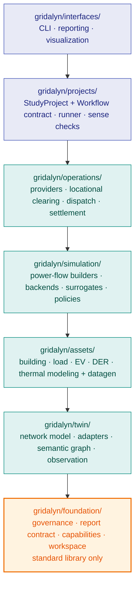

# The Platform, In One Pass

Gridalyn is seven packages under `gridalyn/`. Each one imports only from the
packages below it (`foundation → twin → assets → simulation → operations →
projects → interfaces`), and tests enforce that rule:
`tests/test_layer_direction.py` and the `tests/test_*_boundaries.py` suite fail
the build on an upward import.

This page is the map. The seven pages that follow it walk the stack bottom to
top, one layer per page, each ending with a link to the next, so reading them
in order follows the direction the imports run.

## The stack

`foundation` is the floor: it depends on nothing else in this repository.
`interfaces` may import from `twin`, but `twin` may never import from
`interfaces`.

## The seven layers, one sentence each

| Layer | Answers | Covers |
| --- | --- | --- |
| [Foundation](foundation.md) | How does a run prove what it did? | governance, the report contract, capability gating, workspace paths |
| [Twin](twin.md) | What is the grid, canonically? | network model, identity, schema, observed state |
| [Assets](assets.md) | What is connected to the grid? | buildings, EVs, DER, thermal models, synthetic data |
| [Simulation](simulation.md) | Does it hold up physically? | power flow, backends, surrogates, policies |
| [Operations](operations.md) | What can the grid absorb, and at what price? | providers, clearing, dispatch, settlement |
| [Projects](projects.md) | How does a study reproduce itself? | `StudyProject`, `Workflow`, the runner, regression |
| [Interfaces](interfaces.md) | How does a person reach any of this? | CLI, reports, dashboard |

Start at [Foundation](foundation.md) and follow each page's last section to the
next. Unfamiliar terms are collected in the [Glossary](../reference/glossary.md); every
public class and function this walk names is indexed by module, and rendered
from its live docstrings, in the [Python API Reference](../reference/python-api.md).

## Why this order, and not the org chart

A distribution-grid platform could be organized around use cases (studies,
markets, dashboards) or around this import stack. Gridalyn is organized around
the stack, deliberately: a use case can always be described in terms of the
layers it touches, but a layer described in terms of every use case that
touches it never settles into a stable contract. `operations/clearing`, for
example, is one page here regardless of how many studies call it.

Two prior efforts are visible in the platform's shape without being copied
wholesale: the durable utility network-model philosophy of platforms such as
Evolve, and the clean study/simulation separation of tools like Sienna. What
Gridalyn adds on top is treating providers, clearing, dispatch, settlement and
KPIs as a first-class platform layer (`operations`) rather than
per-study glue code: every study that needs a market reuses the same
`operations` contract instead of reimplementing it.

## What is stable, what is not

**Stable**: the `gridalyn` CLI entry points; the documented public surface of
each of the seven layers (the pages this section links to); the `project.yaml`
/ `workflow.yaml` contract under `projects/<name>/`; a twin instance's
declaration, `instances/<name>/twin.yaml`; the canonical report and manifest
shapes.

**Not public**: anything reached only through a private submodule path (for
example `gridalyn.simulation.simulators.powerflow.synthetic_network` rather
than `gridalyn.simulation`); generated caches and instance data, such as the
parquet the twin commands write under `instances/<name>/digital_twin/`, which
git ignores; retired paths kept only for git history.

## Where a new capability belongs

Ask which of the seven questions above it answers, and place it in that layer.
If it spans two layers, it is almost always because one of them is being asked
to do the other's job. The fix is usually to thin the higher layer down to
orchestration and push the behavior into the lower one, not to invent an
eighth layer.

If two projects independently need the same behavior, that behavior belongs in
`gridalyn/`, not duplicated in `projects/<name>/scripts/`. A project script's
job is to call the SDK and write declared artifacts, not to reimplement it.
