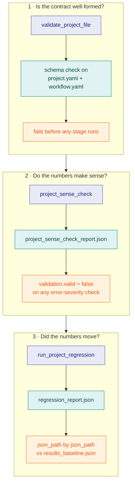

# Projects

## What problem this layer solves

Everything below this layer is a capability the SDK offers; `projects` is
where a specific study actually consumes them, and it does so as **data, not
code**. A `project.yaml` (`kind: StudyProject`) plus a `workflow.yaml`
(`kind: Workflow`) fully describe a study — the DAG of stages, their inputs,
and what gets validated. `gridalyn/projects/runner.py` executes that DAG as
subprocesses; nothing shares process memory, so a stage's only input is a
file another stage wrote, and its only output is a file on disk.

## The vocabulary

- **The study model** (`gridalyn/projects/models.py`) — frozen dataclasses
  that are the in-memory form of the two YAML files, produced by
  `load_project`: `StudyProject`, which carries a `ProblemSpec` (with its
  `ScenarioSpec`s), its `ExperimentSpec`s and a `WorkflowSpec` of
  `WorkflowStage`s. `ValidationReport` is the mutable result
  `validate_project_file` returns.
- **`ProjectScript`** — the boilerplate-free stage-script context
  (`project_script()`): the study directory (`root`, a `ProjectDir`) and the
  workspace root (`workspace_root`, a `WorkspaceRoot`) as distinct types,
  output paths, headless matplotlib, typed input loading, and `write_report`.
- **The typed input loaders** (`gridalyn/projects/model_inputs.py`) —
  `load_radial_feeder_spec`, `load_der_dispatch_assets`,
  `load_generated_load_profiles`, `load_measurement_source`,
  `load_demand_response_program`, `load_simulation_seed`,
  `load_channel_model_id`, `load_channel_model_parameters`, and siblings.
  They own the camelCase→snake_case key mapping, the defaults, and the
  required-field checks, so a stage script never reaches into
  `script.project.raw` by hand.
- **`bind_project_components(script)`** — resolves a `ProjectScript` into a
  frozen `ProjectComponents` (`script`, `feeder_spec`, `load_profiles`,
  `backend`, `surrogate`, `registered`). A project is *bound*, not hand-wired:
  a stage consumes a resolved component rather than importing a solver or a
  surrogate directly. The backend (`spec.simulation.powerflowBackend`) and the
  surrogate (`spec.simulation.surrogate`) are always bound, each resolved
  through its registry — to the registry default when the study declares
  none — and recorded in the run manifest. `consume(role, id)` returns a
  component the project registered itself, and serves the `backend` role
  only: `registered` is filled from the non-core entries of the power-flow
  backend registry. The `observation_producer` and `policy` roles are not
  bound.
- **The channel model** (`spec.simulation.channelModel`), for a study whose
  simulated agents exchange messages. It declares a registered `id` and its
  `parameters`. A model that draws randomness also names a `seedStream` from
  `spec.simulation.seeds`, and never a seed of its own.
  `ProjectScript.channel_model()` resolves it, and the manifest records it as
  `provenance.channel_model`. A study that declares none records nothing, so
  its manifest bytes stay unchanged.
- **Sense checks and regression** — `project_sense_check` runs objective
  plausibility checks; a study writes its own checker against
  `gridalyn/projects/sense_check_api.py` (`record_check`, `report_summary`,
  `between`). `run_project_regression` compares a run's outputs against
  `baselines/results_baseline.json`.

## The contract

Three distinct questions, three distinct mechanisms, never conflated: is the
contract well-formed (`validate_project_file`, before anything runs); do the
numbers make sense (`project_sense_check`, which writes
`project_sense_check_report.json` and fails `validation.valid` on any
**error**-severity check); did the numbers move (`run_project_regression`,
which reads the pinned baseline and compares `json_path` by `json_path`). A
project with **neither** a registered checker **nor** declarative sense-check
rules in its YAML fails the `project_has_registered_sense_checks` gate, and a
declared checker that records no check fails `project_checker_recorded_no_checks`
— a study cannot pass vacuously, whether by declaring nothing or by checking
nothing.



Nothing in that picture folds into anything else: a well-formed contract says
nothing about whether the numbers are plausible, and a plausible number says
nothing about whether it moved since the baseline was pinned. The regression
also says whether the outputs it read come from the runs on record, without
letting that decide `valid`: it warns of a **recorded mixture** when `--stage`
runs have rewritten part of a full run's outputs, and of **unrecorded drift**
when files no longer match the fingerprints the latest run recorded. Both land
under `warnings` and `artifact_drift` in `regression_report.json`.

The run manifest (`outputs/manifests/project_run_manifest.json`) is the
governed record of what happened, rewritten after every stage so a killed run
still leaves its completed stages behind. It carries `git_commit`; a
`provenance` block (interpreter, `PYTHONHASHSEED`, seeds, macro model, the
resolved backend and surrogate, input hashes, extensions); one entry per stage
with `status`/`started_at`/`ended_at`/`exit_code`; and, at close, an
`artifacts` map fingerprinting every file under `outputs/` plus a `study_run`
governance record. A stage completes only if it exits zero **and** produces
every `outputs:` path it declares: a non-zero exit, or a zero exit with a
declared output absent (recorded as `"declared output missing"`), marks the
stage and the run `"failed"` and re-raises. A `--dry-run` records every stage,
and the run, as `"planned"`. A `--stage` run after a completed full run writes
its own record to `project_run_manifest.partial.json` and lists itself under
`partial_runs_since` in the full run's manifest, which it leaves otherwise
intact.

A declared role is recorded, not merely resolved. `provenance.powerflow_backend`
names the solver a run used. `provenance.surrogate` names the surrogate that
stood in for a solve **and its stated error bound**, because naming a surrogate
without its accuracy invites the reader to assume there is none. It does so
only on evidence: each stage writes what it really used to a file the runner
hands it, and a run whose stages never predict with a surrogate records
`status: "none reached"`, `reached_by: []` and no ID. Both carry a
`declared_source` saying whether the study declared the component or inherited
the registry default — so a study that names the default explicitly stays
distinguishable from one that named nothing.

### Declared contracts

Each part of a study's declaration has a module that owns its rules and its
error messages:

| Declaration | Read by | Reference |
| --- | --- | --- |
| `project.yaml`, `workflow.yaml` shape | `gridalyn/projects/validation.py` against `gridalyn/projects/schemas/` | [Project And Workflow YAML](../reference/workflow-yaml.md) |
| Every declared path | `gridalyn/projects/path_contract.py`: all resolve inside the project directory; `spec.pathBase` only picks the directory stage commands run from | [Path Rules](../reference/workflow-yaml.md#path-rules) |
| `spec.inputs.*` | the typed loaders in `gridalyn/projects/model_inputs.py` | [Build Your Own Project](../guides/build-your-own-project.md) |
| `spec.inputs.extensions` | `gridalyn/projects/extension_roles.py`, which routes a declared `semantic_capability` to the semantic capability registry before any stage runs and refuses `interaction_protocol`; other roles stay in the generic extension registry | [Write An Extension](../guides/write-an-extension.md) |
| `spec.simulation.*` (seeds, backend, surrogate, channel model) | `gridalyn/projects/model_inputs.py`, recorded in `provenance` | [Simulation](simulation.md) |
| `spec.scenarios` | `gridalyn/projects/scenario_catalog.py`: an index plus per-kind artifacts, each partitioned by file or by column | `projects/ieee_33_bus_demo/project.yaml` |
| `spec.validation.objectiveArtifacts` | `gridalyn/projects/sense_checks.py`, and `gridalyn/projects/project_catalog.py`, which describes them for the dashboard in the study's own `study_catalog.json` (see below) | [Open the Dashboard](../guides/open-the-dashboard.md) |
| `spec.validation.senseChecker` / `senseChecks` | `gridalyn/projects/sense_checks.py` | [Build Your Own Project](../guides/build-your-own-project.md) |

`gridalyn/projects/workflows/` is not a study contract: it holds the
twin build pipeline that the `gridalyn twin` and `gridalyn dashboard`
commands drive.

### The study catalog

What the dashboard shows about a study is derived from two committed files,
the study's `project.yaml` and its `baselines/results_baseline.json`. It is
written next to the study, in `projects/<study>/study_catalog.json`, and every
study is listed in `projects/catalog_index.json`.

**After you change a study's declarations or add a study, run
`gridalyn project catalog` and commit what it writes.** A test,
`tests/test_study_catalog.py`, fails when a committed study catalog no longer
matches its study, and `gridalyn project catalog --check` asks the same
question without writing anything.

The study catalog is deliberately not part of the twin's catalog: what a study
declares is not a property of the twin. A change to one study rewrites only
that study's file, the twin instance never has to be re-exported for it, and
two changes to two studies never touch the same file. The twin's catalog
(schema 2.0) carries no `projects` block; the dashboard reads the index
instead.

## Using it

```python
from gridalyn.projects.developer import ProjectComponents
import dataclasses

print([f.name for f in dataclasses.fields(ProjectComponents)])
```
```text
['script', 'feeder_spec', 'load_profiles', 'backend', 'surrogate', 'registered']
```

## Verifying it

```bash
uv run gridalyn project validate projects/minimal_grid_project
uv run gridalyn project run projects/minimal_grid_project
uv run python -m json.tool projects/minimal_grid_project/outputs/manifests/project_run_manifest.json
```

`project run` executes the study's three stages and writes under its
`outputs/`, which git ignores. The manifest it produces carries the fields
described above — this page's claims are read off that file, not recalled.

## Where this sits

`projects` sits on [Operations](operations.md) (and, through it, every layer
below): a study's stages call down through simulation, assets and twin, using
operations when the study needs a market. What builds on `projects` is
[Interfaces](interfaces.md): the CLI, reports and dashboard that let a person
actually run and read what this layer produces.
