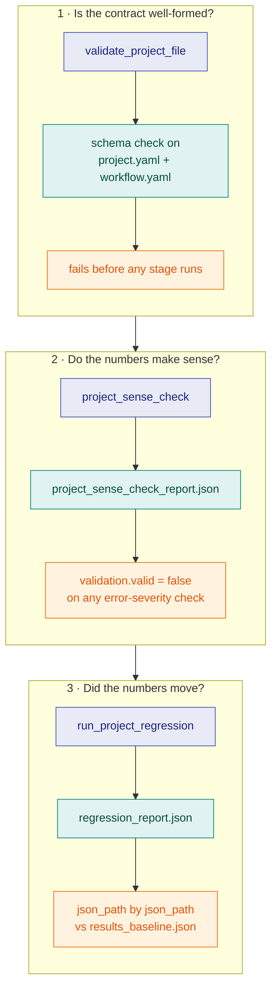

# Projects

## What problem this layer solves

Everything below this layer is a capability the SDK offers; `projects` is
where a specific study actually consumes them, and it does so as **data, not
code**. A `project.yaml` (`kind: StudyProject`) plus a `workflow.yaml`
(`kind: Workflow`) fully describe a study — the DAG of stages, their inputs,
and what gets validated. `gridalyn/projects/runner.py` executes that DAG as
subprocesses; nothing shares process memory, so a stage's only input is a
file another stage wrote, and its only output is a file on disk.

## The vocabulary

- **`StudyProject` / `WorkflowStage`** — frozen dataclasses that are the
  in-memory form of the two YAML files, produced by `load_project`.
- **`ProjectScript`** — the boilerplate-free stage-script context
  (`project_script()`): workspace paths, headless matplotlib, typed input
  loading, and `write_report`.
- **The typed input loaders** (`gridalyn/projects/model_inputs.py`) —
  `load_radial_feeder_spec`, `load_der_dispatch_assets`,
  `load_generated_load_profiles`, and siblings. They own the camelCase→
  snake_case key mapping, the defaults, and the required-field checks, so a
  stage script never reaches into `script.project.raw` by hand.
- **`bind_project_components(script)`** — resolves a `ProjectScript` into a
  frozen `ProjectComponents` (`script`, `feeder_spec`, `load_profiles`,
  `backend`, `surrogate`, `registered`). A project is *bound*, not hand-wired:
  a stage consumes a resolved role rather than importing a solver or a
  surrogate directly. Two roles are wired today — `backend`
  (`spec.simulation.powerflowBackend`) and `surrogate`
  (`spec.simulation.surrogate`) — each resolved through its registry and
  recorded in the run manifest. `observation_producer` and `policy` are
  declared follow-up surface: their registries do not yet expose the
  `registration_source` discriminator that tells a project-registered
  component from a core one.
- **Sense checks and regression** — `project_sense_check` runs objective
  plausibility checks; `run_project_regression` compares a run's outputs
  against `baselines/results_baseline.json`.

## The contract

Three distinct questions, three distinct mechanisms, never conflated: is the
contract well-formed (`validate_project_file`, before anything runs); do the
numbers make sense (`project_sense_check`, which writes
`project_sense_check_report.json` and fails `validation.valid` on any
**error**-severity check); did the numbers move (`run_project_regression`,
which reads the pinned baseline and compares `json_path` by `json_path`). A
project with **neither** a registered checker **nor** declarative sense-check
rules in its YAML fails the `project_has_registered_sense_checks` gate — a
study cannot pass vacuously by declaring nothing to check.



Nothing in that picture folds into anything else: a well-formed contract says
nothing about whether the numbers are plausible, and a plausible number says
nothing about whether it moved since the baseline was pinned.

The run manifest (`outputs/manifests/project_run_manifest.json`) is the
governed record of what happened: `git_commit`, one entry per stage with
`status`/`started_at`/`ended_at`/`exit_code`, and an overall `status` that is
`"completed"` only if every stage exited zero — the first non-zero exit marks
both the stage and the run `"failed"` and re-raises with a re-run hint.

A declared role is recorded, not merely resolved. `provenance.powerflow_backend`
names the solver a run used; `provenance.surrogate` names the surrogate that
stood in for a solve **and its stated error bound**, because naming a surrogate
without its accuracy invites the reader to assume there is none. Both carry a
`declared_source` saying whether the study declared the component or inherited
the registry default — so a study that names the default explicitly stays
distinguishable from one that named nothing.

## Using it

```python
from gridalyn.projects.developer import ProjectComponents
import dataclasses

print([f.name for f in dataclasses.fields(ProjectComponents)])
```
```text
['script', 'feeder_spec', 'load_profiles', 'backend', 'registered']
```

## Verifying it

```bash
uv run gridalyn project validate projects/minimal_grid_project
uv run gridalyn project run projects/minimal_grid_project
python3 -m json.tool projects/minimal_grid_project/outputs/manifests/project_run_manifest.json
```

The manifest this produces carries exactly the fields described above — this
page's claims are read off that file, not recalled.

## Where this sits

`projects` sits on [Operations](operations.md) (and, through it, every layer
below): a study's stages call down through simulation, assets and twin, using
operations when the study needs a market. What builds on `projects` is
[Interfaces](interfaces.md): the CLI, reports and dashboard that let a person
actually run and read what this layer produces.
