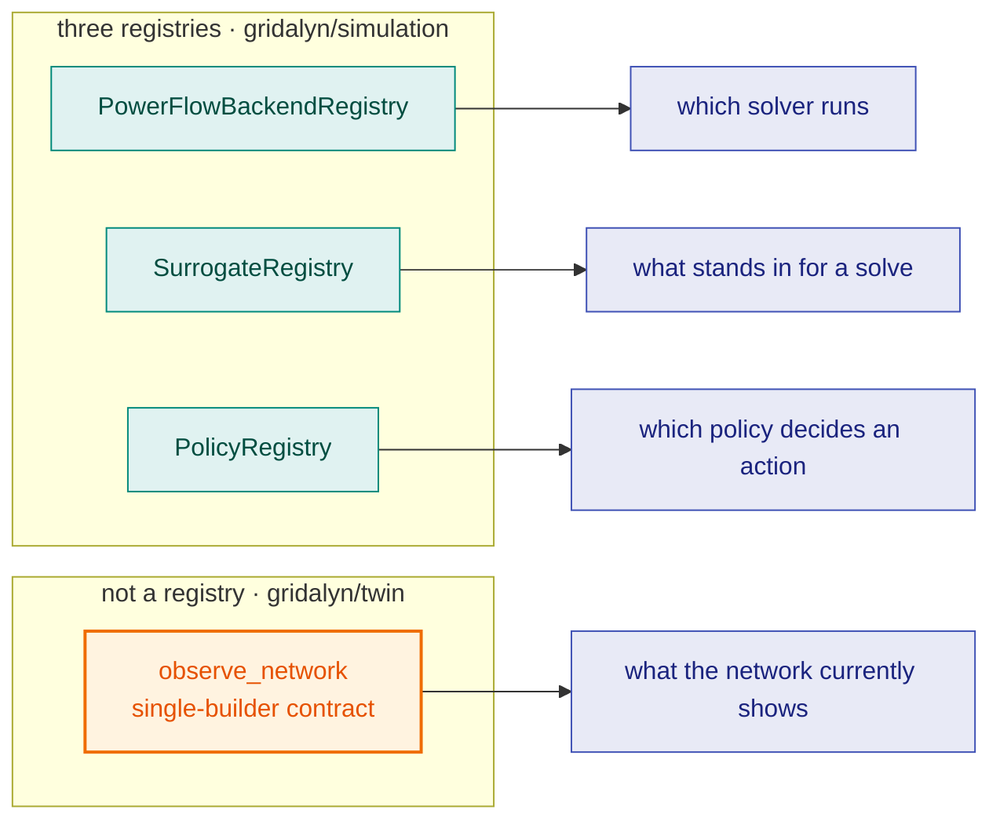

# Simulation

## What problem this layer solves

`twin` and `assets` together describe a network and what is connected to it,
as data. `simulation` is where that data becomes a solvable power-flow
network and gets checked physically: does every bus hold voltage, does every
line stay under its thermal rating. It also owns the machinery for standing
in for a full solve when one is too slow — surrogates — and for deciding what
action a controller takes — policies.

## The vocabulary

- **`PandapowerGridBuilder`** — converts a feeder spec or a twin snapshot into
  a solvable pandapower network.
- **Three registries, four roles, resolved by explicit ID (never
  `entry_points`)**:

  | Registry | Role | Resolves | Recorded in provenance as |
  | --- | --- | --- | --- |
  | `PowerFlowBackendRegistry` | which solver runs | `lightsim2grid` (capability `sim`) or `pandapower_native` | `provenance.powerflow_backend` |
  | `SurrogateRegistry` | which surrogate stands in for a solve | e.g. `network_impact_physics_lookup_v1`, `network_impact_tabular_v1`, each with a stated error bound | — |
  | `PolicyRegistry` | which control policy decides an action | project-registered control policies | — |

  A **fourth** role — observation, "what does the network currently show" —
  is deliberately **not** a registry. It is a single-builder contract
  (`observe_network`) that lives in [Twin](twin.md), because current network
  state is a property of the twin, not of the solver. Three registries, four
  roles: never write "four registries."



Four roles, three registries. The registries resolve by explicit ID and never
by `entry_points`; observation sits one layer down instead, because current
network state is a property of the twin rather than of whichever solver
happened to produce it.

- **`lightsim2grid` is genuinely optional**, gated through
  `require_capabilities("sim", ...)`; `pandapower` itself is a base
  dependency and always available, so the `pandapower_native` backend never
  needs a capability check.

## The contract

A backend's identity is recorded, not implied: whichever `PowerFlowBackend` a
run actually used lands in `provenance.powerflow_backend`, so two runs on
different machines can be compared knowing which solver produced each. A
surrogate declares a stated error bound rather than being trusted blind — a
surrogate that has not measured its own error against the physics it stands in
for does not belong in `SurrogateRegistry`.

## Using it

```python
from gridalyn.simulation.backends import default_powerflow_backend_registry

registry = default_powerflow_backend_registry()
for descriptor in registry.list_descriptors():
    print(descriptor.backend_id, "->", descriptor.name)
```
```text
lightsim2grid -> pandapower runpp via lightsim2grid (C++/Eigen KLU)
pandapower_native -> pandapower Newton-Raphson (native runpp)
```

## Verifying it

```bash
python3 -c "
from gridalyn.simulation.surrogates import default_surrogate_registry
r = default_surrogate_registry()
print(sorted(d.surrogate_id for d in r.list_descriptors()))"
```
```text
['network_impact_physics_lookup_v1', 'network_impact_tabular_v1']
```

Both blocks above were produced by running these exact commands against this
repository.

## Where this sits

`simulation` sits on [Assets](assets.md): it needs a feeder spec or a twin
snapshot plus the DER attached to it before there is anything to solve. What
builds on `simulation` is [Operations](operations.md): the layer that decides
what to do with the headroom (or lack of it) simulation reveals — clearing a
market, dispatching a DER, settling a transaction.
