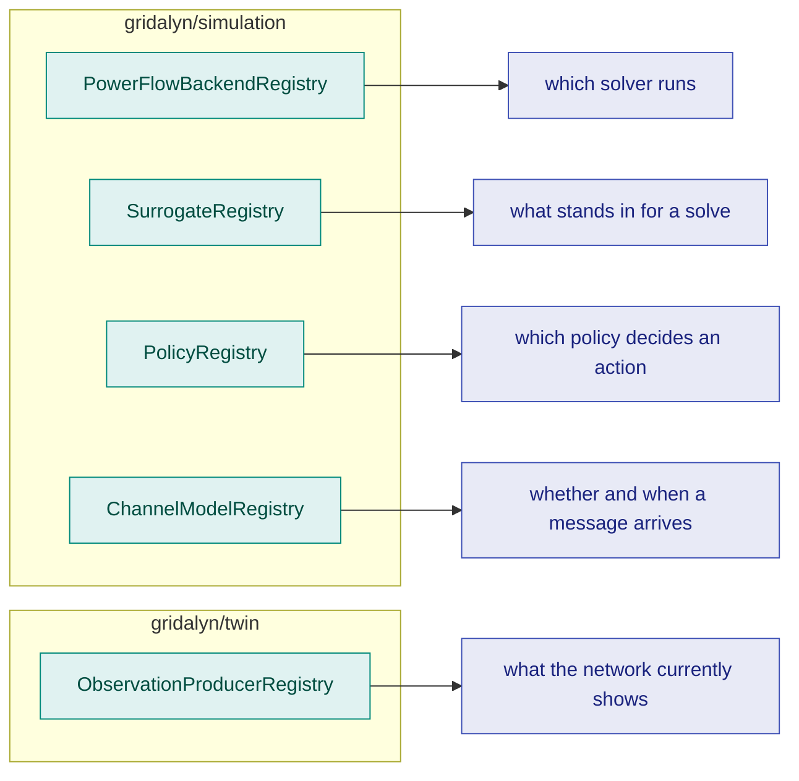

# Simulation

## What problem this layer solves

`twin` and `assets` together describe a network and what is connected to it,
as data. `simulation` is where that data becomes a solvable power-flow
network and gets checked physically: does every bus hold voltage, does every
line stay under its thermal rating. It also owns the machinery for standing
in for a full solve when one is too slow — surrogates — for deciding what
action a controller takes — policies — and for deciding whether, and when, a
message between simulated agents arrives — channel models.

## The vocabulary

- **Network builders** — `build_radial_pandapower_feeder(spec)` turns a
  `RadialFeederSpec` (from [Assets](assets.md)) into a solvable pandapower
  network. `PandapowerGridBuilder(power_grid, config)` does the same for a
  twin `PowerGridGraph`; it lives in `gridalyn.twin.adapters.pandapower_builder`
  and `gridalyn.simulation` re-exports it.
- **`solve_power_flow(net, backend_id=...)`** — solves a pandapower network in
  place through a registry-resolved backend, `pandapower_native` by default.
  A loop that solves repeatedly resolves the backend once with
  `resolve_powerflow_backend(backend_id)` and reuses it.
- **Explicit-ID registries** — each role pairs a registry class with
  a shared default instance and a host registration function, and resolves
  only the IDs registered under it; none discovers implementations from
  `entry_points`. Observation's registry lives in [Twin](twin.md), the rest
  here. They are listed under [The registries](#the-registries).
- **`EventScheduler`** (`gridalyn/simulation/scheduler.py`) — a deterministic
  discrete-event queue in simulated time, ordered by `(time, priority, key,
  sequence)`. Agent interaction is asynchronous in *simulated* time and never
  in wall-clock time: no `asyncio`, no threads. A channel model decides when
  a message is delivered; the scheduler decides the order everything happens
  in. With the `ideal` channel, a scheduled policy loop reproduces
  `run_policy_episode` exactly. Stochastic channels draw from the seed and
  the message's identity only, so the same seed gives a byte-identical event
  trace whatever order handlers run in; `fixed_outage` silences an exact,
  nested, seeded subset of endpoints, the shape of a communication-failure
  sweep.
- **`lightsim2grid` is genuinely optional**, gated through
  `require_capabilities("sim", ...)`; `pandapower` itself is a base
  dependency and always available, so the `pandapower_native` backend never
  needs a capability check.

## The registries



Observation sits one layer down because current network state is a property
of the twin rather than of whichever solver produced it; its registry holds
both the simulated producer and the measured-ingest path.

<!-- BEGIN GENERATED: simulation-registries by tools/generate_registry_reference.py; do not edit by hand -->

| Registry | Import from | Default ID | Recorded as |
| --- | --- | --- | --- |
| `PowerFlowBackendRegistry` | `gridalyn.simulation` | `pandapower_native` | `provenance.powerflow_backend` in the run manifest |
| `SurrogateRegistry` | `gridalyn.simulation` | `network_impact_tabular_v1` | `provenance.surrogate` in the run manifest |
| `PolicyRegistry` | `gridalyn.simulation` | none; the caller names one | not recorded in the run manifest |
| `ChannelModelRegistry` | `gridalyn.simulation` | `ideal` | `provenance.channel_model` in the run manifest, with its parameters and seed, when a study declares `spec.simulation.channelModel` |
| `ObservationProducerRegistry` | `gridalyn.twin` | none; the caller names one | `NetworkObservation.provenance` on each observation |

<!-- END GENERATED: simulation-registries -->

Every ID each shared default registry holds, the default in bold:

<!-- BEGIN GENERATED: simulation-registry-ids by tools/generate_registry_reference.py; do not edit by hand -->

| Registry | ID | Implemented by | Needs extra | Description |
| --- | --- | --- | --- | --- |
| `PowerFlowBackendRegistry` | `lightsim2grid` | `gridalyn.simulation.backends.lightsim.LightSim2GridBackend` | `sim` | pandapower runpp via lightsim2grid (C++/Eigen KLU) |
| `PowerFlowBackendRegistry` | **`pandapower_native`** | `gridalyn.simulation.backends.pandapower_native.PandapowerNativeBackend` |  | pandapower Newton-Raphson (native runpp) |
| `SurrogateRegistry` | `network_impact_physics_lookup_v1` | `gridalyn.simulation.analytics.network_impact.physics_model.NetworkImpactPhysicsLookupSurrogate` |  | Physics-fitted tabular lookup (tabular_physics_lookup_v1); error bound `unmeasured` |
| `SurrogateRegistry` | **`network_impact_tabular_v1`** | `gridalyn.simulation.analytics.network_impact.surrogate.NetworkImpactTabularSurrogate` |  | Deterministic topology surrogate (tabular_deterministic_v1); error bound `unmeasured` |
| `PolicyRegistry` | `sensitivity_dispatch` | `gridalyn.simulation.policies.registry.SensitivityDispatchPolicy` |  | Local voltage-sensitivity dispatch (finite-difference, single bus) |
| `PolicyRegistry` | `tabular_rl` | `gridalyn.simulation.control.tabular_voltage.TabularRLPolicy` |  | Tabular Q-learning voltage-control policy (greedy lookup) |
| `ChannelModelRegistry` | `bernoulli_loss` | `gridalyn.simulation.channels.models.BernoulliLossChannel` |  | independent per-message loss |
| `ChannelModelRegistry` | `fixed_latency` | `gridalyn.simulation.channels.models.FixedLatencyChannel` |  | fixed latency, no loss |
| `ChannelModelRegistry` | `fixed_outage` | `gridalyn.simulation.channels.models.FixedOutageChannel` |  | fixed outage: exact seeded subset of silent endpoints |
| `ChannelModelRegistry` | **`ideal`** | `gridalyn.simulation.channels.models.IdealChannel` |  | ideal channel: zero latency, no loss |
| `ObservationProducerRegistry` | `measured-ingest` | `gridalyn.twin.observation.ingest.read_measured_observations` |  | Reads tidy (timestamp, entity_id, quantity, value) measurement rows against a declared entity-to-bus join; one observation per instant, as_of stamped from the datum. |
| `ObservationProducerRegistry` | `powerflow` | `gridalyn.twin.observation.contract.observe_network` |  | Reads observed state off a solved network's result tables (res_bus / res_line); one observation per solved operating point. |

<!-- END GENERATED: simulation-registry-ids -->

Both tables are generated from the live registries by
`tools/generate_registry_reference.py`, and a test fails when they are stale.

The functions around each registry follow one naming pattern:
`default_<role>_registry()` returns the shared instance and
`register_<role>_extension(...)` adds a host's own entry to it, for `<role>`
one of `powerflow_backend`, `surrogate`, `policy`, `channel_model` and
`observation_producer`. The roles with a default ID also have a one-call
resolver that falls back to it: `resolve_powerflow_backend`,
`resolve_surrogate` and `resolve_channel_model`. A policy is built with
`default_policy_registry().create(policy_id, ...)` and an observation
producer with `default_observation_producer_registry().resolve(producer_id)`.
`PolicyRegistry`, `default_policy_registry` and `measure_error_bound` are on
the `gridalyn.simulation` facade with the rest; the policy contract itself
(`Policy`, `PolicyDescriptor`) is in `gridalyn.simulation.policies`.

## The contract

A backend's identity is recorded, not implied: whichever `PowerFlowBackend` a
run actually used lands in `provenance.powerflow_backend`, so two runs on
different machines can be compared knowing which solver produced each. A
surrogate is different, because a run can resolve one and never ask it
anything. `provenance.surrogate` therefore names a surrogate only after a stage
has really used one, either by a prediction or by a clearing on predicted
impact. Until then it records `status: "none reached"` and no ID.

Every registered surrogate states an `ErrorBound` (defined in
[Foundation](foundation.md), re-exported here); `SurrogateRegistry`
refuses a descriptor without one (`UnboundedSurrogateError`). The bound is
either `measured` — a value, its sample size and the protocol that produced
it — or `unmeasured`, carrying no value and a located reason. The table
above gives each shipped surrogate's status. An `unmeasured` bound on a
network-impact surrogate means the physics labels its relief error was
measured against have no writer in this repository, so the number cannot be
re-derived and is not stated. `registered_error_bounds()` returns each
registered surrogate's bound, reason included.

`measure_error_bound(predicted, observed, ...)` produces a `measured` bound
for any surrogate against any physical reference, in that domain's own
units; `measure_relief_error_bound` is its network-impact caller. Pairing
stays the caller's job: how a prediction is matched to an observation is
domain knowledge — join keys for a tabular impact frame, a shared timestamp
for a dispatch replay.

Measuring a bound and being resolvable by ID are separate claims. Entering
`SurrogateRegistry` means implementing `fit`/`predict`/`verify` over that
domain's frames; a surrogate measured through `measure_error_bound` has a
real, falsifiable bound without necessarily being in the registry.

## Using it

Build a small radial feeder and solve it with the default backend:

```python
from gridalyn.assets.modeling import RadialFeederSpec
from gridalyn.simulation import build_radial_pandapower_feeder, solve_power_flow

spec = RadialFeederSpec(
    name="demo",
    bus_count=4,
    sn_mva=1.0,
    base_voltage_kv=12.47,
    slack_vm_pu=1.0,
    loads_mw={1: 0.2, 2: 0.3, 3: 0.25},
)
net = build_radial_pandapower_feeder(spec)
solve_power_flow(net)  # backend_id="pandapower_native" by default
print(f"min voltage {net.res_bus.vm_pu.min():.4f} pu")
print(f"max loading {net.res_line.loading_percent.max():.1f} %")
```
```text
min voltage 0.9971 pu
max loading 18.2 %
```

List the registered power-flow backends:

```python
from gridalyn.simulation.backends import default_powerflow_backend_registry

registry = default_powerflow_backend_registry()
for descriptor in registry.list_descriptors():
    print(descriptor.backend_id, "->", descriptor.name)
```
```text
lightsim2grid -> pandapower runpp via lightsim2grid (C++/Eigen KLU)
pandapower_native -> pandapower Newton-Raphson (native runpp)
```

## Verifying it

The registry tables above are rendered from the live registries; this exits
non-zero, naming the page, when either no longer matches them:

```bash
python tools/generate_registry_reference.py --check
```

Every output block on this page was produced by running the code above it
against this repository.

## Where this sits

`simulation` sits on [Assets](assets.md): it needs a feeder spec or a twin
snapshot plus the DER attached to it before there is anything to solve. What
builds on `simulation` is [Operations](operations.md): the layer that decides
what to do with the headroom (or lack of it) simulation reveals — clearing a
market, dispatching a DER, settling a transaction.
