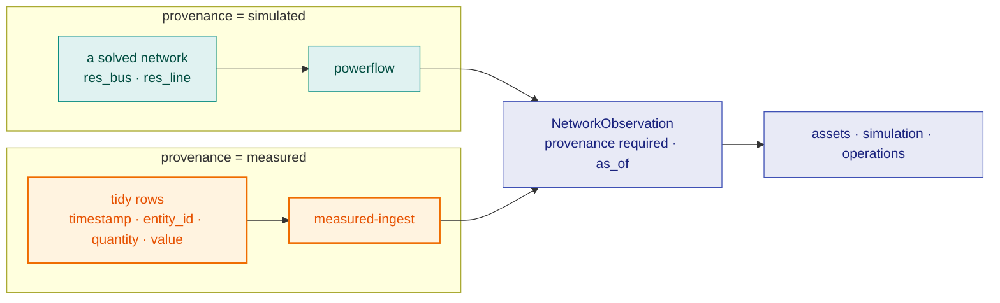
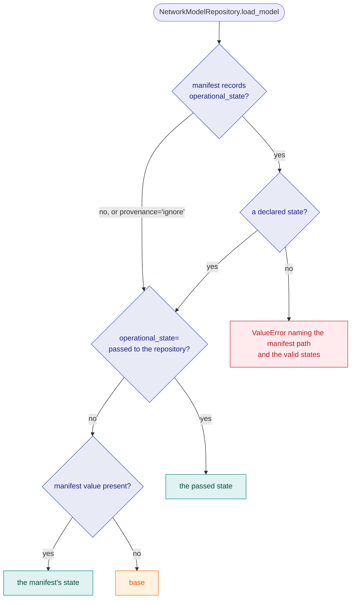

# Twin

## What problem this layer solves

Every layer above this one (assets, simulation, operations) needs one
trustworthy answer to "what does the grid look like right now, and where did
that answer come from." `twin` is that answer: a canonical network model with
a declared schema, a stamped identity, and a contract for how observed state
enters it. It does not solve power flow and it does not model building
behaviour; it holds the topology and state that everything else reasons about,
the adapters that produce them, and the semantic graph that describes them.

**The name is aspirational.** Kritzinger's
digital-twin taxonomy separates *digital model*, *digital shadow* and *digital
twin* by how data moves between the physical and digital sides, not by how
detailed either one is. By that measure `gridalyn.twin` is a canonical,
identified, schema-declared digital model with a one-way, automated
measured-state ingest path: physical → digital only. A *deployment*
becomes a digital shadow when its operator feeds it real measured data
through that path; the SDK on its own is not one, because every producer it
exercises in CI is simulated or a fixture. Bidirectional flow (digital →
physical control) is a non-goal.

## The vocabulary

- **The base** — the canonical tables (`buildings`, `grid_buses`,
  `grid_lines`, `grid_transformers`, `building_grid_connectivity`) plus a
  `metadata.json` manifest, each table with a schema declared in
  `twin/network/schema.py` (`BASE_TABLE_SCHEMAS`) rather than guessed at read
  time from whatever columns happen to be present. `NetworkModelRepository`
  reads it into a `NetworkModel`.
- **`ModelIdentity`** — the model's identity, read from the manifest. `id`
  (the manifest's `model_version_id`, a content digest), `created` (its
  `created_at`) and `profile` (the declared profile id joined to the
  manifest's schema version) carry CGMES `FullModel` header semantics.
  `scenario_time` is the `scenarioTime` slot and is always `None`, because
  nothing records one. `artifact_paths` (the parquet files the manifest
  declares) and `governance_schema_version` deliberately claim no CGMES
  mapping, because the values they hold would not honour one.
- **`ModelAuthoritySet` / `ModelProfile`** (`twin/adapters/authority.py`) — the
  CGMES Model Authority Set and profile pattern expressed as *fields and rules
  over parquet*, never as RDF/XML serialization. A profile's dependencies are
  derived from `BASE_TABLE_SCHEMAS`'s column references, not hand-declared,
  so they cannot drift out of sync with the schema.
- **Source adapters** — anything satisfying the `NetworkSourceAdapter`
  protocol: `load_snapshot()` returns an in-memory `NetworkModel`, and
  `export(out_dir=..., root=..., operational_state=...)` writes the
  canonical tables, the manifest and an adapter validation report, returning
  a `NetworkExportResult`. The shipped adapters are registered by explicit ID
  in `default_network_adapter_registry()` and listed under
  [What is registered](#what-is-registered); a host adds its own with
  `register_network_adapter_extension`. An adapter that reads a network with
  no footprint layer, such as `pandapower_topology`, exports `buildings` and
  `building_grid_connectivity` empty.

  The construction step behind `synthetic_pandapower` lives here too:
  `build_power_grid_and_network` and `PandapowerGridBuilder`
  (`twin/adapters/pandapower_builder.py`) turn footprints into a grid graph
  and a pandapower network (topology only, no solve). A grid config can
  declare a sourced conductor catalog instead of pandapower's European line
  types (`"catalog": "hydro_quebec_overhead"` under `lines`,
  `twin/adapters/conductor_catalogs.py`); see
  [Synthetic Networks From GeoJSON](../guides/synthetic-network-from-geojson.md#a-north-american-conductor-catalog-opt-in).
- **`TwinInstance`** — `instances/<name>/twin.yaml`, the contract naming the
  adapter, footprints and grid config a base is built from, the row counts
  that build must produce, and the weather file it is pinned to. Parsed by
  `load_twin_instance`; [Build A Twin](../guides/build-a-twin.md) covers it.
- **`NetworkGeography`** — `resolve_network_geography` says where a snapshot
  sits and how sure it is: the CRS the manifest declares (`crs_source:
  declared`), or `EPSG:4326` reported as `assumed` when none is declared; the
  extent; which artifacts carry coordinates; and which geometries are derived
  (a line is the segment between its two buses, and a building is its
  footprint's centroid, not the footprint).
- **The semantic graph** — `build_semantic_graph` turns the base tables into
  node and edge tables in which every node and edge carries a resolved IRI
  (`semantic_uri`), under `north_america_profile()`. The profile is
  model-first: a core (IEC CIM, ASHRAE 223 and Brick, Green Button) is always
  emitted, and further vocabulary arrives only through capabilities a caller
  declares by ID: `flexibility`, `agent_interaction` and `metering`,
  registered in `twin/semantic/registry.py`; an unregistered ID raises.
  `validate_semantic_graph` checks a graph against the profile it was built
  with, including each relationship's predicate, domain, range and
  cardinality axioms and the units on physical quantities.
  `verify_graph_artifacts` holds the node and edge parquet on disk to the
  counts and SHA-256 digests the graph manifest records, and
  `SemanticGraphRepository` answers graph queries over it. The full reference
  is [Semantic Graph](../reference/semantic-graph.md).
- **`NetworkObservation`** — a reading of network state with a **required**
  `provenance: Literal["simulated", "measured"]` field and an `as_of` instant.
  Its producers resolve by explicit ID through `twin/observation/registry.py`,
  never by `entry_points` auto-discovery, and are listed under
  [What is registered](#what-is-registered). The power-flow producer,
  `observe_network`, stamps `as_of` only when the caller passes it. The
  measured-ingest producer, `read_measured_observations`, stamps it from the
  datum and rejects naive timestamps rather than silently localizing them;
  it reads `voltage_pu` → `bus_voltage_pu` and
  `active_power_mw` → `bus_active_power_mw`, load-positive (the unit is in the
  name; a kW meter reading is converted by the caller, in the open).

  **What a measurement makes measured, and what it does not.** A voltage or a
  line loading solved by power flow from measured injections is
  `provenance="simulated"`, because it came out of a solver. Only the observation the
  ingest emits is `measured`, and a report that solves on it names that
  observation as its input through `file_reference`. There is no third
  provenance value for a solved number that stands on a measurement: minting
  one would let a solved number pass for a reading, which is what the
  required field exists to prevent.
- **`ObservationPublication`** — `resolve_observation_publication` answers,
  for any instance, whether it carries measured observations: measurement
  exports plus a declared `entity_join` file in the instance's observations
  directory (`ArtifactLayout(...).observations`, i.e.
  `instances/<name>/digital_twin/observations/`). Its `provenance` is
  `measured` only when both are present, and it names why when they are not,
  so a consumer can say where every number it renders came from.

## What is registered

Network source adapters, the default in bold (the adapter a base is exported
with when its twin instance names none):

<!-- BEGIN GENERATED: twin-network-adapters by tools/generate_registry_reference.py; do not edit by hand -->

| Adapter ID | Source standard | Source format | Declared CRS | Implemented by |
| --- | --- | --- | --- | --- |
| `cim_parquet` | `cim` | `cim-parquet` | none | `gridalyn.twin.adapters.cim.CimParquetAdapter` |
| `pandapower_topology` | `pandapower` | `pandapower-net` | none | `gridalyn.twin.adapters.network.PandapowerTopologyAdapter` |
| **`synthetic_pandapower`** | `pandapower` | `pandapower-cache` | `EPSG:4326` | `gridalyn.twin.adapters.network.SyntheticPandapowerAdapter` |

<!-- END GENERATED: twin-network-adapters -->

Observation producers:

<!-- BEGIN GENERATED: twin-observation-producers by tools/generate_registry_reference.py; do not edit by hand -->

| Producer ID | Provenance | Implemented by | Reads |
| --- | --- | --- | --- |
| `measured-ingest` | `measured` | `gridalyn.twin.observation.ingest.read_measured_observations` | Reads tidy (timestamp, entity_id, quantity, value) measurement rows against a declared entity-to-bus join; one observation per instant, as_of stamped from the datum. |
| `powerflow` | `simulated` | `gridalyn.twin.observation.contract.observe_network` | Reads observed state off a solved network's result tables (res_bus / res_line); one observation per solved operating point. |

<!-- END GENERATED: twin-observation-producers -->

Both tables are generated from the live registries by
`tools/generate_registry_reference.py`, and a test fails when they are stale.
The two provenance lanes:



The right-hand lane is the one that can make a deployment a shadow.

**The first such deployment.** The
`measured_shadow_feeder`
study feeds one measured week of Hydro-Québec per-home consumption through
this lane into a small feeder. Run on the measured export, it is a digital
shadow in a narrow, stated sense:

- **for one quantity** — active power. The record has no voltage channel, so
  every voltage and loading in the study came out of a solver and is
  `provenance="simulated"`;
- **for one week** — the coldest seven days of the record (2019-01-17 → 23),
  replayed, not streamed: the flow is automated from the export to the
  model, but nothing is live;
- **with anonymous homes** — the record says nothing about which home sits on
  which load, so the placement is a seeded draw, and the study reports its
  headline as a median over placements with the interval they span;
- **on the operator's machine only** — the export is private and cannot be
  redistributed, so the study is operator-verified. Run anywhere else, it
  falls back to a generated stand-in record, labels every artifact
  *generated*, and calls the deployment *not a shadow*.

It is also where the semantic graph first decides something: the
measurement join is read off the graph (`query_metered_buses`), not written
down as configuration. What the study found, and its limits, live in its own
`README.md`.

## The contract

**Authority partition.** `validate_authority_partition` runs at the top of
every source adapter's `load_snapshot()` and checks that the declared
authority sets partition the canonical artifacts exactly (no table claimed
twice, none left unclaimed), raising before any table is built.

**Loading is not checking.** `NetworkModelRepository.load_model()` returns
what is on disk: the canonical tables, and the identity, source adapter and
operational state from `metadata.json`. It does not validate the tables: an
absent parquet file loads as an empty frame. `validate_integrity()` is the
check, and it keeps three outcomes apart: an **absent** artifact is an error,
a **present but empty** one is a warning (every check over it would be
vacuous), and an **intact** one is checked for its required columns, its
declared dtypes, the bus endpoints of lines, transformers and connectivity,
and its building and load references. Row counts and a SHA-256 per artifact
are recorded in the manifest when an adapter exports the base
(`write_base_metadata`); loading does not recompute them.

**A missing manifest is never a silent success.** What the repository does
without `metadata.json` is its `provenance` policy. `"warn"`, the default,
returns the model marked `provenance_status="absent"` and emits
`MissingProvenanceWarning`; `"require"` raises `FileNotFoundError`;
`"ignore"` is silent, and exists for the manifest's own writer, which runs
before the manifest does, so under `"ignore"` an existing manifest is not
consulted for the operational state either.

**Which state a snapshot is read as.** A snapshot's operational state is
declared, never inferred from its contents: one of `base`, `normal`,
`current`, `planned` or `study_case`. Under `"warn"` and `"require"` the
repository first validates the manifest's `operational_state` key if it has
one: a value outside that set is a `ValueError` naming the manifest path and
the valid set, whatever the caller passed, so no argument can make a corrupt
manifest load. Then, in order of authority: an explicit `operational_state=`
passed to the repository wins; failing that, the manifest's value; failing
that, `base`. An absent key is not an error: a manifest written by a
producer never told which state it exports loads as `base`. No instance
this repository ships records one.

A non-`base` state reaches disk one way: `write_base_metadata(...,
operational_state=...)`, which rejects anything outside that set, and every
source adapter's `export(...)` takes the same keyword and passes it through.
A study that solves a measured operating point can therefore write it as
`current` and read it back as `current` with no argument. The
`NetworkExportResult` reports the state a reader resolves. It is read back through
the repository, not echoed from the argument, so it is `base` for an export
that declared none. The state belongs to a repository's *reading* of a snapshot,
not to the tables: a `NetworkModel` a source adapter builds in memory carries
`operational_state=None`, because nothing has declared which state it
represents.



**Why no `rdflib`.** CGMES semantics are adopted as *fields and rules*, never
as *serialization*: the base is parquet, and identity, authority sets and
profiles are fields on it. `rdflib` is not a dependency of this repository
(not in `pyproject.toml`, not in any extra), and real imports of it under
`gridalyn/` are pinned at zero by an AST scan. Adding it to serialize the twin
would introduce a second representation that nothing reads.

## Using it

The base parquet files are not committed (only `metadata.json` is), so build
the default instance's base once with `uv run gridalyn twin base` (see
[Build A Twin](../guides/build-a-twin.md#rebuild-an-instance)). Then, from the
workspace root:

```python
from pathlib import Path

from gridalyn.foundation import ArtifactLayout, WorkspaceRoot
from gridalyn.twin import NetworkModelRepository

layout = ArtifactLayout(WorkspaceRoot(Path.cwd()))
repository = NetworkModelRepository.from_parquet(layout.base)
model = repository.load_model()
report = repository.validate_integrity()
print(model.provenance_status, model.operational_state)
print("valid:", report.valid, "errors:", len(report.errors))
```
```text
declared base
valid: True errors: 0
```

Before the base is built, the same code loads empty tables and reports
`valid: False`, with one absent-artifact error per table.

Observing a solved network needs no instance:

```python
import pandapower as pp
import pandapower.networks as pn

from gridalyn.twin import observe_network

net = pn.case33bw()
pp.runpp(net)
observation = observe_network(net)
print(observation.provenance, observation.converged, observation.as_of)
print(round(observation.min_voltage_pu, 4), round(observation.total_line_loss_mw, 4))
```
```text
simulated True None
0.9131 0.2027
```

`as_of` is `None` because the net carries no clock; the caller that chose the
operating point passes `as_of=` when it knows the instant.

Ingesting measurements joins them to buses through the semantic graph. With
the base built (its generated tables are not committed, so on a fresh clone run `gridalyn twin build` first), this declares one usage point per building load, builds a
graph with the `metering` capability, reads the entity-to-bus join off it,
and ingests two readings:

```python
from pathlib import Path

import pandas as pd

from gridalyn.foundation import ArtifactLayout, WorkspaceRoot
from gridalyn.twin import (
    EntityJoin,
    NetworkModelRepository,
    SemanticGraphRepository,
    build_semantic_graph,
    read_measured_observations,
    validate_semantic_graph,
)
from gridalyn.twin.semantic.capabilities.metering import query_metered_buses
from gridalyn.twin.semantic.profile import profile_with_capabilities

layout = ArtifactLayout(WorkspaceRoot(Path.cwd()))
model = NetworkModelRepository.from_parquet(layout.base).load_model()

# One usage point per building load: the deployment's metering declaration.
loads = model.buildings["load_id"].astype(str)
points = pd.DataFrame({"usage_point_id": "up:" + loads, "load_id": loads})
nodes, edges, manifest = build_semantic_graph(
    buses=model.buses,
    lines=model.lines,
    transformers=model.transformers,
    buildings=model.buildings,
    connectivity=model.connectivity,
    metering_points=points,
    capabilities={"metering"},
)
report = validate_semantic_graph(nodes, edges, profile_with_capabilities({"metering"}))
print("graph valid:", report["valid"], manifest["capabilities"])

# The join is read off the graph: usage point -> METERS -> load -> CONNECTED_TO -> bus.
join = EntityJoin.from_mapping(query_metered_buses(SemanticGraphRepository(nodes, edges)))

# Two homes, one instant, in kW converted to MW by the caller.
rows = pd.DataFrame(
    {
        "timestamp": pd.Timestamp("2019-01-17 07:00", tz="America/Montreal"),
        "entity_id": ["up:" + loads.iloc[0], "up:" + loads.iloc[1]],
        "quantity": "active_power_mw",
        "value": [4.2 / 1000, 3.1 / 1000],
    }
)
(observation,) = read_measured_observations(rows, join=join)
print(observation.provenance, observation.as_of, round(observation.total_active_power_mw, 4))
```
```text
graph valid: True ['metering']
measured 2019-01-17 12:00:00+00:00 0.0073
```

In a deployment the rows come from the operator's export through
`load_measurements(path)` (tidy CSV or parquet), kept with the declared
`entity_join` in the instance's observations directory, where
`resolve_observation_publication` finds them.

## Verifying it

```bash
python3 -c "
from gridalyn.twin.network.schema import BASE_TABLE_SCHEMAS
print(sorted(BASE_TABLE_SCHEMAS))"
```
```text
['building_grid_connectivity', 'buildings', 'grid_buses', 'grid_lines', 'grid_transformers']
```

The adapter and producer tables above are rendered from the live
registries; this exits non-zero, naming the page, when either no longer
matches them:

```bash
python tools/generate_registry_reference.py --check
```

## Where this sits

`twin` sits directly on [Foundation](foundation.md): it resolves instance
paths through `ArtifactLayout`, stamps model identity with
`build_model_version`, writes the adapter validation report through the
report contract, records which extension served each registry entry, and
gates its one optional dependency, `osmnx` (street and footprint
download in `twin/geoprocess/`), through `require_capabilities("geo", ...)`.
What builds on `twin` is [Assets](assets.md): the buildings, EVs and DER that
the network model's `buildings` and `building_grid_connectivity` tables anchor
to bus and transformer identities.
