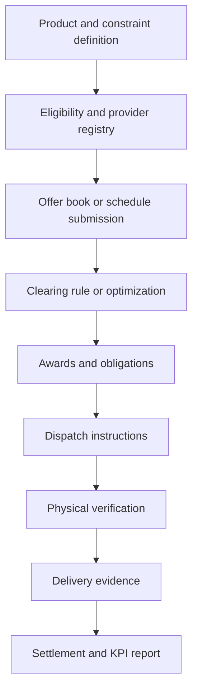

# Markets And Transactions

Gridalyn treats market clearing as one operational mechanism family. A market
turns constraints, forecasts, provider capabilities, bids, contracts, and rules
into awards and dispatch instructions. It should remain separate from physical
verification and settlement, even when one project runs all stages end to end.

## Market Roles

| Role | Meaning |
| --- | --- |
| System or distribution operator | Defines constraints, reliability margins, product rules, and validation requirements. |
| Aggregator | Manages a portfolio of controllable providers and submits offers or schedules. |
| Provider | Physical or logical resource that can change demand, injection, storage state, or operating envelope. |
| Prosumer | Entity that may both consume and produce energy and participate through prices or schedules. |
| Settlement agent | Computes payments, penalties, obligations, and delivery evidence. |

## Product Families

| Product | Purpose | Example mechanism |
| --- | --- | --- |
| Local congestion relief | Reduce loading on a transformer, line, or feeder segment. | locational flexibility clearing |
| Voltage support | Improve low/high voltage margins through DER, storage, or flexible demand. | optimization or local market |
| Balancing and recourse | React to forecast error or residual system imbalance. | real-time reserve or interruption product |
| Dynamic operating envelope | Allocate time-varying import/export limits. | transactive allocation, proportional sharing, optimization |
| Prosumer energy exchange | Coordinate local PV, batteries, and demand response. | double auction, real-time price, bilateral schedule |
| Reliability backstop | Emergency interruption or load-shed action. | rule-based priority with penalty accounting |

## Clearing Methods

| Method | When useful | Outputs |
| --- | --- | --- |
| Merit order | Transparent ranking by effective cost or priority. | accepted offers, marginal price, shortfall |
| Pay-as-clear auction | Uniform clearing price for accepted offers. | awards, clearing price, settlement basis |
| Pay-as-bid auction | Each provider is paid its offer price. | awards, provider-specific payment |
| Welfare optimization | Maximize social surplus or minimize operating cost. | accepted offers, dual values, objective value |
| Locational clearing | Include network location and deliverability in selection. | constraint-event awards and local relief |
| Stochastic or two-stage clearing | Separate day-ahead commitments from real-time recourse. | first-stage contracts and second-stage actions |

## Transaction Lifecycle

The important architectural point is that clearing does not prove physical grid
impact by itself. Market awards must be converted into dispatch instructions and
validated against the network model.

## Current Platform Contracts

| Contract | Purpose |
| --- | --- |
| `provider_registry.parquet` | Eligible resources with location, capacity, cost proxy, role, and lineage. |
| `network_sensitivity.parquet` | First-pass deliverability between providers and constraints. |
| `network_impact_predictions.parquet` | Fast ranking signal for provider-constraint impact. |
| `locational_clearing_events.parquet` | Constraint events requiring procurement or action. |
| `locational_clearing_selections.parquet` | Accepted provider offers by event and timestep. |
| `dispatch_instructions.parquet` | Provider-level actions derived from awards. |
| `settlement_records.parquet` | Payment and penalty records. |
| `operation_run.json` | Durable audit record for the market operation. |

These names are currently materialized most completely by the
`projects/flexibility_cls` workflow, but the contracts are general enough for
prosumer battery markets and future transactive products.

## SDK Surfaces

The platform exposes reusable CLS and flexibility-operation helpers so governed
projects do not need to reimplement market-study logic in local scripts:

| Function | Module | Purpose |
| --- | --- | --- |
| `build_congestion_forecast` | `gridalyn.operations.flexibility` | Convert stochastic baseline and EV traces into thermal requirements, exceedance probabilities, and temporal bounds. |
| `run_cls_capacity_allocation` | `gridalyn.operations.flexibility` | Run an EV-adoption sweep through the Soft/Hard CLS market engine and return summary metrics plus dispatch time series. |
| `materialize_flexibility_operation_artifacts` | `gridalyn.operations.flexibility` | Promote clearing events and selections into constraints, offers, dispatch, settlement, KPI reports, operation runs, and dashboard catalogs. |

Project scripts should call these functions with project-specific paths,
scenario lists, and parameter values. Reusable product logic belongs in the SDK.

## CLS As One Specialized Product

The Flexibility CLS workflow implements one market product:

- firm day-ahead building flexibility;
- real-time recourse for residual uncertainty;
- locational provider selection and AC replay;
- settlement and operational KPI reports.

It should be read as a detailed example of a two-stage local flexibility
product, not as the full definition of Gridalyn operations.

## Transactive Direction

A transactive extension should add:

- explicit participant accounts and counterparties;
- bid/offer validity windows;
- locational or feeder-zone product definitions;
- price formation and settlement rules;
- delivery evidence;
- dispute or penalty metadata;
- links to OpenADR or IEEE 2030.5-style message profiles when needed.

This keeps economic coordination connected to the digital twin instead of
becoming a standalone market script.

## Related Pages

- [Operational Functions](overview.md)
- [Providers And Aggregators](providers-and-aggregators.md)
- [Control And Optimization](control.md)
- [Network Impact Verification](network-impact-surrogate.md)
