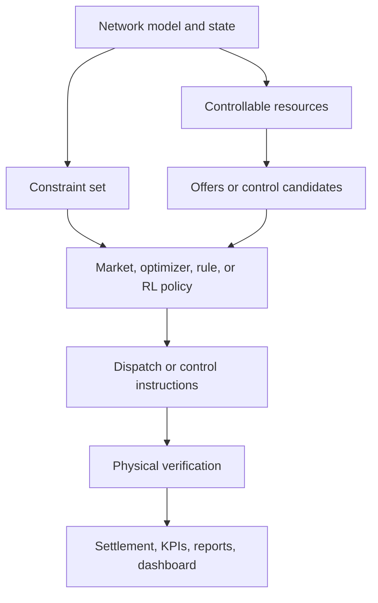

# Operational Functions

Gridalyn operations are organized around utility functions, not around one
study. A project may implement a local market, a DER controller, a reliability
screening workflow, or a learning-based control experiment, but it should still
fit the same operational structure.

This structure follows common ideas from distribution management platforms and
operations simulation literature:

- distribution applications should run against a shared network model and
  standardized APIs, as in GridAPPS-D;
- power-system operations studies should separate system data, problem
  specification, simulation, optimization, and analysis, as in NREL Sienna;
- transactive mechanisms combine economic and control logic to balance supply
  and demand using value as an operational signal, following the NIST
  transactive-energy framing.

## Functional Layers

| Function | Question | Gridalyn role |
| --- | --- | --- |
| Situational awareness | What is the current or forecasted network state? | Read topology, powerflow, voltage, thermal, forecasts, and scenarios. |
| Constraint management | Which network limits require action? | Convert voltage, thermal, hosting-capacity, reliability, or operator limits into constraint objects. |
| Resource management | Which controllable resources can help? | Map buildings, DER, EVSE, batteries, prosumers, and aggregators to grid locations and availability. |
| Market and transaction design | How are rights, prices, offers, and obligations established? | Build offer books, clear mechanisms, record awards, and prepare settlement evidence. |
| Control and optimization | What action should each device or portfolio execute? | Solve OPF/CVXPY, rule-based policies, MPC, DER dispatch, or RL policies. |
| Physical verification | Does the action actually improve the grid? | Replay selected actions with pandapower or compare with surrogate and AC validation. |
| Settlement and KPIs | Did the mechanism work and who gets paid? | Publish delivery, shortfall, cost, concentration, fairness, and reliability metrics. |

## Operation Families

Gridalyn should support several operation families through the same contracts:

| Family | Examples | Current demos |
| --- | --- | --- |
| Planning and hosting studies | scenario screening, DER hosting capacity, transformer overload analysis | `ieee_33_bus_demo`, `synthetic_geojson_feeder` |
| Flexibility and local markets | congestion relief, demand response, aggregator portfolios, locational procurement | `ev_hosting_flex` |
| Transactive energy | prosumer schedules, price-based coordination, local battery markets | `prosumer_battery_market` |
| Optimization-based control | DER voltage support, battery dispatch, constrained setpoints | `der_voltage_optimization` |
| Learning-based control | RL voltage control, policy comparison, simulator-backed environments | `rl_voltage_control_lightsim` |
| Operator-facing applications | dashboards, catalogs, reports, run manifests, semantic graph queries | dashboard and report artifacts |

## Common Operation Data Flow

The selection engine can change without changing the rest of the operation
contract. A pay-as-clear market, an OPF, a CVXPY problem, a rule-based
controller, or an RL policy should all produce explicit dispatch/control
instructions and verification evidence.

## Current Contracts

| Contract | Meaning |
| --- | --- |
| `NetworkConstraint` | A grid condition that requires action, such as overload, voltage violation, hosting limit, or operator-defined margin. |
| `Provider` | A controllable resource or portfolio participant with location, capacity, availability, and role metadata. |
| `Offer` | A market-facing quantity/price/quality statement from a provider or aggregator. |
| `ControlCandidate` | A control-facing setpoint, envelope, or action alternative. |
| `DispatchInstruction` | The selected action to execute or replay. |
| `OperationRun` | Audit object linking model version, method, scenario, inputs, outputs, validation, and status. |
| `SettlementRecord` | Financial or contractual evidence of delivery, payment, penalty, or obligation. |
| `OperationalKPIReport` | Mechanism-level performance summary. |

## Literature-Informed Design Direction

The documentation and SDK should keep these distinctions explicit:

- **Operations are not only markets.** Markets are one mechanism family; control
  and optimization are equally important.
- **Control is not only deterministic optimization.** Rule-based control,
  convex optimization, OPF, MPC, and RL policies should fit the same
  dispatch-and-verify contract.
- **Transactive mechanisms mix economics and control.** Prices, bids, and
  contracts are operational signals, not just accounting artifacts.
- **Physical verification is mandatory.** Fast ranking, ML, or RL can propose
  actions, but powerflow or an accepted simulator remains the validation layer.
- **Projects are examples, not architecture.** `ev_hosting_flex` is one
  flexibility product; `prosumer_battery_market`, `der_voltage_optimization`,
  and `rl_voltage_control_lightsim` exercise other operational families.

## References

- NIST, [Transactive Energy: An Overview](https://www.nist.gov/el/smart-grid-menu/hot-topics/transactive-energy-overview).
- NIST, [Transactive Energy for Effective Integration of Customer Flexibility](https://www.nist.gov/programs-projects/transactive-energy-effective-integration-customer-flexibility).
- GridAPPS-D, [About GridAPPS-D](https://gridapps-d.org/about).
- GridAPPS-D, [Integrated Applications](https://gridapps-d.readthedocs.io/en/stable/hosted_applications/index.html).
- NREL, [Sienna](https://www.nrel.gov/analysis/sienna).

## What To Read Next

- [Providers And Aggregators](providers-and-aggregators.md)
- [Markets And Transactions](clearing.md)
- [Control And Optimization](control.md)
- [Network Impact Verification](network-impact-surrogate.md)
- [Operational KPIs](economic-validation.md)
