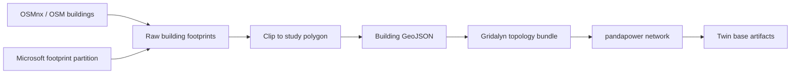

# Synthetic Networks From GeoJSON

Gridalyn can build a synthetic distribution network from building-footprint
GeoJSON. This path is useful when a utility-grade GIS model is unavailable but
you still need a reproducible topology for studies, examples, or an early network
model.

The worked example of exactly this task is the
`synthetic_geojson_feeder`
study, one of the CI fixture studies: it generates footprints, builds the
feeder, solves it, exports the network model and pins the result against a
baseline. Start from it when you want the same chain inside your own project;
this page covers the pieces it is made of.

Run every command on this page from the repository root: the examples and the
tutorial scripts read `configs/grid/config.json` and the tutorial data by
relative path.

## Data Sources

Two footprint sources are supported:

| Source | How Gridalyn uses it | Notes |
| --- | --- | --- |
| OpenStreetMap through OSMnx | `gridalyn twin download-osm-buildings` queries OSM features with `building=True` inside a polygon and writes a local GeoJSON. Needs the `geo` extra. | OSMnx returns a GeoPandas GeoDataFrame from the OpenStreetMap Overpass API. The OSM `building=*` tag describes physical buildings and includes broad categories, so inspect local data quality before treating tags as customer classes. |
| Microsoft Global ML Building Footprints | `gridalyn twin prepare-microsoft-buildings` converts a local line-delimited GeoJSON partition to regular, optionally clipped GeoJSON. | Microsoft publishes open building footprints derived from imagery under CDLA Permissive 2.0. Many partitions are `.csv.gz` files whose contents are GeoJSON lines, so convert and clip them before using them as study inputs. |

The repository does not track heavyweight source downloads. Keep raw OSM or
Microsoft source files outside Git, then write filtered outputs under a project
input folder or `examples/generated/outputs/` for tutorial work.

## Flow



Footprint preparation lives in `gridalyn.twin.geoprocess`, which the three
`gridalyn twin` footprint commands below call. Network generation is
`gridalyn.simulation.build_synthetic_network_from_geojson`. Turning the result
into a twin instance's base tables is [Build A Twin](build-a-twin.md).

## Project API

Projects call the SDK builder instead of duplicating the tutorial script steps:

```python
from pathlib import Path

from gridalyn.simulation import build_synthetic_network_from_geojson

result = build_synthetic_network_from_geojson(
    footprints_path=Path("projects/my_project/inputs/buildings.geojson"),
    config_path=Path("configs/grid/config.json"),
    out_dir=Path("projects/my_project/outputs/cache"),
    clustering_crs="auto",
    write_cache=True,
    run_powerflow=True,
)
```

The function returns:

| Field | Meaning |
| --- | --- |
| `power_grid` | Generated topology bundle used by Gridalyn simulation and visualization helpers. |
| `net` | The generated pandapower network. |
| `validation_report` | Counts, CRS lineage, source hashes, topology checks, and optional power-flow convergence. |
| `report_path` | Path to `synthetic_network_validation.json` when `out_dir` is provided. |

Use `clustering_crs="auto"` for normal GeoJSON inputs. It estimates a local
metric CRS for K-Means and MST distances while preserving longitude/latitude on
graph nodes for maps and twin geodata.

### Capacity-constrained LV assignment

The builder works out how many MV/LV transformers the footprints need, then
decides which buildings each one serves. With `lv_assignment="kmeans"`, K-Means
partitions by geometry alone, so some transformers can serve far more buildings
than they were sized for. `lv_assignment="capacitated"` caps every transformer
at `ceil(buildings / transformers)` buildings, the count the transformer number
was sized for, or at a declared `max_customers_per_transformer`. The validation
report then gains an `lv_assignment` block with the limit, the
buildings-per-transformer distribution, and any transformer still above its
rated kVA. Adding `block_penalty_km2=0.005` also keeps clusters from straddling
streets; it needs a declared street layer or the `geo` extra and a live
street-network fetch, because it works from the blocks the streets enclose.

The builder arguments default to `None`, which takes the grid config's
`topology` block, and K-Means when the config declares none. The shipped
`configs/grid/config.json` declares `lv_assignment: capacitated` with a
`max_customers_per_transformer` limit. The choice changes which buildings share
a transformer, so switching it for an existing study is a deliberate re-base,
not a display change.

### Declaring topology in the grid config

A study pins these choices as data instead of passing arguments. The grid
config accepts a `topology` block with `lv_assignment`,
`max_customers_per_transformer` (a limit the study can cite, which wins over the
sized count), `block_penalty_km2`, `snap_transformers_to_streets`,
`street_layer` and `max_customers_per_lv_run`, plus an `external_grid` block
whose `vm_pu` sets the slack setpoint (1.0 pu when absent). An explicit argument
to the builder overrides the config.

A live fetch from OpenStreetMap is not reproducible, because the map changes.
Write the streets once with `python tools/snapshot_streets.py --footprints
<buildings.geojson> --out <streets.geojson>`, commit the file beside the
footprints with its OpenStreetMap attribution, and declare
`street_layer` as its `path` (relative to the footprints file's directory) and
the printed `sha256`. The build refuses a layer whose digest no longer matches,
and because the digest lives in the config, a changed layer also changes the
config hash every topology cache keys on.

### A North American conductor catalog (opt-in)

pandapower's own line types are European: 0.4 kV AL/ST and NAYY cable at LV,
10 and 20 kV types at MV. A Québec feeder is 25 kV overhead with a 120/240 V
split-phase secondary. Declaring `"catalog": "hydro_quebec_overhead"` under
`lines` builds every level from sourced conductors instead: aluminum triplex
(2, 1/0, 2/0, 4/0 AWG) at LV, Hydro-Québec's standard 2/0 ACSR and 477 Al
(with 3/0 A1 and 336.4 ACSR between them) at 25 kV, and 795 ACSR at 120 kV.
Each level's `std_type` must name one of them, and load-aware sizing chooses
only among them. The validation report gains a `conductor_catalog` block with
every value, its source and the catalog's limitations; the sources and the
derivation of each reactance and capacitance are in
`gridalyn/twin/adapters/conductor_catalogs.py`.

pandapower has no split-phase element, so the triplex entries are the
three-phase equivalent of a balanced 240 V loop on a 0.24 kV bus: twice the
per-conductor impedance, which keeps the per-unit drop and the losses, and the
rating divided by √3, which keeps the loading. Neutral current from unbalanced
120 V loads is not represented, and the ratings are summer ratings.

A real secondary carries far less than a 0.4 kV three-phase line: 4/0 triplex
is about 67 kVA. One tree per transformer, hung off its most central building,
then overloads whichever span carries most of the cluster. Declaring
`max_customers_per_lv_run` under `topology` wires each transformer as several
secondary runs of at most that many buildings (the Esau-Williams heuristic for
the capacitated minimum spanning tree, in `gridalyn/twin/core/runs.py`); the
report gains an `lv_runs` block with the runs per transformer and the buildings
per run. The limit follows from the catalog and the load envelope: at 10 kW per
building and a 0.8 utilization margin, 4/0 triplex carries 5.

Both are opt-in. A config that declares neither builds on pandapower's line
types with one secondary tree per transformer.

### Which footprints are customers (opt-in)

A footprint layer is not a customer list: it carries sheds and detached
garages beside the houses, and by default every polygon becomes a customer with
the full load envelope. A `buildings` block in the grid config decides which
footprints are customers. `min_customer_area_m2` drops polygons below that
area, and `excluded_building_types` drops polygons whose source `building` tag
(OpenStreetMap's `garage`, `shed`, and so on) is listed.
`non_residential_area_m2` keeps larger polygons but marks them
`non_residential` in the `Customer Class` column; nothing loads them
differently yet, so the mark is only reported. Kept buildings keep their
`Building ID`, the validation report gains a `building_ingest` block with the
counts, and the source tag is kept as `Building Type` whenever the layer
carries one. The load and EV draw of each customer are not touched: the block
decides only who is a customer.

### Does the network look like a distribution network?

Every build's `synthetic_network_validation.json` carries a `realism` block:
properties that published data can bound, each with its band, its source and
whether the build sits inside it.

| Metric | Band | Source |
|---|---|---|
| `mv_line_km_per_customer` | typical up to 0.145 km, uncommon up to 1.24 km, rare beyond | Krishnan et al. 2020, Table IV (about 8 600 real U.S. feeders) |
| `lv_service_voltage_pu` | 0.95–1.05 pu (ANSI C84.1 Range A) | Krishnan et al. 2020, Table II |
| `mv_lv_transformers_over_rating` | none above 100 % loading | Krishnan et al. 2020, Table II |
| `losses_percent_of_load` | below 10 % | Krishnan et al. 2020, Table II |
| `customers_per_mv_lv_transformer` | reported; judged only for a Hydro-Québec reading | see below |

The last three need a power flow, so they are measured only when the build
ran one (`run_powerflow=True`) and it converged; otherwise the block lists
them under `not_measured`. Declaring `"realism": {"region": "hydro_quebec"}`
in the grid config switches the voltage band to CSA C235's normal operating
range (0.917–1.042 pu). It also bounds customers per transformer by
Hydro-Québec's own figures: at most ten houses on a 100 kVA unit, and a fleet
mean of at most about 6.8 subscriptions per transformer. The full citations
are in the block's `sources`.

A metric outside its band adds a warning to the payload's `warnings`; it does
not change `valid`, because a network outside a band is still a network that
was built. The payload stays a domain diagnostic, not a platform report.
Properties without a defensible published band, such as LV circuit length per
customer, are not judged.

## Offline Smoke Test

Run the synthetic generator example:

```bash
uv run python examples/tutorials/basic_grid_creation.py
```

It generates fake building footprints, creates LV/MV/HV graphs, and writes the
footprint GeoJSON, the topology/network caches, and
`synthetic_network_validation.json` under
`examples/generated/outputs/basic_grid_creation/`. It does not render maps.

Run the bundled real-footprint example:

```bash
uv run python examples/tutorials/create_grid_from_real_data.py
```

It reads the packaged Trois-Rivières footprint layer, the same file the default
twin instance is built from, builds and solves a pandapower model, and writes
the caches and `synthetic_network_validation.json` under
`examples/generated/outputs/create_grid_from_real_data/`.

## Clip Existing Footprints

Use this when you already have GeoJSON from OSMnx, Microsoft after conversion,
or another source:

```bash
uv run gridalyn twin clip-buildings \
  --buildings-file examples/tutorials/data/example_buildings.geojson \
  --polygon-file configs/geography/tr01.json \
  --output-file examples/generated/outputs/buildings_inside_polygon.geojson
```

The same command clips your own footprints into a project's inputs:

```bash
uv run gridalyn twin clip-buildings \
  --buildings-file path/to/buildings.geojson \
  --polygon-file configs/geography/tr01.json \
  --output-file projects/my_project/inputs/buildings.geojson
```

The polygon file can be one of:

- a JSON file with `polygon_coordinates`;
- a GeoJSON `Polygon`;
- a GeoJSON `Feature` whose geometry is a `Polygon`.

## Download From OSMnx

Use this only when you want to query OpenStreetMap through Overpass:

```bash
uv run gridalyn twin download-osm-buildings \
  --polygon-file configs/geography/tr01.json \
  --output-file examples/generated/outputs/osmnx_buildings.geojson
```

Network access and Overpass availability determine whether this command
succeeds. For reproducible projects, commit a small input manifest and keep the
raw downloaded source outside Git.

## Prepare Microsoft Building Footprints

After downloading the relevant Microsoft partition locally, convert and clip it:

```bash
uv run gridalyn twin prepare-microsoft-buildings \
  --input-file /path/to/microsoft-partition.csv.gz \
  --polygon-file configs/geography/tr01.json \
  --output-file projects/my_project/inputs/buildings.geojson
```

Use `--limit 1000` for a fast smoke test on a large partition.

## Quality Checks

Before using footprints as twin inputs:

1. Filter to `Polygon` and `MultiPolygon` geometries.
2. Validate geometries and repair invalid polygons.
3. Clip to the study boundary.
4. Inspect the footprint count and map.
5. Confirm CRS is WGS84 or explicitly projected before area-sensitive work.
6. Record the source's lineage in the project's declared inputs.

## References

- [OSMnx features module](https://osmnx.readthedocs.io/en/stable/getting-started.html#urban-amenities)
- [OSMnx `features_from_polygon`](https://osmnx.readthedocs.io/en/stable/user-reference.html#osmnx.features.features_from_polygon)
- [OpenStreetMap building tags](https://wiki.openstreetmap.org/wiki/Buildings)
- [Microsoft Global ML Building Footprints](https://github.com/microsoft/GlobalMLBuildingFootprints)
