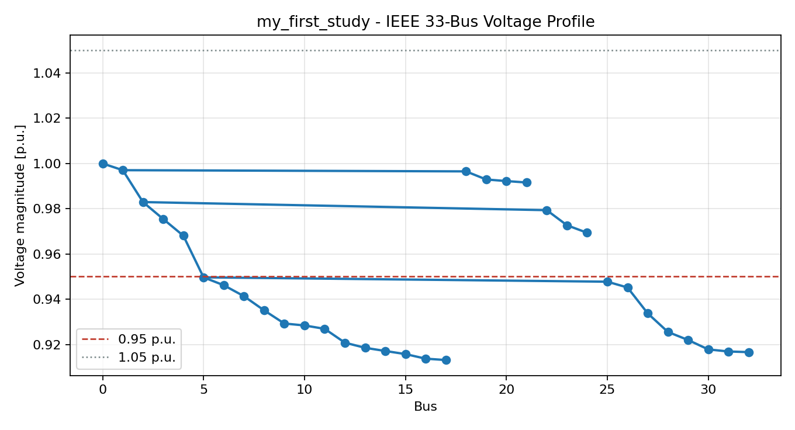
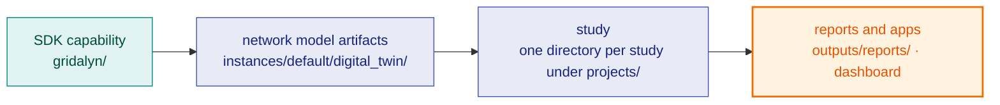

# Gridalyn

Gridalyn is an open-source Python SDK for modeling, simulating and optimizing
multi-scale electric distribution systems and their distributed energy
resources: flexible building loads, EV chargers and energy storage.

It is built for researchers who need **reproducible, citable studies**. A
study is data, not code: two YAML files, a `StudyProject` contract and a
`Workflow`, drive synthetic data generation, a canonical network model, power
flow and flexibility operations, and every stage writes a governed platform
report. Re-running the two files reproduces the numbers, and a committed
baseline checks that they did.

## Access to the source

The documentation is public; the source repository is private until the
work it supports is published. At publication a citable snapshot (the code,
the study YAMLs and their pinned baselines) is released in
[lirei-lab/gridalyn](https://github.com/lirei-lab/gridalyn) and archived on
Zenodo with a DOI. Until then, collaborators with access clone
`github.com/lirei-lab/gridalyn-dev`; to request access, write to lirei.info@uqtr.ca.

## Your first result

With Python 3.12+, Git and [`uv`](https://github.com/astral-sh/uv) installed:

```bash
git clone https://github.com/lirei-lab/gridalyn-dev.git gridalyn
cd gridalyn
uv sync
uv run gridalyn quickstart my-first-study
```



<sub>The `gridalyn quickstart` output is a real run, replayed with compressed
pacing; the clone and `uv sync` output is abridged.</sub>

The last command creates a small study, solves an AC power flow on the IEEE
33-bus feeder and writes a governed report and this figure, in seconds:



The [Quickstart](start/quickstart.md) walks through what it wrote and how to
check it.

## Where to start

**[Start](start/what-is-gridalyn.md)** is one path, read in order: what
Gridalyn is, installation, the [Quickstart](start/quickstart.md), reading the
outputs of your first run, and the studies that ship with the repository.

**[Components](components/overview.md)** explains the platform itself: seven
layers, one page each, in the order their imports run, `foundation → twin →
assets → simulation → operations → projects → interfaces`. Start here if you
want to understand before you run.

**[Guides](guides/overview.md)** are task-shaped how-tos: build your own
project, build a network model, write reports and figures, open the dashboard.

**[Reference](reference/overview.md)** covers the CLI, the Python API, the
project and workflow YAML contracts, the report schema and the artifact
policy.

**[Contributing](contributing/overview.md)** covers module boundaries,
conventions, testing and release, for extending the platform itself.

## How the pieces fit

Reusable capability lives in the SDK; a study uses it; what the study writes
is what reports and the dashboard read:



## Where things live

| Path | What it holds |
| --- | --- |
| `gridalyn/` | The Python SDK, the only import namespace. Reusable logic belongs here. |
| `projects/<name>/` | One study each: its `project.yaml`, `workflow.yaml`, stage scripts, baseline and git-ignored `outputs/`. [The Studies](start/studies.md) lists them. |
| `instances/<name>/digital_twin/` | A named network-model instance; `default` unless a `gridalyn twin` command is given `--instance <name>`. |
| `configs/` | Reusable grid and geography configuration. |
| `dashboard/` | Browser application that reads generated catalogs and reports. |
| `examples/` | Tutorial material, not study runtime logic. |
| `docs/` | This site's source. |

Generated caches, large data and derived artifacts stay out of git unless the
[Artifact Policy](reference/artifact-policy.md) explicitly allows them. Start
a new study from the project contract and keep reusable behaviour in
`gridalyn/`, rather than editing generated outputs or growing study scripts
into library code.

Next: [What Is Gridalyn?](start/what-is-gridalyn.md)
