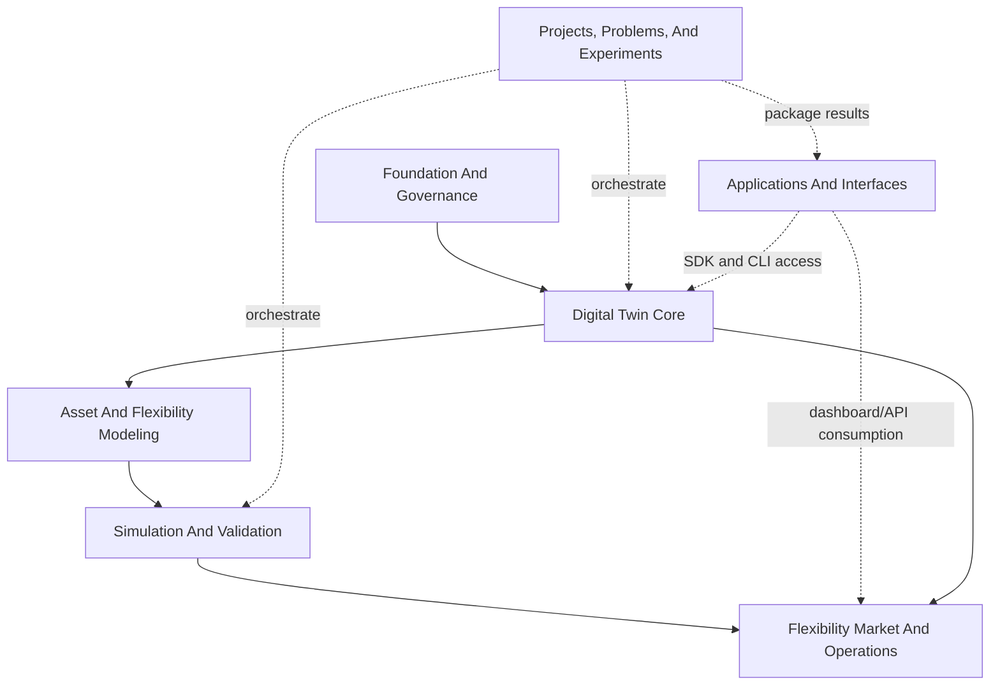
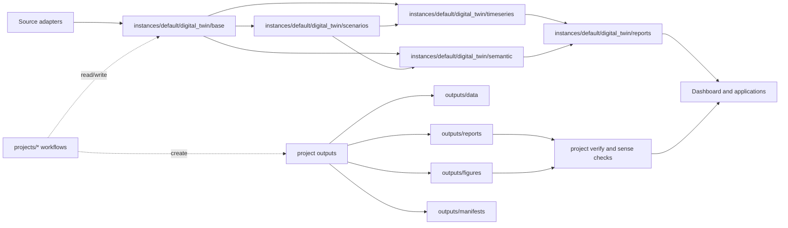

# Platform Architecture

Gridalyn is organized as a utility digital-twin, governed project workflow, and
flexibility-analysis stack. The main design rule is simple: generated artifacts
are explicit, versionable, and traceable. The dashboard, project figures,
semantic graph, and reports should all point back to the same Parquet/JSON
sources.

## Capability View

Gridalyn uses a capability architecture to keep the utility-facing platform
separate from individual studies:



The detailed capability contract is in
[Capability Architecture](capability-architecture.md). The project and artifact
flow below shows how the current implementation realizes those capabilities.

## Artifact Flow



## Responsibilities

| Layer | Responsibility | Main artifacts |
| --- | --- | --- |
| Core SDK | Generate and load grid/building topology, adapters, pandapower models, reports, and workflows | `gridalyn/foundation`, `gridalyn/twin`, `gridalyn/assets`, `gridalyn/simulation`, `gridalyn/operations`, `gridalyn/projects`, `gridalyn/interfaces` |
| Digital twin base | Static assets and connectivity | `instances/default/digital_twin/base/*.parquet` |
| Scenario layer | Adoption, DER participation, controllable asset roles, and scenario metadata | `instances/default/digital_twin/scenarios/*.json`, `asset_registry.parquet` |
| Time-series layer | Per-scenario load, DER, dispatch, and powerflow outputs | `instances/default/digital_twin/timeseries/*.parquet` |
| Flexibility provider layer | Network-aware Soft/Hard CLS provider registry and sensitivity | `instances/default/digital_twin/flexibility/*` |
| Network impact surrogate | GNN-ready graph/features and fast provider impact predictions | `network_impact_*.parquet`, `network_graph_*.parquet` |
| Semantic graph | North America ontology-aligned relationship index | `instances/default/digital_twin/semantic/*` |
| Project layer | Public reproducibility contract for executable case projects | `projects/*`, including minimal, IEEE 33-bus, GeoJSON, DER, market, RL, and flexibility demos |
| Reports | Canonical JSON summaries with input hashes | `instances/default/digital_twin/reports/canonical`, `projects/*/outputs/reports` |
| Dashboard | Static browser visualization served by Nginx | `dashboard/` |

See [Core Package Architecture](../development/core-package-architecture.md) for the package-level
boundary rules that keep reusable library code separate from project outputs,
tutorial datasets, caches, and generated artifacts.

## Current Source of Truth

- Use project workspaces as the source of governance for reproducible studies.
  A project starts before `instances/default/digital_twin/base`: it declares the raw geography,
  grid synthesis configuration, workflow stages, generated artifacts, and
  validation requirements.
- Use `instances/default/digital_twin/base` for physical asset counts, buses, lines, transformers, buildings, and connectivity.
- Use `instances/default/digital_twin/scenarios/asset_registry.parquet` for scenario/building/EV/CLS participation.
- Use `instances/default/digital_twin/flexibility/network_impact_predictions.parquet` for fast
  provider impact screening; validate final dispatch with pandapower.
- Use `instances/default/digital_twin/flexibility/locational_clearing_*.parquet` and
  the relevant project or canonical report to trace
  which provider offers were selected for each transformer constraint event.
- Use the locational clearing verification report to
  verify the selected locational dispatch with pandapower before treating it as
  an operational result.
- Use `instances/default/digital_twin/semantic/graph_manifest.json` for semantic graph health and counts.
- Use `projects/<name>/outputs/manifests/project_run_manifest.json` for
  project-stage report discovery.
- Use `gridalyn project verify <project>` as the publication gate for project
  contract validation, required artifacts, and objective-level sense checks.
- Use `instances/default/digital_twin/reports/canonical/digital_twin_report_manifest.json` for operational digital-twin report discovery.

## Project Workspaces

Project workspaces govern reproducible studies from raw geographic inputs
through synthetic grid generation, digital twin artifacts, simulations, reports,
figures, and dashboard metadata. Each workspace owns a `project.yaml` and
`workflow.yaml` using the `apiVersion`, `kind`, `metadata`, `spec` pattern used
by Kubernetes and Argo-style systems.

Workspace paths can be resolved from the project folder or the repository root.
Larger workflows may use `spec.pathBase: repo`, so their manifests can use
readable top-level paths like `projects/...`, `instances/default/digital_twin/...`, and
`configs/...`.

The digital twin base is therefore a generated canonical artifact, not the
first source of truth. The source of truth for a project is the project contract
plus its declared raw inputs and configuration files.

For a compact governed workspace, start with:

```text
projects/minimal_grid_project/
  project.yaml
  workflow.yaml
  README.md
```

Inspect it with:

```bash
uv run gridalyn project validate projects/minimal_grid_project --check-artifacts
uv run gridalyn project plan projects/minimal_grid_project
```

Dry runs and executions write a project run manifest under
`projects/<name>/outputs/manifests/`, allowing a project run to be audited from
the project contract and generated artifacts.

## Design Constraints

- Do not make figures recalculate project metrics when a canonical report exists.
- Do not make the semantic graph replace numerical Parquet analytics.
- Keep generated report inputs hash-addressed so stale outputs can be detected.
- Keep North America ontology alignment explicit: CIM for grid topology, ASHRAE
  223/Brick for buildings, EFOnt for building flexibility characterization,
  Green Button/ESPI for metering metadata, OpenADR for demand response
  semantics, IEEE 2030.5 for EV/DER control readiness, and `cls:` for local
  Soft/Hard CLS contracts and network-aware market extensions.
- Keep project orchestration separate from tutorial examples. `examples/` should
  not be a runtime dependency of a reproducible project workflow.
