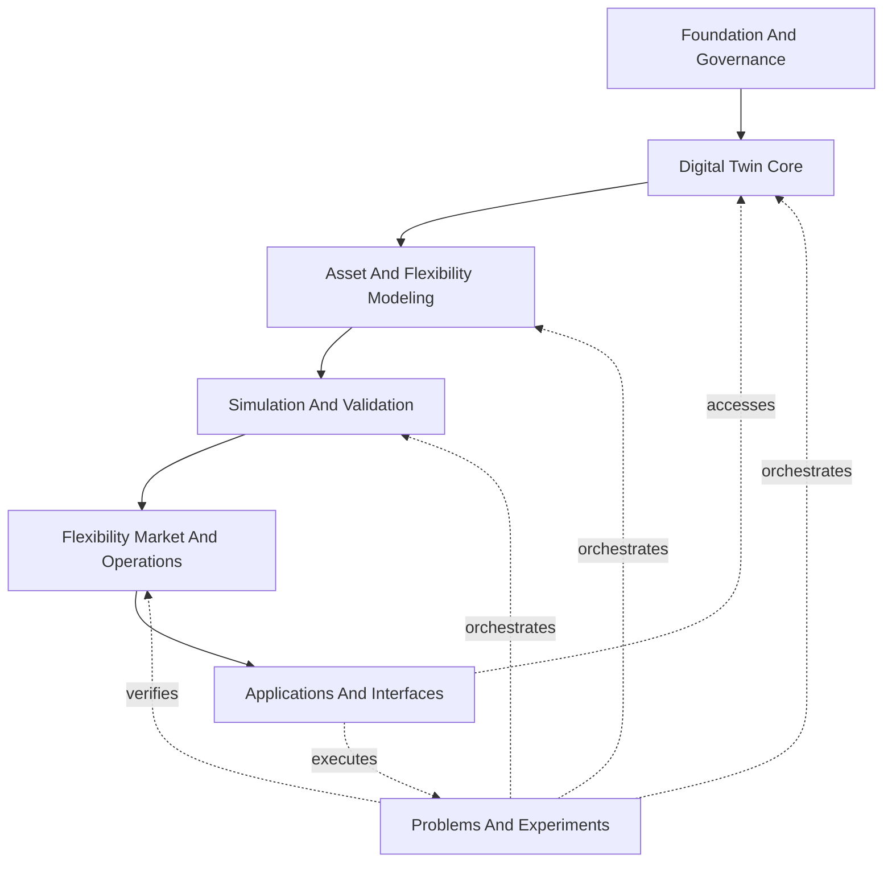

# Capability Architecture

This page is the executive map of Gridalyn's platform capabilities. Use it to
decide where a concern belongs before reading the detailed
[Platform Layer Model](platform-layer-model.md).

Gridalyn separates three ideas:

| Term | Meaning |
| --- | --- |
| Capability | What the platform must do for a distribution-grid workflow. |
| Module | Where reusable Python code lives today. |
| Project | A governed, reproducible study that consumes platform capabilities. |

The goal is to keep demos thin. A demo should prove a capability; it should not
become the architecture.

## Capability Map

The arrows are responsibility flow, not a rigid import graph. Applications may
read digital-twin metadata directly; operations may query topology; projects may
orchestrate any reusable capability through declared workflow stages.

## Capability Summary

| Capability | Owns | Public surface |
| --- | --- | --- |
| Foundation And Governance | IDs, units, lineage, manifests, reports, artifact policy. | `gridalyn.foundation` |
| Digital Twin Core | Network snapshots, adapters, topology, scenarios, semantic graph. | `gridalyn.twin` |
| Asset And Flexibility Modeling | Building, EV, DER, load, thermal, forecast, and flexibility models. | `gridalyn.assets` |
| Simulation And Validation | Synthetic-network builders, power flow, solver adapters, network-impact checks. | `gridalyn.simulation` |
| Flexibility Market And Operations | Providers, aggregators, offers, constraints, clearing, dispatch, settlement, KPIs. | `gridalyn.operations` |
| Problems And Experiments | Project contracts, workflow execution, regressions, sense checks. | `gridalyn.projects` |
| Applications And Interfaces | CLI, dashboard/catalog contracts, reports, visualization, future APIs. | `gridalyn.interfaces` |

## Design Rule

Every platform change should answer three questions:

1. Which capability owns this behavior?
2. Which lower-level contracts does it consume?
3. Which project, report, CLI, dashboard, or API exposes the result?

If the answer is unclear, the work probably belongs in a project script first.
Promote it to `gridalyn/` only when at least two workflows benefit from the same
reusable contract.

## Where To Go Next

| Need | Read |
| --- | --- |
| Detailed responsibility boundaries | [Platform Layer Model](platform-layer-model.md) |
| Public Python surfaces | [Public Python API](../development/public-api.md) |
| Project contracts and workflows | [Project Model](../projects/project-model.md) |
| Release posture and exclusions | [Release Readiness](release-readiness.md) |
