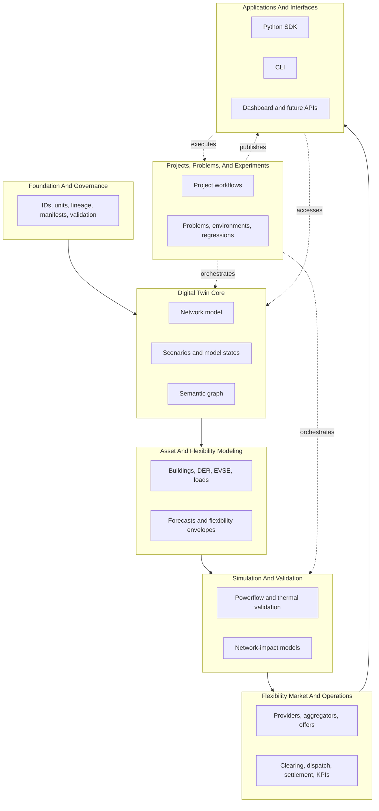

# Capability Architecture

Gridalyn should not be organized only as a collection of scripts, models, or
experiments. The platform needs a capability architecture that can support both
research studies and a utility proof of concept.

The key distinction is:

- **capabilities** describe what the platform does for a utility workflow;
- **modules** describe where code currently lives;
- **projects** describe reproducible studies that consume the capabilities.

This lets demo projects remain reproducible studies while the core evolves
toward a utility digital-twin platform.

For the more detailed responsibility contract, package direction, and design
consensus with comparable platforms, see the
[Platform Layer Model](platform-layer-model.md).

## Capability Stack

The stack is intentionally not a strict one-way dependency graph. Applications
can read digital-twin metadata directly; market operations can query the digital
twin without waiting for an experiment; validation can be used by studies,
operations, and dashboards.

## 1. Foundation And Governance

This layer makes results trustworthy.

**Responsibilities:**

- stable IDs;
- unit conventions;
- time and temporal resolution;
- model versions;
- source lineage;
- artifact manifests;
- validation reports;
- project/workflow governance;
- release and artifact policy.

**Current modules and artifacts:**

- `gridalyn.foundation`
- `gridalyn.projects`
- `gridalyn.interfaces.reporting`
- `projects/*/project.yaml`
- `projects/*/workflow.yaml`
- `projects/*/outputs/manifests`
- `instances/default/digital_twin/reports`

**Current P0 contract:** the platform now exposes first-class `ModelVersion`
and `StudyRun` objects. Base digital-twin metadata stores `model_version_id`
and a `model_version` object; project run manifests store `study_run`; platform
reports can reference both with governance IDs.

## 2. Digital Twin Core

This layer is the utility model backbone. It must remain a first-class platform
capability, not a byproduct of simulations.

**Responsibilities:**

- canonical network model;
- topology and connectivity;
- network source adapters;
- scenarios and operational states;
- time-series references;
- semantic graph;
- partial model access by feeder, transformer, bus, and zone;
- model snapshot export.

**Current modules and artifacts:**

- `gridalyn.twin`
- `gridalyn.twin.adapters`
- `gridalyn.twin.semantic`
- `instances/default/digital_twin/base`
- `instances/default/digital_twin/scenarios`
- `instances/default/digital_twin/timeseries`
- `instances/default/digital_twin/semantic`

**Near-term gap:** digital twin artifacts are strong, but we need a cleaner
distinction between base state, current state, planned state, and study-case
state.

## 3. Asset And Flexibility Modeling

This layer describes how assets behave and what flexibility they can provide.
It is where the useful part of the Enflow-style separation starts to fit:
assets, spaces, state variables, action variables, models, and parameters.

**Responsibilities:**

- building models;
- EV and EVSE models;
- DER/load models;
- baselines;
- forecasts;
- dynamic thermal limits;
- flexibility envelopes;
- rebound behavior;
- action/state/output spaces for controllable assets.

**Current modules and artifacts:**

- `gridalyn.assets`
- `gridalyn.assets.datagen`
- `instances/default/digital_twin/models`
- `instances/default/digital_twin/scenarios/asset_registry.parquet`
- project output profiles under `projects/*/outputs/data`

**Near-term gap:** the platform has useful models, but lacks explicit
`InputSpace`, `StateSpace`, `ActionSpace`, and `OutputSpace` contracts.

## 4. Simulation And Validation

This layer answers the physical question: what happens to the grid if a scenario
or operation is applied?

**Responsibilities:**

- pandapower execution;
- powerflow validation;
- voltage and thermal metrics;
- dynamic transformer validation;
- network-impact physics checks;
- surrogate prediction and calibration;
- scenario replay;
- consistency checks between fast screening and physical validation.

**Current modules and artifacts:**

- `gridalyn.simulation.simulators`
- `gridalyn.simulation.analytics.network_impact`
- `projects/*/outputs/json/pandapower_validation.json`
- `instances/default/digital_twin/flexibility/network_impact_*`

**Near-term gap:** simulations and surrogates should share a common
`GridEnvironment` interface so a workflow can swap between fast estimation and
physical validation without changing the market logic.

## 5. Flexibility Market And Operations

This layer is the bridge from digital twin to utility operation. It must not be
hidden inside a modeling or experiment layer.

**Responsibilities:**

- flexibility providers;
- aggregators;
- offers and bids;
- Soft/Hard CLS contracts;
- locational constraints;
- clearing;
- dispatch;
- settlement;
- risk and reliability metrics;
- post-clearing network verification;
- operational KPIs for mechanism intelligence.

**Current modules and artifacts:**

- `gridalyn.operations`
- `gridalyn.operations.market`
- `instances/default/digital_twin/flexibility`
- `projects/*/outputs/json/ev_summary_results.json`
- `projects/*/outputs/reports/stage_4_realtime_dispatch_report.json`

**Current P0 contract:** `gridalyn.operations.flexibility` now exposes a
validated flexibility clearing facade. It creates a deterministic
`FlexibilityOperationContext`, validates method-specific impact inputs, calls
the market clearing engine, and writes operation context, governance IDs,
validation, and input summaries into the clearing report. It also exposes
tabular domain contracts for `AggregatorPortfolio`, `FlexibilityOffer`,
`DispatchInstruction`, `SettlementRecord`, `NetworkConstraint`, and an
`OperationalKPIReport` builder.

**Near-term gap:** aggregators and providers need a graph-aware portfolio
relationship model: an aggregator should own a portfolio of providers whose
network impact is explicitly measured against constraints.

## 6. Problems And Experiments

This layer packages a reusable problem into a reproducible run. It is where the
Enflow-style concepts of dataset, environment, objective, model, and experiment
are most useful.

**Responsibilities:**

- problem definitions;
- objectives and constraints;
- datasets;
- environments;
- model selection;
- experiment parameters;
- sweeps and benchmarks;
- regression baselines;
- reproducible run manifests.

**Current modules and artifacts:**

- `gridalyn.projects`
- `projects/flexibility_cls`
- `projects/*/baselines`

**Near-term gap:** `projects/flexibility_cls` is governed, but there is
not yet a reusable `Problem` and `Experiment` abstraction that another study can
instantiate.

## 7. Applications And Interfaces

This layer is what users and external systems touch.

**Responsibilities:**

- CLI;
- dashboard;
- report readers;
- catalog generation;
- future Python service APIs;
- future model server endpoints;
- integration points for utility workflows.

**Current modules and artifacts:**

- `gridalyn.interfaces.cli`
- `dashboard`
- `instances/default/digital_twin/dashboard`
- `docs`

**Near-term gap:** the dashboard should become a general network and operations
viewer, with project-specific panels loaded only when extension manifests are
present.

## Mapping To Current Package Structure

| Capability | Current package/module | Direction |
| --- | --- | --- |
| Foundation And Governance | `gridalyn.foundation` | Promote model/run contracts and release checks. |
| Digital Twin Core | `gridalyn.twin` | Add stateful model snapshots and partial model access. |
| Asset And Flexibility Modeling | `gridalyn.assets` | Add explicit spaces and reusable asset behavior models. |
| Simulation And Validation | `gridalyn.simulation` | Add environment abstraction and surrogate/physics comparison contracts. |
| Flexibility Market And Operations | `gridalyn.operations` | Keep market mechanics reusable and expose utility-facing operation facades. Add graph-aware aggregators, portfolio selection, and operational KPIs. |
| Problems And Experiments | `gridalyn.projects` | Package studies as reproducible problem definitions. |
| Applications And Interfaces | `gridalyn.interfaces`, `dashboard`, `instances/default/digital_twin/dashboard` | Keep UI and CLI consuming canonical contracts. |

## Transition Rule

Every new feature should answer three questions before implementation:

1. Which capability owns this behavior?
2. Which lower-level contracts does it consume?
3. Which application, project, or report will expose the result?

If a feature cannot answer those questions, it is probably still a case-study
script rather than platform functionality.
