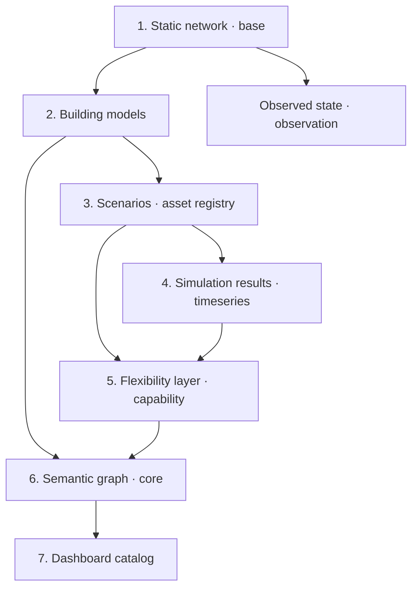

# Digital Twin

The digital twin is the stable asset and scenario layer used by project
workflows, the dashboard, and semantic graph tooling. It is not a database
service; it is a materialized workspace of Parquet and JSON artifacts that can
later be loaded into DuckDB, FalkorDB, or another operational backend.

!!! note "The name is aspirational — read this before quoting it"

    Under Kritzinger's taxonomy this layer is a **canonical, identified,
    schema-declared digital model**, and the SDK ships the measured-state
    ingest path — automated one-way physical → digital flow through
    `gridalyn.twin.observation.ingest`, with two producers (`powerflow`,
    simulated; `measured-ingest`, measured) distinguished by a required
    `provenance` field and `as_of` stamped from the datum on the measured
    path. A deployment becomes a digital *shadow* when a user feeds that path
    their own measured data. The SDK cannot ship measured data: both
    producers it exercises in CI remain simulated-or-fixture, and the
    measured path at scale is operator-receipted (protocol
    `measured-state-ingest`). It is not a digital twin — bidirectional flow
    is a recorded non-goal. See
    [Network Model](../concepts/network-model.md#what-class-of-thing-this-is)
    for the measurement behind that statement.

The default runtime instance lives at `instances/default/digital_twin/`. This
is the only default digital-twin path. Commands, tests, documentation, and
dashboard mounts should resolve through `ArtifactLayout` or explicit
`instances/<name>/digital_twin/` paths, not through a repository-root alias.

## The model-first architecture

A gridalyn twin is **model-first**: its first, faithful representation is the
grid model — a canonical, schema-declared network plus its observed state.
Domain capabilities (flexibility, EV/DER, market) are **layers added on
demand** by declaring a capability, never baked into the core. See
[Digital Twin Layering](digital-twin-layering.md) for the full layering model,
framework decision, and the API to declare a capability.

Conceptually, the twin is built as a stack — each layer depends on the one
below it:



Each layer is described below with the artifacts it produces and the command
that regenerates it.

## 1. The static network (base)

`instances/default/digital_twin/base` describes the static network:

- `buildings.parquet`: one row per building/load instance with `building_id`,
  `load_id`, `pandapower_load`, location, area, static load, and seeds.
- `building_grid_connectivity.parquet`: maps buildings and loads to load
  buses, LV clusters, feeder buses, and transformers.
- `grid_buses.parquet`: CIM-like connectivity nodes with voltage, category,
  location, and service status.
- `grid_lines.parquet`: line assets with terminal buses and electrical
  parameters.
- `grid_transformers.parquet`: transformer assets with HV/LV buses and
  nameplate data.
- `metadata.json`: repository-centric model manifest with schema version,
  model version, source adapter, artifact hashes, topology counts, and network
  validation status.

### Reading the base through the repository

Reusable code should access these tables through the network repository instead
of duplicating topology joins:

```python
from gridalyn.twin import NetworkModelRepository

repo = NetworkModelRepository.from_parquet("instances/default/digital_twin/base")
model = repo.load_model()
integrity = repo.validate_integrity()
```

`validate_integrity()` reports **three** states, not two: a required artifact
that is **absent** is an error and fails validation; an artifact that exists but
holds **no rows** is a warning and still validates; an intact base is checked
against the declared column contract. A missing `metadata.json` is a separate,
softer axis — it warns and records a degraded `provenance_status` rather than
failing, and the repository takes `provenance="require" | "warn" | "ignore"` to
change that. See
[Network Repository](../sdk/network-repository.md#validation-has-three-states-not-two)
for the full contract and the error text.

The same repository is used by platform services such as dashboard catalog
generation so that topology counts, feeder queries, transformer downstream
queries, and validation metadata stay consistent across studies. Current
repository-first consumers include base metadata generation, EV scenario
generation, building model input loading, semantic graph generation,
flexibility provider registry generation, and dashboard catalog topology
summaries.

### Base metadata

The base metadata manifest is generated after the Parquet files are written and
is validated by loading those files back through `NetworkModelRepository`. Its
key fields are:

| Field | Meaning |
| --- | --- |
| `schema_version` | Metadata contract version. |
| `model_version_id` | Stable model identifier in the form `model:sha256:<digest>`. |
| `model_version` | Governance object with source system, adapter, source format, artifact hashes, counts, validation status, timestamp, and lineage. |
| `adapter_id` | Stable adapter identifier, currently `synthetic_pandapower`. |
| `source_adapter` | Adapter that produced the model snapshot, currently `SyntheticPandapowerAdapter`. |
| `source_standard` | Source model family, currently `pandapower`. |
| `source_format` | Concrete input format, currently `pandapower-cache`. |
| `adapter_capabilities` | Declared adapter behaviors such as snapshot loading, base export, metadata writing, and validation report writing. |
| `adapter_validation_report` | Validation report emitted by the adapter export. |
| `artifacts` | Path, row count, and SHA-256 for each base Parquet artifact. |
| `validation` | Endpoint and customer-connectivity validation from `NetworkModelRepository`. |
| `model_authority` | The producing adapter's Model Authority Sets and profiles, JSON-native. `null` when a producer declares none. See [Model Authority Sets and Profiles](#model-authority-sets-and-profiles). |

The base export command is a thin wrapper around the default
`gridalyn.twin.adapters.NetworkAdapterRegistry`, which resolves
`synthetic_pandapower` to `gridalyn.twin.adapters.SyntheticPandapowerAdapter`.
That keeps the synthetic workflow working while making the source-adapter
boundary explicit for future GIS, CIM, OpenDSS, or DMS imports. Adapter
exports also write `network_adapter_validation_report.json`, which records
adapter identity, source standard, source format, declared capabilities,
artifact existence, model counts, and topology validation results. Dashboard
catalogs read `model_version_id` and `model_version` from
`base/metadata.json` when a network repository is available, so visualized
scenarios can be traced back to the exact model snapshot.

The registry also exposes `cim_parquet` through
`gridalyn.twin.adapters.CimParquetAdapter`. This first utility-facing path
accepts CIM-like Parquet source tables and emits the same canonical base
snapshot as the synthetic pandapower path. It is a pragmatic interchange
adapter, not a full CIM RDF/XML importer.

### Model Authority Sets and Profiles

The twin adopts CGMES **semantics** — who owns which artifact, and which
artifact depends on which — without adopting CGMES **serialization**.

A `ModelAuthoritySet` names the single authority responsible for a set of
canonical artifacts. Two are declared, one per producer:

| Authority set | Authority | Source standard | Artifacts |
| --- | --- | --- | --- |
| `gridalyn:mas:synthetic-pandapower` | `SyntheticPandapowerAdapter` | `pandapower` | all five |
| `gridalyn:mas:cim-parquet` | `CimParquetAdapter` | `cim` | all five |

**The partition of any one model is single-member, and the code says so.** Both
producers emit all five canonical artifacts, neither is a proper subset of the
other, and a base export selects exactly one of them — so the two sets are
*alternatives*, not co-owners, and `authority_set_partition()` returns a
one-tuple. The multi-member case the mechanism supports is therefore
**untested against a real second owner**; that is recorded in-code as
`AUTHORITY_SET_PARTITION_IS_SINGLE_MEMBER` and asserted by a test, so it cannot
quietly drop out of the documentation.

Geography is **not** a second authority. `gridalyn/twin/geoprocess/` constructs
zero canonical artifacts; building footprints reach the model as an *input* to
`PowerGridGraph.building_data`, inside the synthetic authority set rather than
beside it.

A `ModelProfile` carries a stable id, a version, its artifacts, and a
`depends_on` list. **`depends_on` is derived, never authored**: it is computed
at import from `ColumnSpec.references` in the declared schema, so it cannot be
invented and cannot go stale. Five per-artifact profiles plus one aggregate are
declared under the `gridalyn:digital-twin-base` namespace; the four artifacts
that carry a bus reference depend on that namespace's `grid_buses` profile, and
the `grid_buses` profile itself depends on nothing.

`depends_on` holds **profile ids**, and is named and serialized for that. It is
*not* CGMES `Model.DependentOn`, which references other models by mRID: a base
here is one model assembled from files, so that header field has nothing to
point at.

`validate_authority_partition()` runs at the top of **both** producers'
`load_snapshot()`, before any IO, so the declaration is a rule that gets checked
rather than metadata nothing reads. It catches genuine drift: the canonical
artifact list is single-sourced from `BASE_TABLE_FILENAMES`, while each
authority set writes the artifacts it owns as a **literal**, so adding a sixth
canonical table without giving it an owner turns both loads red.

**That literal is load-bearing, and it is why the declarations live in
`gridalyn/twin/adapters/authority.py`.** As first written, both sets were
declared `artifacts=CANONICAL_ARTIFACTS` — the same object — so the rule asked
whether the canonical list partitions itself and a sixth table did *not* turn it
red. The declarations also lived in `adapters/cim.py`, which imports
`adapters/network.py` and not the reverse, so `SyntheticPandapowerAdapter` — the
producer of the committed base — could not reach its own declaration without an
import cycle. Both are fixed: `authority.py` imports only from
`gridalyn/twin/network/`, both producers import it, and
`test_no_authority_set_aliases_the_canonical_artifact_list` fails on a
reintroduced alias.

Both producers also render their declarations into the manifest they write: as
prose in `notes`, and as the structured, machine-readable `model_authority`
field carrying every `as_dict()`. The committed
`instances/default/digital_twin/base/metadata.json` carries both.

#### Why there is no `rdflib`, and why adding it back would be a regression

**Real `rdflib` imports under `gridalyn/` are zero, and a test pins that at
zero by AST scan.** This is deliberate and load-bearing; a future contributor
reaching for a graph library to "finish" CGMES support should read this first.

- The repository *used* to ship an RDF/XML exporter. It was removed because it
  had **no importers and no tests** — it was dead code, and `rdflib`
  came off the dependency list with it.
- What this layer needs from CGMES is its **vocabulary**: `FullModel` identity
  fields, authority sets, profile dependencies. Those are expressible as frozen
  dataclasses with JSON-native `as_dict()` over the surviving parquet adapter,
  and in that form at least one of them is checked by running code (see the
  scope note above). A serializer would add a dependency, a file format and a
  second source of truth to produce an artifact that, on today's evidence,
  nothing would read.
- The pin is an **AST** scan, not a text scan, and the difference is tested in
  both directions: an `import rdflib` hidden inside a never-executed function
  body turns it red, while a doc comment that merely *names* the import stays
  green. A text scan gets both of those backwards.

If a consumer for CGMES RDF/XML ever appears, the honest move is to add the
dependency *with* that consumer and delete this section — not to add the
serializer first and hope a reader arrives.

## 2. Building models

`instances/default/digital_twin/models` turns static building rows into
simulation-ready building entities. It follows a pyCity-style decomposition
without introducing a pyCity runtime dependency:

- `building_models.parquet`: one deterministic model per building with
  archetype, floor area, bus/transformer lineage, thermal parameters, and
  estimated HVAC/base-load capacity.
- `thermal_zones.parquet`: one conditioned thermal zone per building for the
  current simplified profile.
- `device_registry.parquet`: HVAC devices for Soft CLS flexibility and EVSE
  device rows when the source building table already marks an EV instance.
- `end_use_loads.parquet`: heating, cooling, and non-HVAC background load
  estimates.
- `building_model_manifest.json`: profile, counts, inputs, units, and artifact
  paths.
- `models/scenarios/S*_device_registry.parquet`: scenario-specific device
  overlays that attach Soft CLS HVAC devices and Hard CLS EVSEs to building
  models, buses, transformers, providers, and aggregators.
- `models/scenarios/scenario_model_manifest.json`: scenario counts for EVSEs,
  Soft CLS buildings, Hard-only EVs, Soft+Hard overlap, and available capacity.

Generate it directly with:

```bash
uv run gridalyn twin building-models
```

Generate scenario overlays after `asset_registry.parquet` exists:

```bash
uv run gridalyn twin scenario-models
```

The current default profile is `north_america_residential_v1`. It is a compact
North America residential profile intended as a reproducible baseline for
studies, flexibility provider synthesis, and future calibration against measured
or simulated building data.

## 3. Scenarios and asset registry

The scenario layer separates study assumptions from physical assets.

- `ev_assignments.parquet` records nested EV adoption by scenario.
- `asset_registry.parquet` joins buildings, EV assignments, and CLS roles.
- `asset_registry_summary.json` gives scenario-level counts used by dashboard and reports.

For S4 in the current generated dataset:

- buildings: `3235`
- EVs: `1294`
- soft CLS participants: `970`
- EVs overlapping soft participants: `389`
- hard-preferred EVs: `905`

## 4. Simulation results (timeseries)

`instances/default/digital_twin/timeseries` stores scenario-specific simulation results:

- `S*_ev_load.parquet`: EV load by building/load and timestamp.
- `S*_powerflow_nodes.parquet`: bus voltage results.
- `S*_powerflow_lines.parquet`: line loading results.
- `S*_powerflow_transformers.parquet`: transformer loading results.
- `S*_powerflow_power.parquet`: aggregate power exchange.

The dashboard reads these files directly through DuckDB in the browser.

## 5. The flexibility layer (capability)

The provider layer turns scenario roles into network-aware controllable assets.
It is a **capability** — it participates only when a project declares the
flexibility semantic capability (see
[Digital Twin Layering](digital-twin-layering.md)):

- `provider_registry.parquet`: one provider row for each Soft CLS building and
  Hard CLS EV, including building, load, bus, feeder, transformer, capacity,
  scenario-device lineage, and cost proxy metadata.
- `network_sensitivity.parquet`: first-pass topology sensitivity between
  providers and transformer constraints.
- `provider_registry_summary.json`: scenario counts and capacity summaries for
  dashboard/report consumers.
- `network_graph_nodes.parquet` and `network_graph_edges.parquet`: GNN-ready
  graph snapshot linking providers, buildings, loads, buses, EVSEs, scenarios,
  and constraints.
- `network_node_features.parquet` and `network_edge_features.parquet`: stable
  integer-indexed feature tables for future tensor conversion.
- `network_impact_training.parquet`: tabular provider-constraint training rows.
- `network_impact_predictions.parquet`: fast predicted deliverability, relief,
  side-effect, and ranking metrics.
- `network_impact_surrogate_report.json`: model scope, counts, and validation
  boundary metadata.
- `network_impact_physics_labels.parquet`: pandapower finite-difference labels
  for provider/timestep/constraint perturbations.
- `network_impact_physics_labels_report.json`: sample counts and aggregate label
  metrics.
- `network_impact_physics_predictions.parquet`: selector-compatible predictions
  from the first physics-backed surrogate.
- `network_impact_physics_surrogate_report.json`: training coverage and
  prediction summary for the physics-backed model.
- `network_impact_catalog.json`: scenario-indexed dashboard manifest pointing
  to the Network Impact JSON reports currently available for each scenario.
- `locational_clearing_events.parquet`: one row per active
  constraint/timestep requirement cleared by the locational market MVP.
- `locational_clearing_selections.parquet`: provider-level selections for each
  event, including selected kW, expected relief, deliverability, rank score, and
  estimated cost.
- `locational_clearing_summary.json`: scenario-level summary for the locational
  clearing run.
- `locational_clearing_dispatch.parquet`: timestep dispatch realized after
  applying selected provider reductions to the S4 building and EV load matrices
  for pandapower replay.

When `instances/default/digital_twin/models/scenarios` exists, providers include:

- `scenario_device_ids`: the scenario HVAC/EVSE device rows behind the provider;
- `device_ids`: base device IDs;
- `building_model_id`: the model-layer building entity;
- `device_types`: `hvac_heating`, `hvac_cooling`, or `evse_l2`;
- `aggregator_id`: the aggregator identity assigned by the scenario overlay.

This keeps clearing, semantic graph queries, and future GNN feature generation
on the same provider/device identity contract.

Generate it with:

```bash
uv run gridalyn market providers \
  --base-dir instances/default/digital_twin/base \
  --scenario-dir instances/default/digital_twin/scenarios \
  --out-dir instances/default/digital_twin/flexibility
```

This layer does not yet replace aggregate clearing engines. It provides the
provider selection substrate needed for locational, constraint-aware clearing.

Generate the GNN-ready impact surrogate:

```bash
uv run gridalyn market surrogate \
  --scenario-id S4 \
  --provider-registry instances/default/digital_twin/flexibility/provider_registry.parquet \
  --sensitivity instances/default/digital_twin/flexibility/network_sensitivity.parquet \
  --out-dir instances/default/digital_twin/flexibility
```

The surrogate is a fast screening layer. Pandapower remains the authority for
validating final dispatch impact on voltage, line loading, and transformer
loading.

Generate the locational clearing MVP:

```bash
uv run gridalyn market locational-clearing \
  --scenario-id S4 \
  --top-constraints 3
```

This derives transformer-specific requirements from overload time series,
selects providers by local deliverability-adjusted offer cost, writes provider
selection Parquet tables, and emits
`instances/default/digital_twin/flexibility/locational_flexibility_clearing_report.json`.

### Retired: the pandapower replay chain

Five commands were removed — `market verify-clearing`,
`market perturbation-samples`, `market verify-network-impact`,
`market shadow-report` and `market scorecard` — together with the five
`gridalyn twin build --include-network-impact` steps that invoked them.

All five read
`instances/default/digital_twin/flexibility/market_dispatch_timeseries.parquet`.
No command in this repository writes that file: it came from a study that was
consolidated away, and the capability was never re-homed. They therefore failed
with `FileNotFoundError` wherever they were run. Because their build steps were
declared optional, the build tolerated those failures and still exited 0 — a
green exit on a build missing its verification artifacts.

The locational clearing MVP above still runs and still emits its report; what
is gone is the replay-and-verify layer that consumed a dispatch time series
this repository cannot produce. Reinstating it requires a producer for that
artifact first. See
[Instruction Verification](../development/instruction-verification.md).

`market train-physics-surrogate` trained the physics-backed predictions and
was retired with the chain above: its labels parquet was written only by
`market perturbation-samples`, so removing that command left it without a
producer too.

Refresh the dashboard manifest after generating or replacing Network Impact
reports:

```bash
uv run gridalyn market network-impact-catalog
```

## 6. The semantic graph (capability)

The semantic graph is a federated index over the twin artifacts: stable entity
IDs, ontology labels, and relationship metadata that let the same assets be
queried as a graph. It is **model-first** — the core emits only generic CIM/Brick
types — and the flexibility/market ontology is an **on-demand capability**
declared through `--semantic-capabilities`. See
[Semantic Graph](../reference/semantic-graph.md) for the ontology and
[Digital Twin Layering](digital-twin-layering.md) for the capability model.

Generate semantic graph artifacts (omitting `--semantic-capabilities` preserves
the full legacy graph, passing an empty list builds the model-first core only,
and `flexibility` adds the market-management layer):

```bash
uv run gridalyn semantic build \
  --profile north_america \
  --base-dir instances/default/digital_twin/base \
  --scenario-dir instances/default/digital_twin/scenarios \
  --flexibility-dir instances/default/digital_twin/flexibility \
  --timeseries-dir instances/default/digital_twin/timeseries \
  --out-dir instances/default/digital_twin/semantic
  # model-first core only:  add  --semantic-capabilities
  # core + flexibility:      add  --semantic-capabilities flexibility
```

When the `flexibility` semantic capability is declared (or the flag is
omitted, which assumes it for backwards compatibility) and
`instances/default/digital_twin/flexibility/provider_registry.parquet` is
present, the semantic graph also indexes the market-management layer:
aggregators, portfolios, providers, offers, and constraint zones. This lets
FalkorDB/DuckDB consumers ask which providers belong to an aggregator, which
contract each provider implements, and which transformer constraint an offer
targets without embedding heavy time-series data in the graph.

Validate semantic graph:

```bash
uv run gridalyn semantic validate \
  --semantic-dir instances/default/digital_twin/semantic \
  --scenario-dir instances/default/digital_twin/scenarios
```

## 7. The dashboard catalog

`instances/default/digital_twin/dashboard/catalog.json` is the general-purpose
UI contract for the grid viewer. It is intentionally study-agnostic:

- scenario labels and descriptions;
- Parquet paths for nodes, lines, transformers, and power traces;
- pure grid metrics such as grid peak, load peak, minimum voltage, line loading,
  transformer loading, and overload counts;
- topology counts such as buses, lines, loads, transformers, and timesteps;
- optional extension report paths for study-specific panels.

Generate it with:

```bash
uv run gridalyn dashboard catalog
```

The dashboard should load this catalog first. Other manifests are supporting
diagnostics rather than the primary UI contract.

## Observed state

`gridalyn.twin.observation` owns `NetworkObservation` and `observe_network`:
one definition of what a solved network shows, in the same layer as the model
it describes. `gridalyn.simulation.observation` still resolves — it re-binds the
same objects and emits a `DeprecationWarning` — so no consumer had to change.

An observation carries a keyword-only `as_of: datetime | None`, and it is
**caller-supplied**, never inferred. A solved `pandapowerNet` holds one
converged operating point with no record of which instant it represents; only
the caller that chose the point knows. All **13** production
`observe_network(...)` call sites pass `as_of=None` today, which is correct
rather than a gap — a sensitivity perturbation, a named scenario and a
Monte-Carlo draw index have no real instant to offer, and stamping one would
fabricate evidence. `AS_OF_ABSENT_REASON` travels with the field to say exactly
that.

There is deliberately **no state-producer registry**. One real producer plus a
placeholder is the speculative abstraction the platform's registries exist to
avoid; the absence is asserted by a test rather than left to be mistaken for an
oversight.

## Building the twin

Use `gridalyn twin` as the top-level regeneration entrypoint when rebuilding
the canonical artifacts. Preview the ordered build without writing heavy
simulation outputs:

```bash
uv run gridalyn twin build --dry-run --skip-heavy
```

Rebuild the core digital twin:

```bash
uv run gridalyn twin build
```

### A general mechanism: any project's twin

`gridalyn twin` is not a single hard-wired build for the `default` instance
and the flexibility/EV study. It is a **general mechanism**: every command
selects a named **instance** (which twin to operate on) and the build declares
which **capability layers** to include. A project's twin materializes under
`instances/<name>/digital_twin/`, and the layer scripts resolve that selection
through `GRIDALYN_INSTANCE` / `GRIDALYN_WORKSPACE_ROOT`, so the same general
commands build, regenerate, and inspect *any* twin.

Select the instance and declare the capabilities explicitly:

```bash
uv run gridalyn twin build --instance <name> --capabilities "" --dry-run
```

`--capabilities` is a comma-separated set of on-demand layers. An empty value
declares **none** — a generic model-first build (base + building models +
semantic core + reports, no EV or flexibility stages). `flexibility`,
`ev-hosting`, or both reproduce the layer content of the legacy build:

```bash
uv run gridalyn twin build --instance <name> --capabilities flexibility
```

The per-layer regeneration commands accept the same `--instance` and `--root`
flags, so a single layer can be rebuilt on any twin:

```bash
uv run gridalyn twin building-models --instance <name>
uv run gridalyn twin dashboard-catalog --instance <name>
```

Omitting `--instance` and `--capabilities` keeps the canonical default twin
exactly as before: instance `default`, legacy `ev-hosting,flexibility` layers.

The first step, `export_base`, reads the topology caches
`pp_net_cache.pkl` and `pg_graph_cache.pkl` from
`instances/default/digital_twin/cache/`. That directory is git-ignored and is
absent on a fresh checkout, so the build fails there with `FileNotFoundError`
until it is populated. Populate it with
`gridalyn.simulation.build_synthetic_network_from_geojson`, passing the cache
directory as `out_dir` and `write_cache=True` — the same call
`examples/tutorials/create_grid_from_real_data.py` makes, pointed at the twin
cache instead of `examples/generated/outputs/`.

Include the Network Impact and clearing scorecard artifacts:

```bash
uv run gridalyn twin build --include-network-impact
```

For fast CI or local checks, combine `--skip-heavy` with
`--include-network-impact`; this skips pandapower-heavy sampling while still
planning the semantic, dashboard, report, and surrogate metadata steps.

Every run writes
`instances/<instance>/digital_twin/reports/digital_twin_build_manifest.json`
(the default instance writes `instances/default/...`) with the planned/executed
steps and canonical downstream artifacts, including the selected `instance`
and the declared capability steps.

## Operational reports

Transformer overload summaries should be published through canonical reports
under `instances/default/digital_twin/reports/canonical`.

Canonical reports include:

- `network_capacity_report.json`
- `scenario_registry_report.json`
- `semantic_graph_report.json`
- `digital_twin_report_manifest.json`

Each canonical report records input file hashes, source artifacts, metrics, and schema version.

## The artifact contract (reference)

The default runtime instance materializes under `instances/default/digital_twin/`:

```text
instances/default/digital_twin/
  base/
    buildings.parquet
    building_grid_connectivity.parquet
    grid_buses.parquet
    grid_lines.parquet
    grid_transformers.parquet
    metadata.json
  models/
    building_models.parquet
    thermal_zones.parquet
    device_registry.parquet
    end_use_loads.parquet
    building_model_manifest.json
    scenarios/
      S*_device_registry.parquet
      scenario_summary.parquet
      scenario_model_manifest.json
  dashboard/
    catalog.json
  scenarios/
    S0.json ... S4.json
    ev_assignments.parquet
    asset_registry.parquet
    asset_registry_summary.json
    index.json
  timeseries/
    S*_ev_load.parquet
    S*_powerflow_*.parquet
    ev_load_summary.json
    powerflow_smoke_summary.json
  flexibility/
    provider_registry.parquet
    network_sensitivity.parquet
    provider_registry_summary.json
    network_graph_nodes.parquet
    network_graph_edges.parquet
    network_node_features.parquet
    network_edge_features.parquet
    network_impact_training.parquet
    network_impact_predictions.parquet
    network_impact_surrogate_report.json
    network_impact_physics_labels.parquet
    network_impact_physics_labels_report.json
    network_impact_physics_predictions.parquet
    network_impact_physics_surrogate_report.json
    locational_clearing_events.parquet
    locational_clearing_selections.parquet
    locational_clearing_summary.json
  reports/
    digital_twin_build_manifest.json
    mv_lv_transformer_overload_report.json
    canonical/
  semantic/
    nodes.parquet
    edges.parquet
    graph_manifest.json
    profile_north_america.json
    validation_report.json
```

## Related documentation

- [Network Model](../concepts/network-model.md) — what class of thing the twin is (Kritzinger taxonomy), the model identity and observed-state contracts.
- [Digital Twin Layering](digital-twin-layering.md) — the model-first layering model and the capability API.
- [Semantic Graph](../reference/semantic-graph.md) — the graph ontology and its profile.
- [Network Repository](../sdk/network-repository.md) — the repository API and its validation contract.
