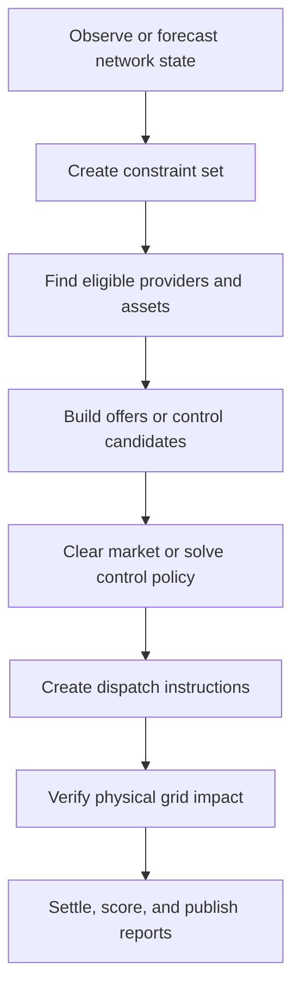

# Operations Layer

The operations layer turns a digital twin into decisions. It is where Gridalyn
connects network state, controllable assets, forecasts, market mechanisms,
control actions, physical verification, settlement, and operational KPIs.

This section is intentionally broader than one demo project. A project may study
EV charging, prosumer batteries, DER voltage support, demand response, or
restoration logic, but the operations layer should expose the same durable
concepts: constraints, providers, offers, dispatch, verification, settlement,
and audit records.

## Operating Questions

Gridalyn operations should help answer questions such as:

- What network constraints are active or forecasted?
- Which assets can provide relief or control authority?
- Which aggregator or portfolio owns those assets?
- Which market, rule, or control policy should select actions?
- Which actions are physically deliverable on the grid?
- What was dispatched, delivered, paid, penalized, and verified?
- Which KPIs show whether the mechanism improved grid operation?

## Capability Map

| Capability | Purpose | Typical artifacts |
| --- | --- | --- |
| Network-state awareness | Represent voltage, thermal, topology, congestion, and reliability constraints. | constraint sets, powerflow outputs, limit reports |
| Provider and asset management | Map controllable assets to providers, portfolios, aggregators, and grid locations. | provider registry, asset registry, semantic graph |
| Forecast and uncertainty | Attach expected demand, DER output, prices, weather, availability, and scenario uncertainty to operations. | forecasts, scenarios, model states |
| Market and transactive mechanisms | Clear offers, prices, contracts, bilateral schedules, or local flexibility products. | offers, awards, prices, commitments |
| Control and dispatch | Convert selected actions into executable setpoints or limits. | dispatch instructions, control envelopes |
| Physical verification | Replay or simulate selected actions before treating them as grid-valid. | pandapower reports, surrogate checks, validation reports |
| Settlement and audit | Record delivery, payment, penalties, governance IDs, and evidence. | settlement records, operation runs, KPI reports |
| Applications | Surface the operation to dashboards, APIs, reports, and future operator workflows. | catalogs, summaries, dashboard metadata |

## General Operation Lifecycle

This lifecycle supports both market-based and control-based mechanisms. A
real-time market may use bids and clearing prices; a voltage-control controller
may solve an optimization; an emergency action may use rule-based priorities.
All should still produce traceable operation records.

## Core Operational Objects

| Object | Meaning |
| --- | --- |
| `NetworkConstraint` | A voltage, thermal, topology, reliability, or operator-defined limit requiring action. |
| `FlexibilityProvider` | A controllable resource or group of resources that can change injection, demand, or operating envelope. |
| `AggregatorPortfolio` | A commercial or logical grouping of providers under one market/control participant. |
| `Offer` | Quantity, price, availability, quality, and location metadata submitted to a mechanism. |
| `ClearingResult` | Accepted offers, prices, residual shortfall, and rule metadata. |
| `DispatchInstruction` | Provider-level action: setpoint, cap, curtailment, storage charge/discharge, or availability request. |
| `DeliveryRecord` | Measured or simulated delivery against the dispatch instruction. |
| `SettlementRecord` | Payment, penalty, obligation, and counterparty evidence. |
| `OperationRun` | Durable audit object linking model version, scenario, inputs, outputs, method, status, and validation. |

## Mechanism Families

Gridalyn should be able to host several operational mechanisms:

| Family | Examples | Selection logic |
| --- | --- | --- |
| Flexibility markets | day-ahead flexibility, real-time balancing, local congestion products | pay-as-clear, pay-as-bid, welfare maximization, merit order |
| Transactive energy | peer-to-grid schedules, prosumer battery markets, dynamic prices | double auction, locational price signals, settlement rules |
| Grid control | DER voltage support, battery dispatch, tap/VAR coordination | optimization, model predictive control, rule-based control |
| Emergency actions | load shedding, EV interruption, reliability backstops | priority rules, criticality, contractual rights |
| Planning studies | hosting capacity, scenario comparison, policy evaluation | simulation batches and KPI comparison |

The current demos exercise only part of this space. The purpose of the
operations architecture is to make those demos comparable and extensible.

## SDK Boundary

The operations layer composes lower platform modules rather than replacing
them:

| Module | Role in operations |
| --- | --- |
| `gridalyn.twin` | Network topology, connectivity, model versions, semantic graph, and source-of-truth artifacts. |
| `gridalyn.assets` | Buildings, loads, DER, EVSE, forecasts, envelopes, and controllable asset models. |
| `gridalyn.simulation` | Powerflow, thermal checks, network impact, replay, and surrogate features. |
| `gridalyn.operations` | Providers, aggregators, offers, clearing, dispatch, settlement, constraints, and KPIs. |
| `gridalyn.projects` | Reproducible execution of operation studies and demos. |
| `gridalyn.interfaces` | CLI, reports, dashboard/catalog generation, and future service surfaces. |

Project scripts should orchestrate operations. Reusable provider logic,
clearing, dispatch, verification, and reporting should live in the SDK.

## Current Implementation

Today Gridalyn has reusable building blocks for:

- thermal screening of stochastic load and EV-adoption traces;
- CLS scenario sweeps that produce market summaries and dispatch time series;
- CLS market replay contexts for visualizations, diagnostics, and realized
  scenario inspection without rebuilding market inputs in project scripts;
- CLS output-consistency validation across JSON summaries, dispatch parquet,
  temporal thermal bounds, and pandapower scenario reports;
- transformer peak-loading validation that compares scenario demand against
  static nameplate loading and a thermal winter-design limit;
- provider registries and aggregator portfolios;
- locational sensitivity and network-impact screening;
- offer construction and locational clearing;
- dispatch and settlement records;
- network constraints and operational KPI reports;
- project-owned operation run records and operations catalogs;
- synthetic topology-cache manifests and building-footprint validation reports.

The larger `projects/flexibility_cls` workflow is one stress test of those
contracts. Its project scripts now mostly bind project paths and constants to
native SDK utilities such as `build_congestion_forecast`,
`run_cls_capacity_allocation`, `prepare_cls_market_replay_context`,
`validate_cls_output_consistency`,
`validate_transformer_peak_scenarios`, and
`materialize_flexibility_operation_artifacts`; they should be read as
orchestration wrappers, not as the definition of the operations layer.

## What To Read Next

- [Operational Functions](../flexibility/overview.md)
- [Providers And Aggregators](../flexibility/providers-and-aggregators.md)
- [Markets, Clearing, And Transactions](../flexibility/clearing.md)
- [Network Impact Verification](../flexibility/network-impact-surrogate.md)
- [Operational KPIs](../flexibility/economic-validation.md)
- [Building Flexibility](../flexibility/building-flexibility.md)
