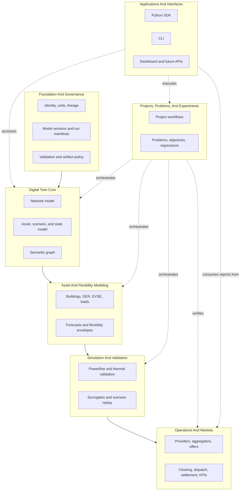

# Platform Layer Model

Gridalyn should be understandable in two modes at the same time:

- as a reproducible study platform, where a project declares inputs, stages,
  outputs, validation, and reports;
- as a utility-oriented digital-twin platform, where the core model, operations,
  simulations, and applications are reusable beyond one study.

The layer model below is the contract that keeps those two modes aligned. It is
inspired by public utility and energy-simulation platforms, but it is not a copy
of any single one. Gridalyn keeps a strong digital-twin and operations layer
because flexibility management, market clearing, and network verification are
central to the platform.

## Design Consensus

The architecture takes lessons from several platform families:

| Reference family | Useful lesson for Gridalyn | What Gridalyn should not copy blindly |
| --- | --- | --- |
| Zepben / Evolve | Durable utility network model, SDK-first access, CIM-aligned thinking, partial model queries. | Product scope, service layout, or exact object model. |
| GridAPPS-D | Distribution applications run against a shared grid model and message/data services. | Its full distributed runtime is more than Gridalyn needs for a first public release. |
| NREL Sienna | Separate system data, operations/planning studies, simulation, and analysis packages. | Its transmission/planning emphasis does not replace Gridalyn's distribution and flexibility focus. |
| HELICS | Coupled simulations should communicate through explicit interfaces and time coordination. | Co-simulation should remain optional until Gridalyn has stable local model contracts. |
| pandapower / OpenDSS | Solvers are engines under the platform, not the platform identity. | Solver-specific data structures should not leak into project, dashboard, or market contracts. |
| Enflow-style modular modeling | Problems, models, environments, scenarios, and experiments are useful abstractions for reusable studies. | A pure modeling framework would understate digital twin governance, operations, and market clearing. |

The consensus is: **Gridalyn should be model-centered, operation-aware, and
application-friendly.**

**HELICS precondition update (Phase 10, Milestone 5, 2026-08-10).** The row
above records that co-simulation should wait for "stable local model
contracts." Phase 10 built those: an explicit-ID `PowerFlowBackend` registry,
a `Surrogate` registry, an observation contract, and a `Policy` registry, each
resolved by name and recorded in run provenance rather than discovered
ambiently. The precondition is therefore satisfied. This is **not** a decision
to adopt HELICS, mosaik, or any external co-simulation framework — the user's
Milestone 5 strategy was in-repo contracts with no new external dependency,
and that stands. What changes is only that adopting co-simulation later is now
a separately-decidable option with a real foundation under it, not a
prerequisite still unmet.

## Layer Stack



This is not a rigid import graph. It is a responsibility map. A dashboard may
read digital-twin metadata directly, and operations may query topology without
going through a project workflow. Code dependencies should still stay simple:
shared contracts live lower in the stack; orchestration and applications live
higher in the stack.

## 1. Foundation And Governance

This layer makes every artifact traceable and publishable.

**Owns:**

- platform identifiers and naming conventions;
- units and time conventions;
- model versions and run IDs;
- source lineage and artifact hashes;
- validation reports;
- project/workflow manifests;
- release and artifact policy.

**Current Gridalyn surface:**

- `gridalyn.foundation`
- `gridalyn.projects`
- `gridalyn.interfaces.reporting`
- `projects/*/project.yaml`
- `projects/*/workflow.yaml`
- `projects/*/outputs/manifests`
- `instances/default/digital_twin/reports`

**Design rule:** generated outputs are acceptable only when their source inputs,
model version, run context, and validation state can be traced.

## 2. Digital Twin Core

This layer is the utility model backbone. It should not be treated as a folder
of simulation leftovers.

**What class of thing it is — read this before quoting the section title.**
The heading names the layer's *target*, not its measured class. Under the
Kritzinger taxonomy — which separates the classes by *automated data flow*, not
by fidelity — `gridalyn.twin` today is a **digital model with provenance, a
declared schema, and a place for a clock**. It is not a digital shadow, which
would need automated one-way flow from a physical counterpart, and not a digital
twin, which would need both directions. Every `NetworkObservation` in the
repository is read off a *solved* network — a simulation result, not a
measurement — and every production `observe_network(...)` call site passes
`as_of=None`, correctly, because none has a real instant to offer. The list
below is what the layer **owns**; it is not a claim that any of it is fed from a
physical feeder. See
[Network Model](../concepts/network-model.md#what-class-of-thing-this-is) for
the measurement and for the single thing that would move it up a class.
Bidirectional flow is a recorded **non-goal**, not an omission.

**Owns:**

- canonical network model;
- topology and connectivity;
- substations, feeders, transformers, buses, lines, loads, DER, EVSE, and
  buildings;
- source adapters for synthetic, GIS, CIM, and future utility systems;
- scenarios and operational model states;
- time-series dataset references;
- semantic graph metadata;
- partial access by feeder, transformer, bus, downstream zone, and asset type.

**Current Gridalyn surface:**

- `gridalyn.twin`
- `gridalyn.twin.network`
- `gridalyn.twin.adapters`
- `gridalyn.twin.observation`
- `gridalyn.twin.semantic`
- `instances/default/digital_twin/base`
- `instances/default/digital_twin/scenarios`
- `instances/default/digital_twin/timeseries`
- `instances/default/digital_twin/semantic`

**Design rule:** solvers, dashboards, reports, and markets consume the twin
through stable IDs and repositories, not through ad hoc file assumptions.

## 3. Asset And Flexibility Modeling

This layer describes asset behavior and controllability.

**Owns:**

- building model generation;
- EV, EVSE, DER, and load models;
- thermal and operational states;
- baselines and forecasts;
- dynamic thermal limits;
- flexibility envelopes;
- rebound behavior;
- documented model assumptions and validation signals.

**Current Gridalyn surface:**

- `gridalyn.assets`
- `gridalyn.assets.modeling`
- `gridalyn.assets.datagen`
- `instances/default/digital_twin/models`
- `instances/default/digital_twin/scenarios/asset_registry.parquet`
- project output profiles under `projects/*/outputs/data`

**Design rule:** an asset model should explain what can happen, what can be
controlled, what constraints apply, and which measurements validate it.

## 4. Simulation And Validation

This layer answers the physical question: what happens to the grid?

**Owns:**

- pandapower execution;
- future OpenDSS or other solver adapters;
- powerflow validation;
- voltage and thermal metrics;
- transformer overload and dynamic thermal validation;
- network-impact surrogate calibration;
- scenario replay;
- consistency checks between fast screening and physics validation.

**Current Gridalyn surface:**

- `gridalyn.simulation`
- `gridalyn.simulation.simulators`
- `gridalyn.simulation.analytics.network_impact`
- `projects/*/outputs/reports/<stage>_report.json`
- `instances/default/digital_twin/flexibility/network_impact_*`

**Design rule:** market logic may use fast estimates, but final operational
claims must be explainable against physical validation or a calibrated surrogate
with known error.

### Network Control Registries (Phase 10, Milestone 5, 2026-08-10)

Four network-control roles resolve by explicit ID rather than a hardcoded
choice: which physical solver runs, which surrogate stands in for it, what a
controller observes, and which policy decides an action. Three of the four
are registries; the fourth (observation) is a single contract, not a
registry — see the note below the table.

| Role | Registry | IDs registered |
| --- | --- | --- |
| Power-flow backend | `gridalyn.simulation.backends.registry.PowerFlowBackendRegistry` | `pandapower_native` (default), `lightsim2grid` |
| Surrogate | `gridalyn.simulation.surrogates.registry.SurrogateRegistry` | `network_impact_tabular_v1` (default), `network_impact_physics_lookup_v1` |
| Control policy | `gridalyn.simulation.policies.registry.PolicyRegistry` | `sensitivity_dispatch`, `tabular_rl` |

(Observation, `gridalyn.twin.observation`, is a contract and a single
pandapower-shaped builder function, `observe_network` — not a registry. It has
one implementation because nothing in this repository yet needs a second one;
adding a registry ahead of that need would be exactly the speculative
abstraction the platform's own conventions warn against.)

**Explicit-ID resolution, every time.** Each registry exposes `register(...,
replace=False)`, `get_descriptor`, `list_descriptors()` (sorted, for a stable
manifest sequence), and `create(id, **kwargs)`. A caller names the
implementation it wants; there is no default-discovery path that silently
picks one for it beyond the one documented default ID per registry.

**Why none of them use `entry_points` discovery.** An ambient plugin
discovered via `importlib.metadata.entry_points` would change a run's solved
result, surrogate prediction, or control decision without that choice
appearing anywhere in the run manifest — installing an unrelated package into
the same environment could silently change what a study reports. This is the
exact failure mode `provenance.macro_model` was added to close for the load
generator (see `CLAUDE.md`'s data-generation constraints): a run's behaviour
must be reconstructable from its own manifest, not from what happened to be
importable in the environment that produced it. `provenance.powerflow_backend`
records the resolved backend's descriptor for the same reason. A future
contributor who wants to add a new solver, surrogate, or policy registers it
explicitly in the relevant `default_*_registry()` function — a one-line,
reviewable, provenance-visible change — rather than dropping a package on the
path and letting it be discovered.

## 5. Operations And Markets

This layer is where Gridalyn differs from a generic modeling toolkit. It turns
the twin and asset models into decisions.

**Owns:**

- flexibility providers;
- aggregators and portfolios;
- offers, bids, availability, and effort;
- Soft/Hard CLS contracts;
- locational constraints;
- clearing;
- dispatch;
- settlement;
- rebound and reliability metrics;
- post-clearing network verification;
- operational KPIs for mechanism intelligence.

**Current Gridalyn surface:**

- `gridalyn.operations`
- `gridalyn.operations.clearing`
- `instances/default/digital_twin/flexibility`
- `projects/*/outputs/reports/<stage>_report.json`
- `projects/*/outputs/reports/<stage>_report.json`

**Design rule:** an aggregator is not just a price curve. It is a portfolio of
providers with spatial location, network sensitivities, delivery risk, and
contract obligations.

## 6. Projects, Problems, And Experiments

This layer packages reusable platform capability into reproducible work.

**Owns:**

- project workspace structure;
- workflow stages;
- input and output contracts;
- declared dependencies;
- problem definitions and objectives;
- datasets and environments;
- experiment parameters;
- sweeps, benchmarks, and regressions.

**Current Gridalyn surface:**

- `gridalyn.projects`
- `gridalyn.projects.workflows`
- `projects/ev_hosting_flex`
- `projects/ieee_33_bus_demo`
- `projects/*/baselines`

**Design rule:** projects orchestrate platform capabilities; they should not
contain reusable platform logic unless it is intentionally project-specific.

## 7. Applications And Interfaces

This layer is what users and external systems touch.

**Owns:**

- CLI;
- dashboard;
- report readers;
- catalog generation;
- future service APIs;
- future model-server endpoints;
- utility integration surfaces.

**Current Gridalyn surface:**

- `gridalyn.interfaces`
- `gridalyn.interfaces.cli`
- `dashboard`
- `instances/default/digital_twin/dashboard`
- `docs`

**Design rule:** applications consume declared artifacts and APIs. They should
not infer scenario semantics from a single demo project.

## Package Direction

Gridalyn uses seven product-oriented top-level modules. Public docs and project
code should point users to these modules instead of historical script names or
deep implementation paths.

```text
gridalyn/
  foundation/
  twin/
  assets/
  simulation/
  operations/
  projects/
  interfaces/
```

| Public module | Responsibility |
| --- | --- |
| `gridalyn.foundation` | IDs, units, lineage, validation, manifests, model versions, schemas, artifact policy. |
| `gridalyn.twin` | Network model, topology, repositories, states, scenarios, time-series references, semantic graph. |
| `gridalyn.assets` | Buildings, loads, EV/EVSE, DER, forecasts, flexibility envelopes, asset contracts, synthetic input generation. |
| `gridalyn.simulation` | Synthetic-network construction, powerflow, thermal checks, solver engines, network-impact validation. |
| `gridalyn.operations` | Providers, aggregators, offers, constraints, clearing, dispatch, settlement, operational KPIs. |
| `gridalyn.projects` | Project manifests, workflow execution, regressions, reproducible studies and demos. |
| `gridalyn.interfaces` | CLI, dashboard contracts, reports, graph exports, future API/service adapters. |

The module names are intentionally product-oriented. A utility user should be
able to infer what each area owns without knowing the history of the repository.

New reusable code should enter the module that owns its capability. Project
scripts should call those modules, not recreate shared logic locally. When a
capability is unclear, choose the layer by the artifact it owns:

| Artifact or behavior | Owning module |
| --- | --- |
| Workspace paths, reports, validation, manifests | `gridalyn.foundation` |
| Network topology, scenario metadata, semantic graph | `gridalyn.twin` |
| Building, EV, DER, load, and synthetic asset generation | `gridalyn.assets` |
| Synthetic-network construction, power-flow, thermal, voltage, and surrogate validation | `gridalyn.simulation` |
| Providers, clearing, dispatch, settlement, and KPIs | `gridalyn.operations` |
| Project contracts, runners, regressions, sense checks | `gridalyn.projects` |
| CLI, dashboard/catalog, report, graph, and visualization surfaces | `gridalyn.interfaces` |

Every deeper package move should include tests and documentation updates.
Public docs and new project code should use the native owning module.

Do not introduce deeper subpackages just because a concept exists in another
framework. Promote a boundary when Gridalyn has at least two consumers that
benefit from it.

## Practical Flow

Most users should experience the layers through a simple path:

```text
create or import network data
  -> build a digital twin snapshot
  -> define scenarios and controllable assets
  -> run simulations or fast impact screening
  -> clear/dispatch flexibility with network constraints
  -> validate outcomes
  -> publish reports, dashboard catalogs, and run manifests
```

Developers should experience the same platform through APIs:

New applications should use the seven-module vocabulary when they want the
platform boundary to be explicit:

```python
from gridalyn import foundation, twin, assets, simulation, operations

repository = twin.NetworkModelRepository("instances/default/digital_twin/base")
policy_report = foundation.check_artifact_policy(".")
```

The architectural target is not more ceremony. It is a platform where each
piece has a clear home, and complex utility workflows can be assembled from
small, predictable contracts.
