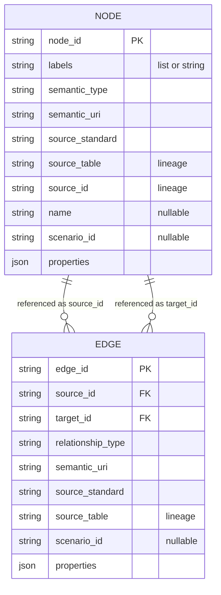

# Semantic Graph

The semantic graph is a federated index over the existing digital twin data. It
does not replace Parquet as the analytical source of truth. Instead, it adds
stable entity IDs, ontology labels, relationship metadata, and validation reports
so the same assets can be queried as a graph and later migrated to FalkorDB.

## North America Profile

The active profile is:

```text
instances/default/digital_twin/semantic/profile_north_america.json
```

The profile is North America-first and **model-first**: the core profile
carries the generic grid model, and the flexibility/market ontology is an
**on-demand capability** a project declares
(`build_semantic_graph(capabilities=...)` / `--semantic-capabilities`, or
`gridalyn twin build --capabilities`, which passes its semantic subset on).

A capability is a declaration registered by explicit ID in
`gridalyn/twin/semantic/registry.py` — its namespaces, semantic types,
relationships with their axioms, and scenario count rules — not a branch in the
orchestrator. Declaring a capability that is not registered raises, naming the
registered set; until 2026-09-10 such a name was ignored in silence. A host
registers its own with `register_semantic_capability_extension`. Every graph
manifest records the capabilities it was built with.

Core (always emitted):

- IEC CIM / IEC 61970 / IEC 61968 for grid topology;
- CIM100 and GridAPPS-D-compatible distribution extensions where needed;
- ASHRAE 223 and Brick for buildings, points, meters, and building systems;
- Green Button / NAESB ESPI for customer interval metadata.

Flexibility capability (`capabilities={"flexibility"}`, on-demand):

- LBNL Energy Flexibility Ontology (EFOnt) for building flexibility resources,
  flexible operations, load characteristics, and flexibility KPIs;
- Brick's `Electric_Vehicle_Charging_Station` for EV charging equipment. IEEE
  2030.5 defines no EVSE type and publishes no RDF namespace, so it is a
  crosswalk (an `EndDevice` with `PEVInfo`), not a prefix;
- `flexint:` (`https://w3id.org/gridalyn/ontology/flexint#`), gridalyn's
  persistent vocabulary, for curtailment contracts — one
  `flexint:CurtailmentContract` class whose `contract_mode` property is `soft` or
  `hard` — and for the market-management vocabulary of aggregators, portfolios,
  providers, offers and constraint zones. Its terms are documented in
  [Ontology: flexint](./ontology/flexint.md);
- OpenADR 3.1.0 terms arrive with the agent-interaction capability below,
  under a gridalyn-owned namespace: the Alliance publishes no RDF, so no
  `openadr:` IRI is emitted.

Agent-interaction capability (`capabilities={"agent_interaction"}`,
on-demand):

- the agents, parties and functional roles a protocol run recorded, read as
  parquet from the message log `gridalyn.operations.interaction` writes. The
  semantic layer sits below operations and never imports it, so the role
  table and the columns the emitter reads are restated in the capability and
  pinned against their sources by
  `tests/test_agent_interaction_capability.py`;
- one summary node per conversation — message counts by outcome, the window
  it spans, the message types and acts exchanged. Never a protocol state:
  only a replay in `operations` can decide one, and a graph that stated a
  state it had not computed would be a graph that lies;
- `flexint:DemandResponseProgram` and `flexint:DemandResponseEvent`, the
  first OpenADR-aligned nodes the graph emits. They are gridalyn's own terms
  whose `aligns_with` property names the OpenADR 3.1.0 object they render,
  carrying 3.1.0's own payload spellings (`programID`, the event window, the
  import cap);
- a conversation records the `constraint_id` its request named, not a zone
  node id the log cannot know. `query_agents_answering_constraint` joins on
  that property — the question the graph could not answer before: which
  agents answered the request for a given constraint.

The identifiers these standards actually publish — namespaces, versions, term
spellings — are verified, with sources, in
[Standards Alignment](standards-alignment.md), including the profile
namespaces found to be wrong.

SAREF is not a primary ontology in this profile. It can be added later as a
crosswalk if an integration requires it. The emitted profile is the model-first
core composed with the declared capabilities; composition refuses a namespace
prefix bound to two IRIs, a relationship declared with two predicates, and a
relationship that names a type no active declaration lists.

## Generated Artifacts

The graph build writes:

```text
instances/default/digital_twin/semantic/nodes.parquet
instances/default/digital_twin/semantic/edges.parquet
instances/default/digital_twin/semantic/graph_manifest.json
instances/default/digital_twin/semantic/validation_report.json
```

The graph uses stable IDs such as:

```text
building:123
bus:45
scenario:S4
contract:S4:building:123:soft_cls
efont:flexibility:S4:building:123:soft_cls
aggregator:S4:soft_cls
portfolio:S4:soft_cls
provider:S4:building:123:soft_cls
offer:S4:building:123:soft_cls
constraint-zone:S4:transformer:64
```

## Node And Edge Schema

Two parquet tables, one join. An edge is not a property of a node — it is a
row that names two of them, which is what lets the graph be rebuilt from the
canonical twin tables rather than incrementally mutated.



Every node and edge preserves lineage through `source_table` and `source_id`.
This is important: the graph should be auditable back to the current digital
twin Parquet tables.

## Main Relationships

Every relationship type maps to **one predicate**, and declares the semantic
types its edges may start and end at. The builder refuses an edge whose
predicate is not its relationship's declared one; the validator checks domain,
range and per-source cardinality on the materialized graph. The declarations
live in code — `CORE_RELATIONSHIPS` in `gridalyn/twin/semantic/profile.py` and
`FLEXIBILITY_CAPABILITY` in `gridalyn/twin/semantic/capabilities/flexibility.py`
— and are rendered into the profile JSON under `relationships`. This table is
checked against them by `tests/test_semantic_axioms.py`.

| Relationship | Predicate | Domain → range | Per source | Declared by |
| --- | --- | --- | --- | --- |
| `CONNECTED_TO` | `dt:connectedTo` | `EnergyConsumer` → `ConnectivityNode` | exactly 1 | core |
| `CONNECTS` | `dt:connects` | `ACLineSegment` → `ConnectivityNode` | exactly 2 | core |
| `FEEDS` | `dt:feeds` | `PowerTransformer` → `ConnectivityNode` | exactly 2 | core |
| `HAS_LOAD` | `dt:hasLoad` | `Building` → `EnergyConsumer` | exactly 1 | core |
| `INCLUDES_ASSET` | `dt:includesAsset` | `Scenario` → `Building` (core); `Electric_Vehicle_Charging_Station` / `CurtailmentContract` / `FlexibilityAggregator` / `FlexibilityProvider` (flexibility) | — | core, flexibility |
| `OBSERVES` | `dt:observes` | `TimeSeriesDataset` → `Scenario` | — | core |
| `PRODUCED` | `dt:produced` | `SimulationRun` → `TimeSeriesDataset` | — | core |
| `AGGREGATES` | `flexint:aggregates` | `FlexibilityAggregator` → `FlexibilityProvider` | — | flexibility |
| `ALLOWS` | `efont:allows` | `ThermallyActivatedBuildingSystem` → `FlexibleOperation` | — | flexibility |
| `CONSTRAINT_ZONE_FOR` | `flexint:constraintZoneFor` | `ConstraintZone` → `PowerTransformer` / `ACLineSegment` / `ConnectivityNode` | — | flexibility |
| `DESCRIBES_FLEXIBILITY` | `flexint:describesFlexibility` | `CurtailmentContract` → `EnergyFlexibility` | — | flexibility |
| `ENABLES` | `efont:enables` | `FlexibleOperation` → `EnergyFlexibility` | — | flexibility |
| `ENABLES_CONTRACT` | `flexint:enablesContract` | `Electric_Vehicle_Charging_Station` → `CurtailmentContract` | — | flexibility |
| `HAS_EVSE` | `dt:hasEVSE` | `Building` → `Electric_Vehicle_Charging_Station` | — | flexibility |
| `HAS_FLEXIBILITY_RESOURCE` | `dt:hasFlexibilityResource` | `Building` / `FlexibilityProvider` → `ThermallyActivatedBuildingSystem` / `ScenarioDevice` | — | flexibility |
| `IMPLEMENTS_CONTRACT` | `flexint:implementsContract` | `FlexibilityProvider` → `CurtailmentContract` | exactly 1 | flexibility |
| `INCLUDES_PROVIDER` | `flexint:includesProvider` | `FlexibilityPortfolio` → `FlexibilityProvider` | — | flexibility |
| `LOCATED_IN_CONSTRAINT_ZONE` | `flexint:locatedInConstraintZone` | `FlexibilityProvider` → `ConstraintZone` | — | flexibility |
| `MANAGES_PORTFOLIO` | `flexint:managesPortfolio` | `FlexibilityAggregator` → `FlexibilityPortfolio` | exactly 1 | flexibility |
| `OFFERS` | `flexint:offers` | `FlexibilityProvider` → `FlexibilityOffer` | exactly 1 | flexibility |
| `PARTICIPATES_IN` | `flexint:participatesIn` | `Building` → `CurtailmentContract` | — | flexibility |
| `QUANTIFIES` | `efont:Quantifies` | `EnergyFlexibilityKPI` → `EnergyFlexibility` | — | flexibility |
| `TARGETS_CONSTRAINT` | `flexint:targetsConstraint` | `FlexibilityOffer` → `ConstraintZone` | — | flexibility |
| `ACTS_FOR` | `flexint:actsFor` | `Agent` → `Party` | exactly 1 | agent_interaction |
| `FOLLOWS_EVENT` | `flexint:followsEvent` | `Conversation` → `DemandResponseEvent` | — | agent_interaction |
| `PARTICIPATES_IN_CONVERSATION` | `flexint:participatesInConversation` | `Agent` → `Conversation` | — | agent_interaction |
| `PLAYS_ROLE` | `flexint:playsRole` | `Agent` → `Role` | — | agent_interaction |
| `SCHEDULES_EVENT` | `flexint:schedulesEvent` | `DemandResponseProgram` → `DemandResponseEvent` | — | agent_interaction |

**Re-based 2026-09-10.** Measured on the shipped graph before this change,
`ENABLES` and `HAS_FLEXIBILITY_RESOURCE` each carried two predicate IRIs, and the
10 357 `CONNECTS` / `CONNECTED_TO` / `FEEDS` edges used the class IRI
`cim:ConnectivityNode` as their predicate. Rebuilt on the same inputs, exactly
these edges changed and no node did:

- `CONNECTS`, `CONNECTED_TO` and `FEEDS` carry `dt:connects`, `dt:connectedTo`
  and `dt:feeds` — local shortcuts for CIM's path through a `Terminal`
  (`Terminal.ConductingEquipment`, `Terminal.ConnectivityNode`), which this
  graph collapses;
- the EVSE-to-Hard-CLS edge is `ENABLES_CONTRACT` (`cls:enablesContract`; 3 235
  edges): it shared the label `ENABLES` with EFOnt's operation-to-flexibility
  property while meaning something else;
- provider-to-device `HAS_FLEXIBILITY_RESOURCE` edges carry
  `dt:hasFlexibilityResource` (12 935 edges), the predicate the
  building-to-resource edges of the same relationship already carried.

The namespace IRIs themselves (`cls:`, `dt:`, `efont:`, `ieee2030_5:`) are
unchanged by this re-base.

**Re-based 2026-09-11 (persistent IRIs).** Until this change `dt:` and `cls:`
sat on `gridalyn.local`, a host nothing resolves; `ieee2030_5:` named a
namespace IEEE never published, and `cim:` pointed at the CIM18 draft. Rebuilt
on the same inputs, every node and edge id, edge endpoint, relationship type and
edge property is unchanged; what moved is names:

- `dt:` is `https://w3id.org/gridalyn/ontology/digital-twin#` (12 975 node and
  70 251 edge IRIs), documented in
  [Digital-Twin Vocabulary](./ontology/digital-twin.md);
- the `cls:` terms moved to `flexint:`
  (`https://w3id.org/gridalyn/ontology/flexint#`; 25 083 node and 62 264 edge
  IRIs), documented in [Flexint Vocabulary](./ontology/flexint.md). The two
  contract classes became one: 3 235 `cls:HardCLSContract` and 4 850
  `cls:SoftCLSContract` nodes are 8 085 `flexint:CurtailmentContract` nodes whose
  new `contract_mode` property keeps the distinction;
- 3 235 `ieee2030_5:EVSE` nodes are `brick:Electric_Vehicle_Charging_Station`;
- 10 358 `cim:` node IRIs moved from `https://cim.ucaiug.io/ns#` to the CIM100
  namespace `http://iec.ch/TC57/CIM100#`. The CIM18 spellings are still read at
  ingest, for the four classes this graph maps (`resolve_ingest_iri`), and
  refused for any other;
- on the 4 850 soft contracts' EFOnt nodes, `cls_contract_type` is renamed
  `contract_type` and `mapped_from` names `flexint:CurtailmentContract`.

Validation is unchanged: valid, 0 errors, every scenario count check met. The
former names stay readable for one release: `resolve_deprecated_term` maps each
retired type and predicate to its replacement, and a repository query by a
retired type warns and filters by the property its name used to encode.

## Market Management Layer

The semantic graph now includes the operational flexibility-management layer
generated from `instances/default/digital_twin/flexibility/provider_registry.parquet`.

Current generated counts:

| Semantic type | Count |
| --- | ---: |
| `flexint:FlexibilityAggregator` | 9 |
| `flexint:FlexibilityPortfolio` | 9 |
| `flexint:FlexibilityProvider` | 8085 |
| `flexint:FlexibilityOffer` | 8085 |
| `flexint:ConstraintZone` | 810 |

This layer is gridalyn's own `flexint:` vocabulary because standards such as
OpenADR and IEEE 2030.5 describe messages and device interoperability, while the
locational market entity model is specific to this digital twin. The graph still
cross-links to standards-backed assets: providers implement curtailment
contracts, offers target constraint zones, and each constraint zone resolves to
a CIM `PowerTransformer`.

## EFOnt Crosswalk

EFOnt is integrated as a building-flexibility crosswalk, not as the primary
network or market ontology. CIM owns grid topology, Brick owns buildings and EV
charging stations, and `flexint:` models curtailment contracts, clearing,
settlement and network constraints. OpenADR 3.1.0 is the demand-response
messaging profile of the `dr_program` interaction protocol.

For every soft curtailment contract (`contract_mode: soft`), the graph creates:

- an `efont:ThermallyActivatedBuildingSystem` resource;
- an `efont:FlexibleOperation` representing the dynamic operating envelope or
  setpoint-adjustment operation;
- an `efont:EnergyFlexibility` node representing the delivered building
  flexibility concept;
- an `efont:EnergyFlexibilityKPI` node for `MaximumReducedDemand`.

This gives dashboard, reports, and future FalkorDB consumers a standard language
for building flexibility characteristics without forcing EFOnt to model network
deliverability or market clearing.

## Build And Validate

Generate the graph:

```bash
uv run gridalyn semantic build \
  --profile north_america \
  --base-dir instances/default/digital_twin/base \
  --scenario-dir instances/default/digital_twin/scenarios \
  --flexibility-dir instances/default/digital_twin/flexibility \
  --timeseries-dir instances/default/digital_twin/timeseries \
  --out-dir instances/default/digital_twin/semantic
```

Validate it:

```bash
uv run gridalyn semantic validate \
  --semantic-dir instances/default/digital_twin/semantic
```

The validator checks the graph against the profile it was **built** with —
the capabilities `graph_manifest.json` records. A manifest that predates that
record is validated against the legacy `flexibility` default, and the report
says so. It checks that:

- all edge endpoints exist, and node and edge IDs are unique;
- every semantic type and relationship is declared by the profile, in a bound
  namespace;
- every edge carries its relationship's declared predicate IRI;
- every edge starts inside its relationship's domain and ends inside its range;
- declared per-source cardinalities hold (every building has exactly one load,
  every load connects to exactly one bus, every line and transformer to two);
- scenario counts match the scenario registry through the count rules the
  active capabilities declare — a count the profile has no rule for is
  reported, never silently skipped;
- power, voltage and current properties carry an explicit unit.

## FalkorDB Readiness

The first graph backend is Parquet:

```text
gridalyn/twin/semantic/repository.py
gridalyn/twin/db/federated_graph_adapter.py
```

`SemanticGraphRepository` is the application-facing query API for the Parquet
graph. It answers operational relationship questions such as providers for a
constraint, assets in a scenario, building-to-constraint traces, and
scenario-relevant time-series datasets. The lower-level federated graph adapter
remains a backend migration helper that prepares Cypher batches for FalkorDB or
compatible graph stores. A future FalkorDB writer should import labels from
`semantic_type` and `labels`, not from ad hoc CIM class strings.

Migration rule of thumb:

1. Build the Parquet graph.
2. Pass validation.
3. Dry-run Cypher batches from the adapter (`to_falkor_batches`).
4. Load FalkorDB — **not implemented in-repo**: gridalyn has no FalkorDB
   connection or loader (2026-08-07); loading the exported batches is
   a manual, out-of-repo step.
5. Compare counts and relationship integrity against the Parquet manifest —
   **not implemented**: no in-repo reader exists to perform the comparison.

## Query Repository

Use `SemanticGraphRepository` when application or workflow code needs graph
answers instead of raw node and edge tables. It is an external-facing public
read API for researchers and applications that consume the materialized graph
directly. It has had zero in-repo application consumers since Phase 9 —
**a permanent design decision (confirmed 2026-08-19), not an open question**:
no internal consumer is planned, and its absence from `gridalyn`'s own call
graph is not evidence of dead code.

```python
from gridalyn.twin import SemanticGraphRepository

repo = SemanticGraphRepository.from_parquet("instances/default/digital_twin/semantic")
node = repo.get_node("aggregator:S0:soft_cls")
print(node["semantic_type"], node["scenario_id"])
assets = repo.assets_in_scenario("S0", semantic_type="flexint:FlexibilityAggregator")
print(len(assets), "aggregators in scenario S0")
```
```text
flexint:FlexibilityAggregator S0
1 aggregators in scenario S0
```

The full read surface: `get_node(node_id)`, `neighbors(node_id,
relationship_type=None, *, direction="out", scenario_id=None)`,
`get_asset_context(node_id)`, `assets_in_scenario(scenario_id,
semantic_type=None)`, `timeseries_for_asset(asset_id, *, scenario_id=None)`.
The repository keeps the semantic graph useful without making it the numerical
source of truth — Parquet reports and time-series remain the analytical layer;
the graph answers relationship questions such as which assets belong to a
scenario, or a node's immediate neighbors.
