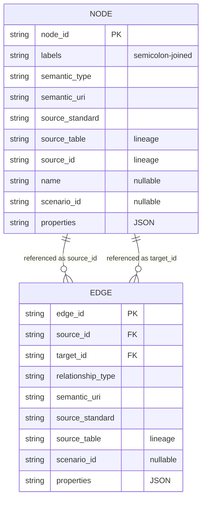

# Semantic Graph

The semantic graph is an index over the twin's Parquet tables. It does not
replace them as the analytical source of truth: it adds stable entity IDs,
ontology types, relationship axioms and a validation report, so the same assets
can be queried as a graph — in Python through `SemanticGraphRepository`, or in
a graph database after a Cypher export.

## Profile And Capabilities

The profile the build writes is:

```text
instances/default/digital_twin/semantic/profile_north_america.json
```

The profile is North America-first and **model-first**: a core that is always
emitted carries the generic grid model, and everything else is an
**on-demand capability** a project declares
(`build_semantic_graph(capabilities=...)`, `gridalyn semantic build
--semantic-capabilities`, or `gridalyn twin build --capabilities`, which passes
its semantic subset on).

A capability is a declaration registered by explicit ID in
`gridalyn/twin/semantic/registry.py` — its namespaces, semantic types,
relationships with their axioms, scenario count rules and the standards it
claims — not a branch in the orchestrator. Declaring a capability that is not
registered raises `UnknownSemanticCapabilityError`, naming the registered set. A
host registers its own with `register_semantic_capability_extension`, and a
study can declare an extension that contributes one through
`spec.inputs.extensions`
([Write An Extension](../guides/write-an-extension.md#rules-for-a-semantic-capability)).
Every graph manifest records the capabilities it was built with.

The composed profile lists the standards it draws on under
`primary_standards`, by concern. This table is that field for the core and
each registered capability:

| Declared by | Concern | Standards |
| --- | --- | --- |
| core | `grid_topology` | IEC CIM, IEC 61970, IEC 61968, CIM100 |
| core | `buildings` | ASHRAE 223, Brick Schema |
| core | `metering` | Green Button, NAESB ESPI |
| `flexibility` | `building_flexibility` | EFOnt |
| `flexibility` | `ev_charging` | Brick Schema |
| `flexibility` | `flexibility_market` | gridalyn flexint |
| `agent_interaction` | `agent_interaction` | gridalyn flexint, FIPA ACL |
| `agent_interaction` | `demand_response` | OpenADR 3.1.0 |
| `agent_interaction` | `role_model` | USEF 2021 |
| `metering` | `usage_points` | IEC 61968-9 |

A claimed standard is not the same as an emitted type. The core emits `cim:`,
`brick:` and `dt:` types only: the `s223:` (ASHRAE 223) and `gb:` (Green
Button) namespaces are bound in the profile but no type is emitted under
either, and Green Button ESPI appears only as the `source_standard` of
`dt:TimeSeriesDataset` nodes. SAREF is not in the profile.

Composition refuses a namespace prefix bound to two IRIs, a relationship
declared with two predicates, and a relationship that names a type no active
declaration lists. The identifiers these standards publish — namespaces,
versions, term spellings — are verified, with sources, in
[Standards Alignment](standards-alignment.md).

### Flexibility

`capabilities={"flexibility"}` adds the flexibility-market layer, generated from
`instances/default/digital_twin/flexibility/provider_registry.parquet`, and an
EFOnt crosswalk for building flexibility:

- Brick's `Electric_Vehicle_Charging_Station` for EV charging equipment. IEEE
  2030.5 defines no EVSE type and publishes no RDF namespace, so it is a
  crosswalk (an `EndDevice` with `PEVInfo`), not a prefix;
- `flexint:` (`https://w3id.org/gridalyn/ontology/flexint#`), gridalyn's own
  vocabulary, for curtailment contracts — one `flexint:CurtailmentContract`
  class whose `contract_mode` property is `soft` or `hard` — and for the market
  entities: aggregators, portfolios, providers, offers and constraint zones.
  The market entity model is gridalyn's own because OpenADR and IEEE 2030.5
  describe messages and device interoperability, not a locational market. The
  layer still links to standards-backed assets: providers implement
  curtailment contracts, offers target constraint zones, and each constraint
  zone resolves to a CIM `PowerTransformer`, `ACLineSegment` or
  `ConnectivityNode`;
- EFOnt (the LBNL Energy Flexibility Ontology) as a crosswalk, not as the
  network or market ontology: CIM owns grid topology, Brick owns buildings and
  EV charging stations, `flexint:` owns contracts and the market. For every
  soft curtailment contract (`contract_mode: soft`) the graph creates an
  `efont:ThermallyActivatedBuildingSystem` resource, an
  `efont:FlexibleOperation` (the operating envelope or setpoint adjustment),
  an `efont:EnergyFlexibility` node for the delivered flexibility, and an
  `efont:EnergyFlexibilityKPI` node for `MaximumReducedDemand`. EFOnt describes
  building flexibility; it does not model network deliverability or market
  clearing.

### Agent Interaction

`capabilities={"agent_interaction"}` reads the message log
`gridalyn.operations.interaction` writes (`--interaction-log`) and emits:

- the agents, parties and functional roles a protocol run recorded. The
  semantic layer sits below operations and never imports it, so the role table
  and the log columns the emitter reads are restated in the capability and
  pinned against their sources by `tests/test_agent_interaction_capability.py`;
- one summary node per conversation — message counts by outcome, the window it
  spans, the message types and acts exchanged. Never a protocol state: only a
  replay in `operations` can decide one, and the graph states nothing it has
  not computed;
- `flexint:DemandResponseProgram` and `flexint:DemandResponseEvent`, gridalyn's
  own terms whose `aligns_with` property names the OpenADR 3.1.0 object each
  renders, carrying 3.1.0's own payload spellings (`programID`, the event
  window, the import cap). The OpenADR Alliance publishes no RDF, so no
  `openadr:` IRI is emitted;
- a conversation records the `constraint_id` its request named, not a zone node
  id the log cannot know. `query_agents_answering_constraint` joins on that
  property: which agents answered the request for a given constraint.

### Metering

`capabilities={"metering"}` records where a reading is attributed. It reads a
deployment's metering-point table (`--metering-points`) — one row per point:
`usage_point_id`, the twin `load_id` it meters, and optionally `quantity`,
`resolution_minutes`, `source_dataset` — and emits one `cim:UsagePoint` per row
with one `METERS` edge to that load's `cim:EnergyConsumer`. The core graph
already reaches the bus from there (`CONNECTED_TO`), so which bus a measurement
belongs to is read off the model instead of being written down a second time.

- Both terms are IEC 61968-9's own: `UsagePoint`, and its `Equipments`
  association to the equipment connecting the point to the grid. No `dt:`
  predicate is minted, and no `EndDevice` is emitted — the capability knows no
  serial, model or install date.
- CIM allows a usage point many equipments; `METERS` is held to exactly one,
  because a reading that cannot be attributed to one load cannot be placed on
  one bus. A repeated point, a load the twin does not carry, or an identifier
  another node already holds is refused at build, naming the offender.
- No instance this repository ships is metered, so the table is absent and the
  capability emits nothing.

### Deprecated Terms

Graphs built before gridalyn's namespaces moved to `w3id.org` carry retired
terms (`cls:`, `dt:` on `gridalyn.local`, `ieee2030_5:EVSE`, and CIM18 `cim:`
IRIs). `resolve_deprecated_term` in `gridalyn/twin/semantic/profile.py` maps
each retired type and predicate to its replacement, and a repository query by a
retired type warns and filters by the property its name used to encode. CIM18
spellings are read at ingest by `resolve_ingest_iri` for the four classes the
core emits, and refused for any other. Each vocabulary page lists its retired
terms.

## Generated Artifacts

The graph build writes:

```text
instances/default/digital_twin/semantic/nodes.parquet
instances/default/digital_twin/semantic/edges.parquet
instances/default/digital_twin/semantic/graph_manifest.json
instances/default/digital_twin/semantic/validation_report.json
```

The graph uses stable IDs such as:

```text
building:123
bus:45
scenario:S4
contract:S4:building:123:soft_cls
energy_flexibility:S4:building:123:soft_cls
aggregator:S4:soft_cls
portfolio:S4:soft_cls
provider:S4:building:123:soft_cls
offer:S4:building:123:soft_cls
constraint-zone:S4:transformer:64
```

An id is `<kind>:<id>`, and its kind is never a prefix the profile binds: an id
such as `efont:resource:...` reads as a term of EFOnt and would expand to an IRI
inside EFOnt's namespace, which gridalyn does not own. The validator refuses
such ids. The flexibility capability minted four kinds that way until
2026-09-23; they are now `flexibility_resource:`, `flexible_operation:`,
`energy_flexibility:` and `flexibility_kpi:`, each named for the EFOnt class the
node carries.

## Node And Edge Schema

Two Parquet tables, one join. An edge is not a property of a node — it is a
row that names two of them, which is what lets the graph be rebuilt from the
canonical twin tables rather than incrementally mutated.



`labels` is always a `;`-joined string (`ACLineSegment;GridAsset`), and
`properties` a JSON object serialized as a string. Lineage back to the twin
tables differs by table: a node records `source_table` and `source_id`; on an
edge, `source_id` is the start node, so an edge records its `source_table` and
— unless it carries properties of its own, as the `terminal` of a `CONNECTS` or
`FEEDS` edge — its source row's id under `source_id` inside `properties`.

## Main Relationships

Every relationship type maps to **one predicate**, and declares the semantic
types its edges may start and end at. The builder refuses an edge whose
predicate is not its relationship's declared one; the validator checks domain,
range and per-source cardinality on the materialized graph. The declarations
live in code — `CORE_RELATIONSHIPS` in `gridalyn/twin/semantic/profile.py` and
`FLEXIBILITY_CAPABILITY` in `gridalyn/twin/semantic/capabilities/flexibility.py`,
and likewise for the other capabilities beside it — and are rendered into the
profile JSON under `relationships`. This table is checked against them by
`tests/test_semantic_axioms.py`.

**These are constraints, not inferences.** The published vocabularies state
domain and range as `schema:domainIncludes` and `schema:rangeIncludes`, which
entail nothing, and gridalyn runs no reasoner: an edge never gives its
endpoints a type they did not already have. The check is closed-world instead —
an endpoint whose declared type is not in the relationship's domain or range is
a validation error — so the graph is held to its declarations, never extended
by them. A reader bringing OWL semantics to the `dt:` and `flexint:` pages
should not expect the entailments `rdfs:domain` and `rdfs:range` would give.

| Relationship | Predicate | Domain → range | Per source | Declared by |
| --- | --- | --- | --- | --- |
| `CONNECTED_TO` | `dt:connectedTo` | `EnergyConsumer` → `ConnectivityNode` | exactly 1 | core |
| `CONNECTS` | `dt:connects` | `ACLineSegment` → `ConnectivityNode` | exactly 2 | core |
| `FEEDS` | `dt:feeds` | `PowerTransformer` → `ConnectivityNode` | exactly 2 | core |
| `HAS_LOAD` | `dt:hasLoad` | `Building` → `EnergyConsumer` | exactly 1 | core |
| `INCLUDES_ASSET` | `dt:includesAsset` | `Scenario` → `Building` (core); `Electric_Vehicle_Charging_Station` / `CurtailmentContract` / `FlexibilityAggregator` / `FlexibilityProvider` (flexibility) | — | core, flexibility |
| `OBSERVES` | `dt:observes` | `TimeSeriesDataset` → `Scenario` | — | core |
| `PRODUCED` | `dt:produced` | `SimulationRun` → `TimeSeriesDataset` | — | core |
| `AGGREGATES` | `flexint:aggregates` | `FlexibilityAggregator` → `FlexibilityProvider` | — | flexibility |
| `ALLOWS` | `efont:allows` | `ThermallyActivatedBuildingSystem` → `FlexibleOperation` | — | flexibility |
| `CONSTRAINT_ZONE_FOR` | `flexint:constraintZoneFor` | `ConstraintZone` → `PowerTransformer` / `ACLineSegment` / `ConnectivityNode` | — | flexibility |
| `DESCRIBES_FLEXIBILITY` | `flexint:describesFlexibility` | `CurtailmentContract` → `EnergyFlexibility` | — | flexibility |
| `ENABLES` | `efont:enables` | `FlexibleOperation` → `EnergyFlexibility` | — | flexibility |
| `ENABLES_CONTRACT` | `flexint:enablesContract` | `Electric_Vehicle_Charging_Station` → `CurtailmentContract` | — | flexibility |
| `HAS_EVSE` | `dt:hasEVSE` | `Building` → `Electric_Vehicle_Charging_Station` | — | flexibility |
| `HAS_FLEXIBILITY_RESOURCE` | `dt:hasFlexibilityResource` | `Building` / `FlexibilityProvider` → `ThermallyActivatedBuildingSystem` / `ScenarioDevice` | — | flexibility |
| `IMPLEMENTS_CONTRACT` | `flexint:implementsContract` | `FlexibilityProvider` → `CurtailmentContract` | exactly 1 | flexibility |
| `INCLUDES_PROVIDER` | `flexint:includesProvider` | `FlexibilityPortfolio` → `FlexibilityProvider` | — | flexibility |
| `LOCATED_IN_CONSTRAINT_ZONE` | `flexint:locatedInConstraintZone` | `FlexibilityProvider` → `ConstraintZone` | — | flexibility |
| `MANAGES_PORTFOLIO` | `flexint:managesPortfolio` | `FlexibilityAggregator` → `FlexibilityPortfolio` | exactly 1 | flexibility |
| `OFFERS` | `flexint:offers` | `FlexibilityProvider` → `FlexibilityOffer` | exactly 1 | flexibility |
| `PARTICIPATES_IN` | `flexint:participatesIn` | `Building` → `CurtailmentContract` | — | flexibility |
| `QUANTIFIES` | `efont:Quantifies` | `EnergyFlexibilityKPI` → `EnergyFlexibility` | — | flexibility |
| `TARGETS_CONSTRAINT` | `flexint:targetsConstraint` | `FlexibilityOffer` → `ConstraintZone` | — | flexibility |
| `ACTS_FOR` | `flexint:actsFor` | `Agent` → `Party` | exactly 1 | agent_interaction |
| `FOLLOWS_EVENT` | `flexint:followsEvent` | `Conversation` → `DemandResponseEvent` | — | agent_interaction |
| `PARTICIPATES_IN_CONVERSATION` | `flexint:participatesInConversation` | `Agent` → `Conversation` | — | agent_interaction |
| `PLAYS_ROLE` | `flexint:playsRole` | `Agent` → `Role` | — | agent_interaction |
| `SCHEDULES_EVENT` | `flexint:schedulesEvent` | `DemandResponseProgram` → `DemandResponseEvent` | — | agent_interaction |
| `METERS` | `cim:UsagePoint.Equipments` | `UsagePoint` → `EnergyConsumer` | exactly 1 | metering |

`CONNECTS`, `CONNECTED_TO` and `FEEDS` are local shortcuts for CIM's path
through a `Terminal` (`Terminal.ConductingEquipment`,
`Terminal.ConnectivityNode`), which this graph collapses. The `dt:` and
`flexint:` terms are documented in
[Digital-Twin Vocabulary](./ontology/digital-twin.md) and
[Flexint Vocabulary](./ontology/flexint.md).

## Build And Validate

Generate the graph from the workspace root. It reads the built twin — the
base tables and the scenario asset registry — and those are not committed: on a
fresh clone run `gridalyn twin build` first, or `semantic build` stops naming the
missing base tables and `semantic validate` reports every scenario count as
zero. Building rewrites the committed instance under `instances/default`;
`git checkout -- instances/` restores it.

```bash
uv run gridalyn semantic build --semantic-capabilities flexibility
```

Validate it:

```bash
uv run gridalyn semantic validate
```

Every `semantic build` flag has a default under the active instance
(`GRIDALYN_INSTANCE`, default `default`, rooted at `GRIDALYN_WORKSPACE_ROOT` or
the current directory):

| Flag | Default |
| --- | --- |
| `--profile` | `north_america` |
| `--root` | `.` — the root recorded paths are relative to |
| `--base-dir` | `instances/<instance>/digital_twin/base` |
| `--scenario-dir` | `instances/<instance>/digital_twin/scenarios` |
| `--flexibility-dir` | `instances/<instance>/digital_twin/flexibility` |
| `--timeseries-dir` | `instances/<instance>/digital_twin/timeseries` |
| `--out-dir` | `instances/<instance>/digital_twin/semantic` |
| `--interaction-log` | `instances/<instance>/digital_twin/operations/message_log.parquet`; a missing file is an empty log |
| `--metering-points` | `instances/<instance>/digital_twin/observations/metering_points.parquet`; a missing file is an empty table |
| `--semantic-capabilities` | when omitted, `flexibility` (the legacy default); given with no value, the core only |

`semantic validate` takes `--root`, `--semantic-dir` and `--scenario-dir`, with
the same defaults.

The validator checks the graph against the profile it was **built** with — the
capabilities `graph_manifest.json` records. A manifest without that record is
validated against the legacy `flexibility` default, and the report says so. It
checks that:

- the Parquet beside the manifest is the Parquet the manifest describes: the
  build records each artifact's size, SHA-256 and row count under
  `artifact_digests`, and a file that no longer matches — or a `node_count` /
  `edge_count` the frame does not carry — is an error, never a pass. A manifest
  without the record is validated with a warning saying the files could not be
  checked;
- all edge endpoints exist, and node and edge IDs are unique;
- every semantic type and relationship is declared by the profile, in a bound
  namespace;
- every edge carries its relationship's declared predicate IRI;
- every edge starts inside its relationship's domain and ends inside its range;
- declared per-source cardinalities hold (every building has exactly one load,
  every load connects to exactly one bus, every line and transformer to two);
- scenario counts match the scenario registry through the count rules the
  active capabilities declare — a count the profile has no rule for is
  reported, never silently skipped;
- power, voltage and current properties carry an explicit unit.

## Query Repository

`SemanticGraphRepository` (`gridalyn/twin/semantic/repository.py`) is the read
API for code that needs graph answers instead of raw node and edge tables. It
is public surface for researchers and applications that consume the
materialized graph; gridalyn's own pipeline does not call it, by design. The
example reads the graph [Build And Validate](#build-and-validate) writes.

```python
from gridalyn.twin import SemanticGraphRepository

repo = SemanticGraphRepository.from_parquet("instances/default/digital_twin/semantic")
node = repo.get_node("aggregator:S0:soft_cls")
print(node["semantic_type"], node["scenario_id"])
assets = repo.assets_in_scenario("S0", semantic_type="flexint:FlexibilityAggregator")
print(len(assets), "aggregators in scenario S0")
```
```text
flexint:FlexibilityAggregator S0
1 aggregators in scenario S0
```

The full read surface: `get_node(node_id)`, `neighbors(node_id,
relationship_type=None, *, direction="out", scenario_id=None)`,
`get_asset_context(node_id)`, `assets_in_scenario(scenario_id,
semantic_type=None)`, `timeseries_for_asset(asset_id, *, scenario_id=None)`,
`resolve_path(node_id, relationship_types)`.

`resolve_path` follows outgoing relationships hop by hop — `("METERS",
"CONNECTED_TO")` takes a usage point to its bus — and resolves only when every
hop reaches exactly one node. A hop that reaches none, or several, raises
naming the hop, the node it left from and the relationships that node does
carry: returning the first of several matches would turn a modelling error
into a silently wrong answer.

The `metering` capability adds two queries over the whole graph at once, in
`gridalyn.twin.semantic.capabilities.metering`:

- `query_metered_buses(repository)` returns `usage_point_id → bus_id`. That is
  the mapping `EntityJoin.from_mapping` takes, so the measured-state ingest's
  join is read off the model instead of written down a second time — and the
  semantic package never imports the observation package to do it. The join
  stays configuration, never inference: the operator declares which load a
  point meters; which bus that load sits on is the model's own fact.
- `query_metered_transformers(repository)` returns `usage_point_id →
  transformer_id`. It cannot be a fixed sequence of hops: a `FEEDS` edge points
  a transformer at its own two terminal buses, and a load bus is reached from
  the low-voltage terminal only through a chain of line segments. So it walks
  `CONNECTS` outward from the metered bus, never across a transformer, to the
  nearest bus that is some transformer's `lv_bus_id` terminal. An islanded bus,
  a bus on the supply side only, and two transformers equally near through a
  meshed tie are each refused, naming the usage points.

The repository keeps the graph useful without making it the numerical source of
truth: Parquet reports and time series remain the analytical layer, and the
graph answers relationship questions — which assets belong to a scenario, what
a node's neighbors are, which bus a meter reads.

## Export To A Graph Database

`FederatedGraphAdapter.to_falkor_batches`
(`gridalyn/twin/db/federated_graph_adapter.py`) turns `nodes.parquet` and
`edges.parquet` into Cypher `UNWIND … MERGE` batches for FalkorDB or another
Cypher store. It needs no graph-database runtime. gridalyn does not connect to,
load, or query a graph database: loading the batches, and checking the loaded
counts against `graph_manifest.json`, are steps outside the repository. It
reads the files [Build And Validate](#build-and-validate) writes.

```python
from gridalyn.twin.db.federated_graph_adapter import FederatedGraphAdapter

adapter = FederatedGraphAdapter.from_parquet("instances/default/digital_twin/semantic")
batches = adapter.to_falkor_batches(batch_size=500)
print(batches["nodes"][0]["cypher"])
print(batches["edges"][0]["cypher"])
```
```text
UNWIND $props AS p
MERGE (n:SemanticAsset:ACLineSegment:GridAsset {node_id: p.node_id})
SET n += p
UNWIND $props AS e
MATCH (source:SemanticAsset {node_id: e.source_id})
MATCH (target:SemanticAsset {node_id: e.target_id})
MERGE (source)-[r:SEMANTIC_RELATION {edge_id: e.edge_id}]->(target)
SET r += e
```

What the export emits, and therefore what a query against the loaded graph can
use:

- every node carries the label `SemanticAsset`, the local name of its
  `semantic_type` (`flexint:ConstraintZone` → `ConstraintZone`), and each entry
  of its `labels` column, made Cypher-safe;
- every edge is a `SEMANTIC_RELATION`; its relationship is the
  `relationship_type` property, not the edge type;
- node and edge properties are the Parquet columns. `properties` stays one JSON
  string, so its keys are not individually queryable once loaded.

For example, the number of offers targeting each constraint zone:

```cypher
MATCH (o:FlexibilityOffer)-[r:SEMANTIC_RELATION]->(z:ConstraintZone)
WHERE r.relationship_type = 'TARGETS_CONSTRAINT'
RETURN z.node_id, count(o) AS offers
ORDER BY offers DESC
```

Validate the Parquet graph before exporting it: a node without a
`semantic_type` has no label to merge on, and the export refuses it.
