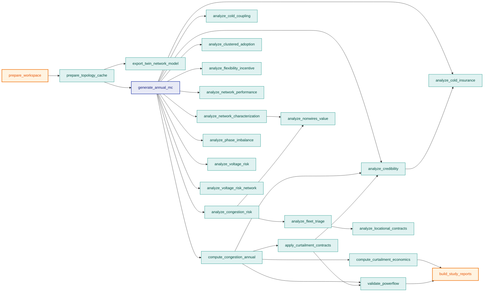

# Workflow YAML Reference

The project and workflow files use a small declarative schema inspired by
Kubernetes-style resources. The goal is readability, stable paths, and simple
automation rather than a full external workflow engine.

## Project Resource

```yaml
apiVersion: gridalyn.io/v1alpha1
kind: StudyProject
metadata:
  name: minimal_grid_project
  version: 0.1.0
  description: Minimal Gridalyn project.
spec:
  pathBase: project
  problem:
    type: powerflow_validation
    dataset: five_bus_teaching_feeder
    environment: pandapower_powerflow
    objective: Validate the smallest reproducible project contract.
    model:
      type: simulation_model
      name: pandapower
    scenarios:
      - id: baseline
        role: deterministic_baseline
        description: Five-bus feeder with fixed loads.
  inputs: {}
  artifacts: {}
  workflow:
    file: workflow.yaml
  validation:
    requiredReports: []
    requiredFigures: []
```

`spec.problem` is **required** — the schema demands it and the loader reads it
unguarded, so an example without it produces a project that cannot load. The
example above is modelled on the real `projects/minimal_grid_project/project.yaml`
and validates.

### Fields

| Field | Required | Meaning |
| --- | --- | --- |
| `apiVersion` | yes | Version of the Gridalyn project resource schema. |
| `kind` | yes | Must be `StudyProject`. |
| `metadata.name` | yes | Stable project identifier. |
| `metadata.version` | required | Project contract version. |
| `spec.pathBase` | recommended | `repo` resolves paths from repository root; default behavior may resolve from the project folder. |
| `spec.inputs` | yes | Raw geography, grid configuration, external datasets, and assumptions. |
| `spec.artifacts` | yes | Canonical artifact locations. |
| `spec.workflow.file` | yes | Workflow resource path. |
| `spec.validation.requiredReports` | recommended | Report JSON files that must exist and satisfy the report contract. |
| `spec.validation.requiredFigures` | recommended | Figures that must exist and be non-empty. |

## Workflow Resource

```yaml
apiVersion: gridalyn.io/v1alpha1
kind: Workflow
metadata:
  name: minimal_grid_project
spec:
  stages:
    - id: prepare_workspace
      command: "{python} -m gridalyn.interfaces.cli.project prepare-workspace ."
      outputs:
        - outputs/data
        - outputs/figures
        - outputs/manifests
        - outputs/operations
        - outputs/reports
        - outputs/cache

    - id: run_minimal_powerflow
      needs: [prepare_workspace]
      command: "{python} scripts/run_minimal_powerflow.py"
      inputs: []
      outputs:
        - projects/minimal_grid_project/outputs/reports/minimal_grid_report.json
```

### The Stage DAG

`needs:` is the only thing that orders a run. The runner topologically sorts
the stages, raises on a cycle, and executes the result **sequentially** — so
the DAG describes what *could* run in parallel, not what does. It is also what
`--stage <id>` resolves against: asking for one stage pulls in its transitive
ancestors and nothing else.

The two-stage example above is a straight line. A real study is not — this is
the flagship `ev_hosting_flex` workflow, 23 stages, drawn from its own
`workflow.yaml`:



`generate_annual_mc` is the hub: eleven stages depend on it and nothing else,
which is why `--stage analyze_voltage_risk` still costs a Monte Carlo run.

### The `{python}` Placeholder

Stage commands run through a shell, so a bare `python` is resolved against
`PATH`. On a virtualenv or a `python3`-only system there is no such executable
and the stage dies with exit 127. Write `{python}` instead: the runner replaces
every occurrence with the interpreter executing the workflow
(`sys.executable`), shell-quoted so an interpreter path containing spaces
survives. Quote the whole scalar in YAML — a leading `{` would otherwise start
a flow mapping.

A compatibility fallback keeps older contracts running: when a command contains
no `{python}`, a *leading* bare `python` token is rewritten to the same
interpreter. It applies to the first token only, so `uv run python …`, an
argument named `python`, and a script named `python_helper.py` are
never touched. Treat the fallback as support for contracts already written, and
`{python}` as the form to author.

### Stage Fields

| Field | Required | Meaning |
| --- | --- | --- |
| `id` | yes | Stable stage identifier used in logs and run manifests. |
| `command` | yes | Shell command executed from repository root when `pathBase: repo`. Use `{python}` for the interpreter. |
| `needs` | optional | Stage IDs that should run before this stage. |
| `inputs` | optional | Files consumed by the stage. |
| `outputs` | optional | Files produced by the stage. |

## Path Rules

Prefer `spec.pathBase: repo` for published workflows. It makes paths stable and
readable:

```yaml
projects/minimal_grid_project/outputs/reports/minimal_grid_report.json
instances/default/digital_twin/base/buildings.parquet
configs/geography/tr01.json
```

Avoid nested relative paths such as `../../instances/default/digital_twin/...` in published
project manifests.

## Report Validation

Required reports are parsed with `gridalyn.foundation.validate_report`.
They must include:

- `report_id`;
- `schema_version`;
- `created_at`;
- `source_domain`;
- `inputs`;
- `artifacts`;
- `summary`;
- `validation`.

Use [Reports](report-schema.md) for the full report contract.

## Commands

```bash
uv run gridalyn project validate projects/minimal_grid_project --check-artifacts
uv run gridalyn project plan projects/minimal_grid_project
uv run gridalyn project run projects/minimal_grid_project
uv run gridalyn project status projects/minimal_grid_project --check-artifacts
```

These are the four lifecycle commands, not a top-to-bottom recipe for a fresh
checkout: `--check-artifacts` requires the reports and figures declared under
`spec.validation` to exist already, so the first line fails until
`gridalyn project run` has produced them. On a project that has never been run,
validate without the flag first, run, and then use `--check-artifacts`.
