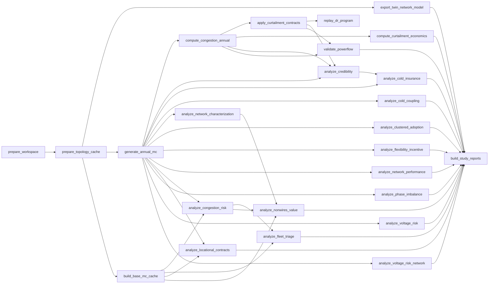

# Project And Workflow YAML

A project is declared in two YAML resources: `project.yaml` (`kind:
StudyProject`), the study contract, and the workflow file it names (`kind:
Workflow`), the graph of stages that produce the study's outputs. Each has a
JSON Schema, `gridalyn/projects/schemas/study_project.schema.json` and
`gridalyn/projects/schemas/workflow.schema.json`, and the field tables on this
page are generated from those schemas.

Both schemas are closed: a key that a table below does not list fails
validation. The exceptions are the free-form mappings: `spec.inputs`,
`spec.problem.model`, every `parameters` map, and `spec.validation`, which
accepts keys beyond the ones listed.

`gridalyn project validate` checks a project against both schemas and then
across them: unique scenario, experiment and stage ids, every `needs` and every
experiment scenario naming something declared, and every declared path landing
inside the project (see [Path Rules](#path-rules)). `gridalyn project plan` and
`gridalyn project run` load the project through the loader, which checks only
the fields it reads, so validate a project before running it.

## Project Resource

A small project that validates:

```yaml
apiVersion: gridalyn.io/v1alpha1
kind: StudyProject
metadata:
  name: my_study
  version: 0.1.0
  description: One AC power flow on a five-bus feeder.
spec:
  pathBase: project
  simulation:
    seed: 7
  problem:
    type: powerflow_validation
    dataset: five_bus_teaching_feeder
    environment: pandapower_powerflow
    objective: Check that the feeder converges inside its voltage band.
    model:
      type: simulation_model
      name: pandapower
    scenarios:
      - id: baseline
        role: deterministic_baseline
  experiments:
    - id: baseline_powerflow
      scenario: baseline
      metrics:
        - min_voltage_pu
  inputs: {}
  workflow:
    file: workflow.yaml
  validation:
    requiredReports:
      - outputs/reports/powerflow_report.json
    senseChecks:
      - id: min_voltage_in_band
        report: outputs/reports/powerflow_report.json
        field: summary.min_voltage_pu
        gte: 0.95
```

`spec.inputs` is empty here because its content is the study's own: each key is
read by a typed loader in `gridalyn/projects/model_inputs.py`, which owns that
key's fields and defaults. For a real one, read
`projects/minimal_grid_project/project.yaml`.

### Project Fields

`Required` is relative to the enclosing field: a required field under an
optional block, such as `spec.scenarios.index`, is required when the block is
present. Paths use `[]` for the items of a list and `<key>` for the entries of
a map whose keys the study chooses.

<!-- BEGIN GENERATED: study-project-fields -->

| Field | Type | Required | Default | Allowed values | Description |
| --- | --- | --- | --- | --- | --- |
| `apiVersion` | string | yes |  | `gridalyn.io/v1alpha1` | Version of the resource schema. |
| `kind` | string | yes |  | `StudyProject` | Resource kind. |
| `metadata` | object | yes |  |  | Identity of the project. |
| `metadata.name` | string | yes |  | non-empty | Stable project identifier. Recorded as the project name in the run manifest and in the platform reports ProjectScript.write_report writes. |
| `metadata.version` | string | yes |  | non-empty | Version of this project contract. |
| `metadata.description` | string | no |  |  | One-line summary of the study, carried into the dashboard's project catalog. |
| `metadata.runtimeClass` | string | no |  | `seconds`, `minutes`, `hours` | How long a cold 'gridalyn project run' of this study takes on one developer machine, as an order of magnitude taken from a measured run: 'seconds' under a minute, 'minutes' under an hour, 'hours' beyond. The Studies page orders its study ladder by it. |
| `spec` | object | yes |  |  | The study contract. |
| `spec.pathBase` | string | no | `project` | `project`, `repo` | The directory stage commands run from: 'project' is the project directory, 'repo' the repository root, which a stage invoked as '{python} -m projects.&lt;study&gt;.scripts...' needs. It is a working directory only: every path declared in project.yaml and workflow.yaml is relative to the project directory whatever this says. |
| `spec.simulation` | object | no |  |  | Runner-reachable simulation settings, recorded verbatim in the run manifest's provenance block. |
| `spec.simulation.seed` | integer | no |  |  | The single RNG base this study's stages draw from. Use it only when there genuinely is one; a study with several independent streams declares 'seeds' instead, because a scalar that names one of several streams is provenance a reader cannot reproduce from. Recorded as provenance.seeds.base. |
| `spec.simulation.seed_base` | integer | no |  |  | Alias of 'seed', read when 'seed' is absent. |
| `spec.simulation.seeds` | map of integer | no |  | non-empty | Named independent RNG streams, for studies that have more than one. Each name must be wired to the code that consumes it -- a declared value the stage script does not actually read is worse than no declaration, because it looks reproducible. Recorded as provenance.seeds.streams. |
| `spec.simulation.powerflowBackend` | string | no |  | non-empty | The backend ID this study's solving stages resolve through by default, via ProjectScript.powerflow_backend(). Recorded as provenance.powerflow_backend.backend_id, with provenance.powerflow_backend.declared_source stating whether it was declared here or inherited from the registry default. |
| `spec.simulation.clearingEngine` | string | no |  | `selection` | The clearing surface this study's stages actually use, when it clears at all. Validated against the modules gridalyn.operations.clearing actually ships, so a retired mode stops being accepted on its own. Omit it for a study that does no flexibility clearing: provenance then records null rather than naming an engine no stage ran. Recorded as provenance.clearing_engine.name. |
| `spec.simulation.surrogate` | string | no |  | non-empty | The surrogate ID this study's stages resolve through when they substitute a surrogate for a full power-flow solve, via ProjectScript.surrogate(). A surrogate answers in place of physics, so which one answered is a property of the run. provenance.surrogate names it, with its stated error bound, only once a stage has really used one, by a prediction or a clearing on predicted impact. Until then it records status 'none reached' and no ID. provenance.surrogate.declared_source states whether the ID was declared here or inherited from the registry default. |
| `spec.simulation.powerflowBackendByStage` | map of string | no |  | non-empty | Per-stage overrides of powerflowBackend, for a study whose stages genuinely solve with different engines. A single scalar cannot describe such a study, and recording one names an engine some stage did not use. Keys are workflow stage IDs; each must exist in the workflow. Recorded as provenance.powerflow_backend.by_stage. |
| `spec.simulation.channelModel` | object | no |  |  | The channel model this study's simulated agents exchange messages through, via ProjectScript.channel_model(). Whether and when a message arrives changes every result that depends on it, so which channel carried a run is a property of the run: recorded as provenance.channel_model with its parameters and seed. Omit it for a study with no simulated communication; provenance then records nothing, and the manifest keeps its bytes. |
| `spec.simulation.channelModel.id` | string | yes |  | non-empty | A registered channel model ID, e.g. 'ideal', 'fixed_latency', 'bernoulli_loss'. |
| `spec.simulation.channelModel.parameters` | object | no |  |  | The model's parameters in camelCase (lossProbability, latency), limited to those its descriptor declares. A seed is never declared here. |
| `spec.simulation.channelModel.seedStream` | string | no |  | non-empty | The spec.simulation.seeds stream a model that draws randomness takes its seed from, so provenance.seeds records the same value the channel draws with. |
| `spec.problem` | object | yes |  |  | The question the study poses, loaded into ProblemSpec and summarised by 'gridalyn project status'. |
| `spec.problem.type` | string | yes |  | non-empty | Problem family, free text, e.g. 'powerflow_validation'. |
| `spec.problem.dataset` | string | yes |  | non-empty | The dataset the study draws on, free text. |
| `spec.problem.environment` | string | yes |  | non-empty | The environment the study runs in, free text, e.g. 'pandapower_powerflow'. |
| `spec.problem.objective` | string | yes |  | non-empty | What the study sets out to show, carried into the dashboard's project catalog. |
| `spec.problem.model` | object | yes |  |  | The model under study. Keys beyond 'type' and 'name' are accepted and kept in ProblemSpec.model. |
| `spec.problem.model.type` | string | yes |  | `asset_model`, `forecast_model`, `simulation_model`, `optimization_model`, `control_model`, `market_model`, `operations_model`, `workflow_model` | Model family. |
| `spec.problem.model.name` | string | yes |  | non-empty | Model identifier, free text, e.g. 'pandapower'. |
| `spec.problem.scenarios` | array of object | yes |  | non-empty | The scenarios the problem is posed over. 'gridalyn project validate' rejects a duplicate id. |
| `spec.problem.scenarios[].id` | string | yes |  | non-empty | Scenario identifier, referenced by spec.experiments[].scenario and scenarios. |
| `spec.problem.scenarios[].role` | string | yes |  | non-empty | The scenario's part in the study, free text, e.g. 'deterministic_baseline'. |
| `spec.problem.scenarios[].description` | string | no |  |  | Human-readable description of the scenario. |
| `spec.problem.scenarios[].parameters` | object | no |  |  | Free-form scenario parameters. load_standard_powerflow_scenarios reads loadMultiplier, pvBuses, pvMwPerBus, evBuses and evMwPerBus from here and rejects any other key. |
| `spec.experiments` | array of object | no |  |  | Named experiments over the declared scenarios, carried into the dashboard's project catalog. 'gridalyn project validate' rejects a duplicate id and a reference to an undeclared scenario. |
| `spec.experiments[].id` | string | yes |  | non-empty | Experiment identifier. |
| `spec.experiments[].objective` | string | no |  |  | What the experiment is for. |
| `spec.experiments[].scenario` | string | no |  | non-empty | The scenario id the experiment runs. An experiment declares 'scenario', 'scenarios', or both. |
| `spec.experiments[].scenarios` | array of string | no |  | non-empty | The scenario ids the experiment runs, the list form of 'scenario'. |
| `spec.experiments[].metrics` | array of string | no |  |  | The summary keys that are the experiment's result, as opposed to context. The dashboard presents them first. |
| `spec.experiments[].model` | string | no |  | non-empty | The model the experiment uses, free text. |
| `spec.experiments[].artifacts` | array of string | no |  |  | Accepted and not read: the loader does not parse it. Kept so project files that still carry it validate. |
| `spec.experiments[].parameters` | object | no |  |  | Free-form experiment parameters, kept in ExperimentSpec.parameters. |
| `spec.inputs` | object | yes |  |  | The study's inputs: geography, grid configuration, external datasets and assumptions. Free-form; each key is read by a typed loader in gridalyn.projects.model_inputs (for example loadGeneration and sourceNetwork), and no SDK code resolves a path declared here, so an entry may point outside the project. |
| `spec.artifacts` | object | no |  |  | Accepted and not read. The output directories are fixed by ProjectScript (data, figures, reports, manifests, operations and cache under outputs/), and the run manifest fingerprints its own fixed set, so declaring directories here governs nothing. Kept as a property because additionalProperties is false, so project files that still carry the block validate. |
| `spec.scenarios` | object | no |  |  | How this study's scenarios may be enumerated and read. Optional: a study without scenarios omits the block and behaves exactly as before. Declared rather than discovered so no consumer assumes a shape -- the twin partitions a scenario's data BY FILE (one artifact per scenario and kind) while ieee_33_bus_demo partitions BY COLUMN (one artifact holding every scenario, discriminated by a scenario_id column), and neither is more correct. |
| `spec.scenarios.index` | string | yes |  | non-empty | Project-relative path of the artifact that ENUMERATES the scenarios, a .csv or .json. Reading ids from an indexer rather than from a directory listing is what lets a study add a scenario without any consumer changing. |
| `spec.scenarios.idColumn` | string | no | `scenario_id` | non-empty | Column or key in the index carrying each scenario id. |
| `spec.scenarios.labelColumn` | string | no |  | non-empty | Column or key in the index carrying a human-readable label. |
| `spec.scenarios.artifacts` | object | yes |  | non-empty | The kinds of data each scenario carries, keyed by the name a consumer asks for. Free-form: the point of the contract is that no consumer holds a fixed set of kinds. |
| `spec.scenarios.artifacts.<key>.path` | string | yes |  | non-empty | Project-relative path. Must carry the literal {scenario_id} when partitioning is 'file', and must not when it is 'column'. |
| `spec.scenarios.artifacts.<key>.partitioning` | string | no | `file` | `file`, `column` | 'file' when the scenario id is in the path, 'column' when it is in the rows. |
| `spec.scenarios.artifacts.<key>.idColumn` | string | no | `scenario_id` | non-empty | Column carrying the scenario id, for a column-partitioned artifact. |
| `spec.workflow` | object | yes |  |  | The workflow this project runs. |
| `spec.workflow.file` | string | yes |  | non-empty | Path of the kind: Workflow file, relative to the project directory. |
| `spec.validation` | object | yes |  |  | What 'gridalyn project validate --check-artifacts', 'sense-check' and 'status' check the study's outputs against. Keys beyond those listed are accepted. Every path in it is relative to the project directory. |
| `spec.validation.requiredReports` | array of string | no |  |  | Platform reports the study must produce. 'validate --check-artifacts' and 'sense-check' require each to exist; 'status' also validates each against the report contract. |
| `spec.validation.requiredFigures` | array of string | no |  |  | Figures the study must produce; each must exist and be non-empty. |
| `spec.validation.senseChecker` | string | no |  | pattern `^[^:]+\.py:[A-Za-z_][A-Za-z0-9_]*$`; at least 3 characters | Project-relative '&lt;module&gt;.py:&lt;function&gt;' reference to this study's own objective sense checks. The library discovers the checker here instead of holding a table of study names, so adding a study needs no library edit. Authors write against gridalyn.projects.sense_check_api. |
| `spec.validation.objectiveArtifacts` | array of string | no |  |  | Project-relative paths this study's objective must produce. Checked for existence before the sense checker runs, so a checker reports a located 'missing_objective_artifact' rather than dying on FileNotFoundError. |
| `spec.validation.senseChecks` | array of object | no |  |  | Declarative plausibility rules, run by 'gridalyn project sense-check'. Each reads one value from one JSON report and passes when every comparison it declares holds; it must declare at least one. |
| `spec.validation.senseChecks[].id` | string | yes |  | non-empty | Check identifier, as reported in the sense-check report. |
| `spec.validation.senseChecks[].report` | string | yes |  | non-empty | The JSON file the rule reads, relative to the project directory. |
| `spec.validation.senseChecks[].field` | string | yes |  | non-empty | Dot-separated path to the value inside that file, e.g. 'summary.min_voltage_pu'. |
| `spec.validation.senseChecks[].severity` | string | no | `error` | `error`, `warning` | A failed 'error' check fails the sense check; a failed 'warning' is reported without failing it. |
| `spec.validation.senseChecks[].message` | string | no |  |  | Text reported with the check; the id with underscores read as spaces when omitted. |
| `spec.validation.senseChecks[].equals` | any | no |  |  | Passes when the value equals this. |
| `spec.validation.senseChecks[].min` | number | no |  |  | Passes when the value is at least this (same as 'gte'). |
| `spec.validation.senseChecks[].max` | number | no |  |  | Passes when the value is at most this (same as 'lte'). |
| `spec.validation.senseChecks[].gt` | number | no |  |  | Passes when the value is greater than this. |
| `spec.validation.senseChecks[].gte` | number | no |  |  | Passes when the value is greater than or equal to this. |
| `spec.validation.senseChecks[].lt` | number | no |  |  | Passes when the value is less than this. |
| `spec.validation.senseChecks[].lte` | number | no |  |  | Passes when the value is less than or equal to this. |

<!-- END GENERATED: study-project-fields -->

## Workflow Resource

The workflow for the project above:

```yaml
apiVersion: gridalyn.io/v1alpha1
kind: Workflow
metadata:
  name: my_study_workflow
spec:
  stages:
    - id: prepare_workspace
      command: "{python} -m gridalyn.interfaces.cli.project prepare-workspace ."
    - id: run_powerflow
      needs: [prepare_workspace]
      command: "{python} scripts/run_powerflow.py"
      outputs:
        - outputs/reports/powerflow_report.json
```

### Workflow Fields

<!-- BEGIN GENERATED: workflow-fields -->

| Field | Type | Required | Default | Allowed values | Description |
| --- | --- | --- | --- | --- | --- |
| `apiVersion` | string | yes |  | `gridalyn.io/v1alpha1` | Version of the resource schema. |
| `kind` | string | yes |  | `Workflow` | Resource kind. |
| `metadata` | object | yes |  |  | Identity of the workflow. |
| `metadata.name` | string | yes |  | non-empty | Workflow identifier. |
| `metadata.description` | string | no |  |  | Human-readable summary of the workflow. |
| `spec` | object | yes |  |  | The stage graph. |
| `spec.stages` | array of object | yes |  | non-empty | The stages. The runner orders them by 'needs', refuses a cycle, and runs them one at a time. 'gridalyn project validate' rejects a duplicate id and a 'needs' entry naming no stage. |
| `spec.stages[].id` | string | yes |  | pattern `^[a-zA-Z0-9_.-]+$` | Stage identifier: what 'needs' and '--stage' name, and what the run manifest records. |
| `spec.stages[].command` | string | yes |  | non-empty | Shell command the runner executes, from the project directory, or from the repository root under spec.pathBase: repo. Every '{python}' is replaced by the interpreter running the workflow. |
| `spec.stages[].needs` | array of string | no |  |  | Ids of the stages that must complete before this one. |
| `spec.stages[].inputs` | array of string | no |  |  | Files the stage reads, relative to the project directory. Declared, not checked at run time; 'gridalyn project validate' rejects one outside the project. |
| `spec.stages[].outputs` | array of string | no |  |  | Files the stage produces, relative to the project directory. After the stage exits zero each must exist, or the run fails naming the stage and the missing paths. |

<!-- END GENERATED: workflow-fields -->

### The `{python}` Placeholder

Stage commands run through a shell, so a bare `python` is resolved against
`PATH`. On a virtualenv or a `python3`-only system there is no such executable
and the stage dies with exit 127. Write `{python}` instead: the runner replaces
every occurrence with the interpreter executing the workflow
(`sys.executable`), shell-quoted so an interpreter path containing spaces
survives. Quote the whole scalar in YAML, because a leading `{` would otherwise
start a flow mapping.

When a command contains no `{python}`, a *leading* bare `python` token is
rewritten to the same interpreter. It applies to the first token only, so
`uv run python …`, an argument named `python`, and a script named
`python_helper.py` are never touched. The fallback keeps existing contracts
running; `{python}` is the form to author.

### The Stage Graph

`needs` is the only thing that orders a run. The runner sorts the stages
topologically, refuses a cycle, and executes the result **one stage at a
time**, so the graph describes what *could* run in parallel, not what does.
It is also what `--stage <id>` resolves against: asking for one stage pulls in
its transitive dependencies and nothing else.

The workflow above is a straight line. The operator-verified `ev_hosting_flex`
study is not; this is its stage graph, one arrow per `needs` entry, generated
from `projects/ev_hosting_flex/workflow.yaml`:

<!-- BEGIN GENERATED: ev-hosting-flex-stage-graph -->



`gridalyn project run projects/ev_hosting_flex --stage analyze_voltage_risk` runs 4 of its 25 stages, in this order: `prepare_workspace`, `prepare_topology_cache`, `generate_annual_mc`, `analyze_voltage_risk`.

<!-- END GENERATED: ev-hosting-flex-stage-graph -->

## Path Rules

Every path declared in `project.yaml` or `workflow.yaml` is relative to the
project directory, whatever `spec.pathBase` says: `spec.workflow.file`, the
paths under `spec.validation` (`requiredReports`, `requiredFigures`,
`objectiveArtifacts`, each sense check's `report`), `spec.scenarios`, and each
stage's `inputs` and `outputs`. Write them as the project sees them:

```yaml
spec:
  pathBase: repo
  validation:
    requiredReports:
      - outputs/reports/minimal_grid_report.json   # not projects/<study>/outputs/...
```

A path that repeats the project directory, such as `projects/<study>/outputs/...`,
is reported as a doubled prefix, naming the corrected declaration, by both
`gridalyn project validate` and `gridalyn project sense-check`. A stale
`spec.workflow.file` stops the project from loading, with an error naming the
path it tried and the corrected declaration. `gridalyn project run` refuses to
start on a doubled prefix in a stage's `inputs` or `outputs`, before any stage
runs.

`spec.pathBase` decides one thing: the directory stage commands run from.
`repo` makes that the repository root, which a stage invoked as
`{python} -m projects.<study>.scripts...` needs; a stage of a `pathBase: repo`
study still declares `outputs/reports/analysis_report.json`, not
`projects/<study>/outputs/reports/analysis_report.json`.

`spec.inputs` entries are not resolved by the SDK, so they may point outside
the project, to shared data such as `configs/geography/tr01.json`. A stage's
`inputs` in `workflow.yaml` may not: those must land inside the project, and
`gridalyn project validate` rejects one that does not. Avoid nested relative
paths such as `../../instances/default/digital_twin/...` in published project
files.

## Checking A Project

```bash
uv run gridalyn project validate projects/minimal_grid_project
uv run gridalyn project plan projects/minimal_grid_project
```

`validate` prints a JSON report whose `valid` is `true` when both files pass the
checks above; `plan` prints the stages in the order `run` would execute them.
With `--check-artifacts`, `validate` also requires every report and figure
declared under `spec.validation` to exist, which holds only after a run. The
reports those entries name follow the [Report And Run-Manifest Schema](report-schema.md); the
full ladder of checks from `validate` to `verify-all` is in
[Testing And Validation](../contributing/testing-and-validation.md).
