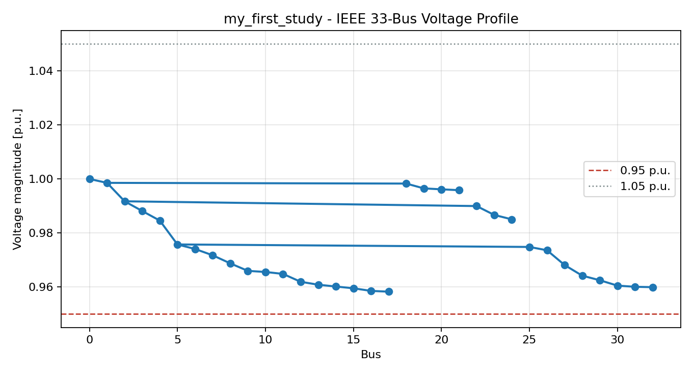
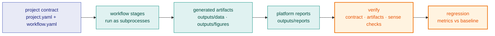

# Quickstart

The shortest path from an installed checkout to a result, then to a verified
study. Run every command from the repository root, in the environment
[Installation](installation.md) set up.

## 1. Your first simulation in one command

```bash
uv run gridalyn quickstart my-first-study
```

This scaffolds a project from the `powerflow-demo` template (an IEEE 33-bus
power-flow study), runs its workflow with per-stage progress, and ends by
naming what it wrote:

```text
Quickstart complete. Artifacts:
  figure: my-first-study/outputs/figures/powerflow_demo_voltage_profile.png
  report: my-first-study/outputs/reports/powerflow_demo_report.json

Next steps:
  gridalyn project status my-first-study --check-artifacts
  gridalyn project verify my-first-study
  edit my-first-study/scripts/run_powerflow_study.py to make it yours
```

The figure is the voltage along the feeder: each dot a bus, each segment a
line, with the far ends of the main feeder and of one lateral below the
0.95 p.u. limit.


The command creates `my-first-study` in the current directory, so from the
repository root it is an untracked directory: delete it when you are done, or
pass a path outside the checkout.

The same study from Python, using only top-level imports. `init_project`
refuses a target directory that already exists, so this uses a second path;
run either the command above or this snippet, not both into one directory:

```python
import gridalyn

created = gridalyn.init_project("my-second-study", template="powerflow-demo")
gridalyn.run_workflow(created.root, echo=True)
print(gridalyn.project_verify(created.root)["valid"])
```

To scaffold without running, use `gridalyn project init <dir> --template
<name>`; `gridalyn project init --list-templates` lists the templates
(`minimal`, `grid-study`, `powerflow-demo`). Turning a scaffold into your own
study is [Build Your Own Project](../guides/build-your-own-project.md).

## 2. Change one number and run it again

The study declares one input you can change without touching code. Open the
`project.yaml` inside `my-first-study` and halve every load on the feeder:

```yaml
  inputs:
    raw: inputs
    loadScale: 0.5
```

Then run the study again:

```bash
uv run gridalyn project run my-first-study
```

Every bus is now back above the 0.95 p.u. limit, and the report records
`load_scale: 0.5` beside the new `min_voltage_pu`:



Set it back to `1.0` for the feeder as published, or try `1.5`.

## 3. Run a shipped study and check it

`minimal_grid_project` is the smallest of the CI fixture studies: a five-bus
feeder solved once. Run it, verify it, and compare it with its baseline:

```bash
uv run gridalyn project run projects/minimal_grid_project
uv run gridalyn project verify projects/minimal_grid_project
uv run gridalyn project regression projects/minimal_grid_project
```

`run` executes the workflow's stages in dependency order, each as its own
subprocess. `verify` checks the contract, the declared artifacts and the
study's sense checks; it reads what a run already wrote, so on a study that
has never run it exits non-zero. `regression` compares the declared metrics
with the committed baseline in `baselines/results_baseline.json`, within
explicit tolerances. Together they are the loop every study goes through:



Expected outcome: one AC power flow, three CSV tables, two platform reports
(the power-flow report and the sense-check report), one voltage-profile
figure, a run manifest, a passing verification, and a passing regression that
writes its own `regression_report.json`. The full set of checks, and when to
run which, is in
[Testing And Validation](../contributing/testing-and-validation.md).

## 4. Look around the workspace

```bash
uv run gridalyn --help
```

```bash
uv run gridalyn validate
```

`validate` checks the repository's artifact policy and every project contract
without running anything. Expected result: `"valid": true`. If it reports
tracked generated artifacts, read [Artifact Policy](../reference/artifact-policy.md)
before adding files to Git.

Next: [Reading The Outputs](reading-the-outputs.md)
