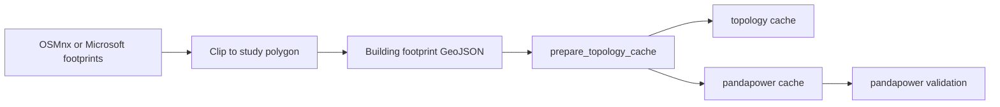

# Flexibility CLS Project

`flexibility_cls` is a larger public demo for topology-aware flexibility
operations. It evaluates scenario adoption, dynamic transformer limits, Soft
CLS building flexibility, Hard CLS backstop control, rebound, settlement, and
analysis figures.

The executable project now lives under `projects/flexibility_cls/`. It owns
the pipeline scripts, plotting scripts, generated data, scenario JSON, figures,
reports, and run manifests for this demo.

## Current Entry Point

Run the full current workflow with:

```bash
uv run gridalyn project run projects/flexibility_cls
```

Validate the governed project contract with:

```bash
uv run gridalyn project validate projects/flexibility_cls
```

Inspect the declared workflow order with:

```bash
uv run gridalyn project plan projects/flexibility_cls
```

Dry-run the governed workflow with:

```bash
uv run gridalyn project run projects/flexibility_cls --dry-run
```

After running the workflow, verify numerical regression against the committed
lightweight baseline with:

```bash
uv run gridalyn project regression projects/flexibility_cls
```

For the publication-ready verification ladder, run:

```bash
uv run gridalyn project verify projects/flexibility_cls
```

This combines project contract validation, required artifact checks, status
reporting, and objective-level sense checks for the generated results.

The project command reads `projects/flexibility_cls/project.yaml`,
validates `workflow.yaml`, and executes project-local scripts.

`run` writes an execution manifest to:

```text
projects/flexibility_cls/outputs/manifests/project_run_manifest.json
```

`regression` writes:

```text
projects/flexibility_cls/outputs/reports/regression_report.json
```

The baseline intentionally tracks compact metrics such as EV counts, S4 managed
peak, Soft/Hard CLS energy, settlement, dynamic congestion, and output
consistency. It does not compare binary figure checksums, which can change due
to renderer metadata even when numerical results are unchanged.

## Project Boundary

```text
projects/flexibility_cls/   # executable project/workflow and outputs
instances/default/digital_twin/                     # canonical network/scenario artifacts
gridalyn/                         # reusable library and workflow code
examples/                         # tutorials only, not a project dependency
```

The project may consume reusable `gridalyn` and
`instances/default/digital_twin` artifacts, but it does not depend on an
external runtime backend.

## Synthetic Network Source

`flexibility_cls` starts from a synthetic distribution grid generated from
building-footprint GeoJSON. The current project contract declares:

```yaml
spec:
  inputs:
    geography:
      source: configs/geography/tr01.json
    buildingFootprints:
      source: examples/tutorials/data/buildings_inside_polygon.geojson
    grid:
      config: configs/grid/config.json
```

The footprint file is a clipped Trois-Rivieres sample used to create the
project topology cache. It represents the physical building layer only; EV
adoption, Soft CLS participation, and Hard CLS eligibility are generated later
as scenario and asset-registry layers.

The source preparation path is:



For OSMnx, use the data-acquisition example to query OpenStreetMap buildings:

```bash
uv run gridalyn twin download-osm-buildings \
  --polygon-file configs/geography/tr01.json \
  --output-file projects/flexibility_cls/inputs/buildings.geojson
```

For Microsoft Global ML Building Footprints, convert a local partition to
regular clipped GeoJSON:

```bash
uv run gridalyn twin prepare-microsoft-buildings \
  --input-file /path/to/microsoft-partition.csv.gz \
  --polygon-file configs/geography/tr01.json \
  --output-file projects/flexibility_cls/inputs/buildings.geojson
```

Then rebuild the project topology cache from that source:

```bash
uv run python projects/flexibility_cls/scripts/pipeline/prepare_topology_cache.py \
  --input-file projects/flexibility_cls/inputs/buildings.geojson \
  --force-rebuild
```

See [Synthetic Networks From GeoJSON](../tutorials/synthetic-network-from-geojson.md)
for footprint quality checks, source notes, and OSMnx/Microsoft references.

## Governed Project Workflow

The project uses two YAML resources:

```text
projects/flexibility_cls/project.yaml
projects/flexibility_cls/workflow.yaml
```

`project.yaml` declares:

- geographic and grid configuration inputs;
- `pathBase: repo`, so paths are resolved from the repository root;
- digital twin artifact locations;
- project data, JSON, report, and figure locations;
- the workflow file;
- required reports and figures used for validation.

`workflow.yaml` declares the governed project DAG as stages. It keeps numerical
data generation, case-study analysis figures, validation checks, operational
artifact materialization, and canonical report generation in one reproducible
contract:

1. `prepare_workspace`
2. `prepare_topology_cache`
3. `generate_stochastic_profiles`
4. `congestion_forecast`
5. `market_allocation`
6. `pandapower_validation`
7. `plot_stage_1_stacked_ev`
8. `plot_stage_1_load_distributions`
9. `plot_stage_1_ev_summary`
10. `plot_stage_1_targeted_transformer_load`
11. `plot_stage_2_grid_exceedance`
12. `plot_stage_2_chance_pdf`
13. `plot_stage_2_temporal_heatmap`
14. `plot_stage_2_temperature_heatmap`
15. `plot_stage_3_day_ahead`
16. `plot_stage_3_profiled`
17. `plot_stage_3_power_heatmap`
18. `plot_stage_4_realization`
19. `plot_stage_4_aggregator_trajectory`
20. `plot_stage_4_multiscenario`
21. `plot_stage_4_aggregator_deficits`
22. `plot_stage_5_settlement`
23. `validate_study_outputs`
24. `materialize_operational_artifacts`
25. `build_study_reports`

The YAML follows the `apiVersion`, `kind`, `metadata`, `spec` convention:

```yaml
apiVersion: gridalyn.io/v1alpha1
kind: StudyProject
metadata:
  name: flexibility_cls
  version: 0.1.0
spec:
  pathBase: repo
  workflow:
    file: projects/flexibility_cls/workflow.yaml
```

This keeps YAML declarative: it says what enters, what runs, what is produced,
and what must validate. Python remains responsible for the numerical model and
grid generation logic.

With `pathBase: repo`, commands and artifacts use top-level paths such as
`projects/flexibility_cls/scripts/...` and `instances/default/digital_twin/base`, avoiding
nested `../../` paths from the project folder.

## Current Stage Flow

The workflow preserves this stage order:

1. `gridalyn project prepare-workspace`
2. `prepare_topology_cache.py`
   - Reads the project building-footprint GeoJSON.
   - Builds or refreshes the synthetic topology and pandapower cache.
   - Writes `projects/flexibility_cls/outputs/cache/building_footprint_validation_report.json`.
   - Writes `projects/flexibility_cls/outputs/cache/pg_graph_cache.pkl`.
   - Writes `projects/flexibility_cls/outputs/cache/pp_net_cache.pkl`.
   - Writes `projects/flexibility_cls/outputs/cache/grid_cache_meta.json`.
   - Writes `projects/flexibility_cls/outputs/cache/topology_cache_manifest.json`.
   - Embeds footprint SHA-256, CRS, bounds, and validation-report lineage in the
     topology manifest.

2. `00_generate_stochastic_profiles.py`
   - Generates building and EV Monte Carlo profiles.
   - Writes `projects/flexibility_cls/outputs/data/substation_baseline_mc.parquet`.
   - Writes `projects/flexibility_cls/outputs/data/substation_ev_capability_mc.parquet`.

3. `01_congestion_forecast.py`
   - Builds the dynamic thermal limit from the transformer thermal model and
     cold-day forecast.
   - Writes `projects/flexibility_cls/outputs/json/flex_requirements.json`.
   - Writes `projects/flexibility_cls/outputs/data/congestion_temporal_bounds.parquet`.

4. `02_solve_capacity_allocation.py`
   - Solves Soft/Hard CLS allocation and real-time dispatch.
   - Writes `projects/flexibility_cls/outputs/json/ev_summary_results.json`.
   - Writes `projects/flexibility_cls/outputs/data/market_dispatch_timeseries.parquet`.

5. `pandapower_validation.py`
   - Writes `projects/flexibility_cls/outputs/json/pandapower_validation.json`.

6. Plotting stages under `projects/flexibility_cls/scripts/plotting`
   - The governed project workflow runs only stochastic load figures, thermal
     screening figures, market clearing figures, dispatch figures, and
     settlement figures that consume case-study outputs.
   - Concept figures and model illustrations stay outside the public project
     DAG.

7. `materialize_operational_artifacts.py`
   - Converts the digital-twin flexibility clearing tables into governed
     project artifacts for operations and dashboards.
   - Writes `projects/flexibility_cls/outputs/operations/network_constraints.parquet`.
   - Writes `projects/flexibility_cls/outputs/operations/flexibility_offers.parquet`.
   - Writes `projects/flexibility_cls/outputs/operations/dispatch_instructions.parquet`.
   - Writes `projects/flexibility_cls/outputs/operations/settlement_records.parquet`.
   - Writes `projects/flexibility_cls/outputs/operations/operation_run.json`.
   - Writes `projects/flexibility_cls/outputs/operations/operations_catalog.json`.
   - Writes `projects/flexibility_cls/outputs/reports/operational_kpi_report.json`.

## Figure Groups

Case-analysis figures are grouped by project stage:

| Stage | Directory |
| --- | --- |
| Stage 1 stochastic load | `projects/flexibility_cls/outputs/figures/02_stage1_stochastic_load` |
| Stage 2 thermal screening | `projects/flexibility_cls/outputs/figures/03_stage2_thermal_screening` |
| Stage 3 market clearing | `projects/flexibility_cls/outputs/figures/04_stage3_market_clearing` |
| Stage 4 real-time dispatch | `projects/flexibility_cls/outputs/figures/05_stage4_realtime_dispatch` |
| Stage 5 settlement | `projects/flexibility_cls/outputs/figures/06_stage5_settlement` |

Publication-only and pedagogical material should stay outside the executable
workflow contract.

## Dynamic Thermal Limit

The active limit is not a static constant. The project computes a dynamic
transformer limit using the IEEE C57.91 thermal model and the selected cold-day
weather trace.

Current summary fields are exposed in:

- `projects/flexibility_cls/outputs/json/flex_requirements.json`;
- `projects/flexibility_cls/outputs/json/ev_summary_results.json`;
- `projects/flexibility_cls/outputs/reports/stage_2_thermal_forecast_report.json`.

Important metrics:

- `dynamic_limit_min_mw`;
- `dynamic_limit_mean_mw`;
- `dynamic_limit_max_mw`;
- `dynamic_limit_at_peak_mw`;
- `thermal_model`;
- `thermal_forecast_start`.

## Soft and Hard CLS

Soft CLS comes from building load modulation. Hard CLS comes from EV charging
interruption or limiting.

Spatial validation consumes:

- `instances/default/digital_twin/scenarios/asset_registry.parquet`;
- `projects/flexibility_cls/outputs/data/market_dispatch_timeseries.parquet`;
- `instances/default/digital_twin/timeseries/S4_ev_load.parquet`;
- the project-owned synthetic pandapower topology cache under
  `projects/flexibility_cls/outputs/cache`.

The topology cache is generated by the `prepare_topology_cache` workflow stage.
It is a runtime artifact and must not be committed.

The spatial validation report is:

```text
projects/flexibility_cls/outputs/json/spatial_cls_powerflow_validation.json
```

The canonical stage report is:

```text
projects/flexibility_cls/outputs/reports/stage_4_realtime_dispatch_report.json
```

## Validation

Run current consistency checks:

```bash
uv run python projects/flexibility_cls/scripts/pipeline/verify_output_consistency.py
```

Run focused tests:

```bash
uv run --with pytest python -m pytest -q \
  tests/test_canonical_reports.py \
  tests/test_semantic_graph.py \
  tests/test_asset_registry.py \
  tests/test_spatial_cls_allocation.py \
  tests/test_market_engine_risk_dispatch.py
```

Check JSON and figures after regeneration:

```bash
uv run python - <<'PY'
import json
from pathlib import Path

json_files = list(Path("projects/flexibility_cls/outputs/json").glob("*.json"))
json_files += list(Path("projects/flexibility_cls/outputs/reports").glob("*.json"))
for path in json_files:
    json.load(path.open())

figures = [
    path for path in Path("projects/flexibility_cls/outputs/figures").rglob("*")
    if path.suffix.lower() in {".png", ".pdf"}
]
assert figures
assert all(path.stat().st_size > 0 for path in figures)
print(f"checked {len(json_files)} json files and {len(figures)} figures")
PY
```

## Design Trace

The current design trace is the project contract itself:

```text
projects/flexibility_cls/project.yaml
projects/flexibility_cls/workflow.yaml
projects/flexibility_cls/outputs/manifests/project_run_manifest.json
```

Historical planning notes were removed from the published documentation. The
public contract is now the executable project manifest plus generated reports.
